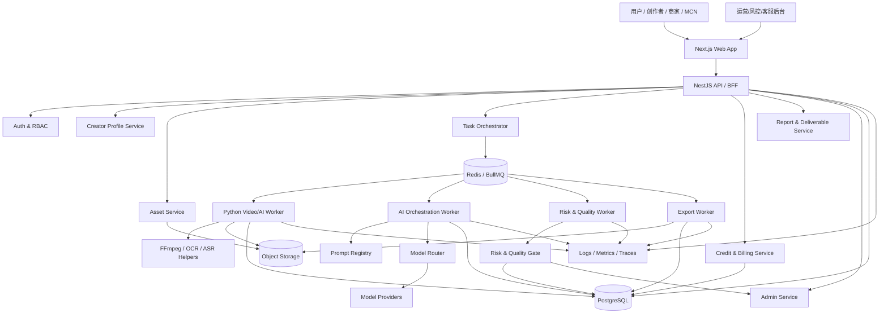
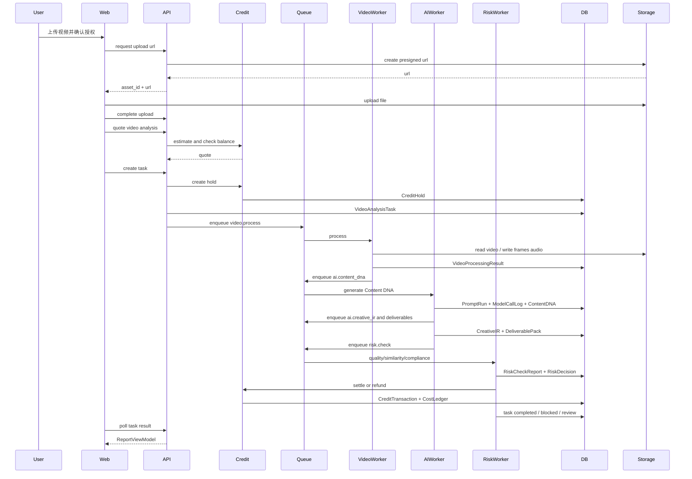

# D15｜技术架构与工程模块设计文档

> 文档编号：D15  
> 文档名称：技术架构与工程模块设计文档  
> 文档版本：V1.0  
> 生成日期：2026-05-25  
> 根上下文：D00《AIcoding 研发总控文档 / 项目上下文总索引》  
> 前置文档：D00、D01、D02、D03、D04、D05、D07、D08、D09、D10、D11、D12、D13、D14  
> 后置文档：D16 数据库 Schema、数据字典与 API 契约文档；D17 异步任务队列、文件存储与生成资产生命周期文档；D18 AIcoding 执行规约；D19 测试发布监控；D20 商业化系统；D21 合规审核；D22 数据安全与权限；D23 运营后台与人工复核；D24 最终交接  
> 当前主线版本：MVP1「视频拆解 + 原创脚本生成」  
> 文档性质：技术架构 + 工程模块设计 + 服务边界 + 部署基础 + AIcoding 执行任务文档  
> 核心定位：本文件不是泛泛技术选型建议，而是把 MVP1 的产品、AI、风控、积分、任务、文件、后台、测试与部署要求固化成可被 AIcoding 直接研发的工程架构契约。

---

## 1. 文档元信息

| 项目 | 内容 |
|---|---|
| 文档编号 | D15 |
| 文档名称 | 技术架构与工程模块设计文档 |
| 所属项目 | AI 短视频爆款增长引擎 |
| 当前研发主线 | MVP1：视频拆解 + 原创脚本生成 |
| 文档级别 | S，工程架构核心文档 |
| 上级根文档 | D00《AIcoding 研发总控文档 / 项目上下文总索引》 |
| 直接前置依赖 | D00、D01、D02、D03、D04、D05、D07、D08、D09、D10、D11、D12、D13、D14 |
| 直接后置依赖 | D16、D17、D18、D19、D20、D21、D22、D23、D24 |
| 适用阶段 | MVP1 技术选型、仓库初始化、模块开发、接口联调、AIcoding 自动化研发、测试验收、内测上线、商业化收费前总控 |
| 适用对象 | 创始人、产品负责人、AI 产品经理、技术产品经理、架构师、后端 Agent、前端 Agent、AI/Prompt Agent、测试 Agent、DevOps Agent、运营后台 Agent、风控合规负责人 |
| 文档目标 | 定义系统总体架构、技术栈、服务边界、模块职责、关键数据流、API/队列/日志/权限/部署要求、异常处理、风控合规、商业化扣费和 AIcoding 执行任务 |
| 最高约束 | 与 D00 冲突时，以 D00 为准；与 D03 MVP 范围冲突时，先按 D03 收敛；与 D04/D05 功能和模块边界冲突时，以已确认 PRD 与模块边界为准；与 D16/D17 最终工程契约冲突时，以 D16/D17 为最终实现口径，并回写 D15 |
| 输出形态 | Markdown 文档 + 架构图 + 技术栈 + 服务边界 + 模块矩阵 + API/数据/队列草案 + 部署方案 + 测试验收 + AIcoding 任务和提示词 |
| 维护责任人 | 项目 Owner / AI 产品总控 / 技术架构负责人 / 技术产品负责人 |
| 更新触发条件 | MVP 范围变化、技术栈变化、核心服务拆分变化、数据库/API 契约变化、任务队列策略变化、模型供应商变化、积分规则变化、合规策略变化、上线验收不通过、重大线上事故 |
| 文档状态 | V1.0 初版可执行；后续必须随 D16-D24 深化持续回写 |

---

## 2. 文档目标

### 2.1 本文档要解决的问题

D15 要解决的是“如何把 AI 短视频爆款增长引擎从产品文档落成工程系统”的问题。它不是技术概念堆砌，而是必须让 Manus、Codex、Claude Code、Hermes Agent 等 AIcoding 工具能够据此完成真实开发、测试、部署和交接。

D15 必须解决以下 12 个问题：

1. **总体架构如何设计**：明确前端、后端、AI 服务、任务队列、数据库、对象存储、模型路由、风控、积分、后台、监控之间的关系。
2. **技术栈如何选择**：选择服务 MVP1 的稳定技术栈，避免过早微服务化，也避免做成不可扩展 Demo。
3. **服务边界如何划分**：明确哪些能力放在 Web/API 服务，哪些放在异步 Worker，哪些放在 Python 视频/AI Worker，哪些只作为后续 Feature Flag。
4. **工程模块如何拆分**：把 D05 的模块边界转化为代码目录、服务、API、队列、数据表、日志与测试入口。
5. **AI 能力如何工程化**：所有 AI 调用必须经 Prompt Registry、Model Router、Schema 校验、模型成本日志、质量评测和风控门禁。
6. **长任务如何稳定执行**：视频处理、OCR、ASR、多模态理解、Content DNA、Creative IR、输出包、风控、导出必须异步化、可重试、可追踪、可补偿。
7. **文件资产如何管理**：上传视频、抽帧、音频、OCR/ASR 文本、导出报告、后续生成资产必须有对象存储、访问权限、生命周期和删除策略。
8. **商业化如何嵌入工程**：积分预估、冻结、扣费、失败返还、模型成本、毛利统计必须进入任务链路，而不是后置补丁。
9. **合规如何嵌入架构**：授权确认、AIGC 标识、风险分级、拦截策略、人工复核、投诉删除必须成为主流程能力。
10. **测试验收如何落地**：单元测试、集成测试、API 测试、队列测试、Prompt 回归、风控红队、计费幂等、E2E、部署 Smoke 必须可执行。
11. **部署和运维如何规划**：定义本地开发、预发、生产、环境变量、密钥、日志、监控、告警、CI/CD、回滚策略。
12. **AIcoding 如何执行**：输出可直接复制给各类研发 Agent 的任务拆分、执行提示词、交付格式和验收标准。

### 2.2 本文档不解决的问题

| 不在 D15 完整展开的内容 | 负责文档 | D15 只提供 |
|---|---|---|
| 产品战略、商业定位、价值主张 | D01 | 架构必须遵守的定位和商业闭环 |
| 首发用户画像与行业选择 | D02 | 画像服务、行业配置、风险配置的工程承接 |
| MVP0-MVP4 版本路线图 | D03 | 当前只实现 MVP1 P0，P1/P2 用 Feature Flag 预留 |
| 总 PRD 与全量用户故事 | D04 | 工程模块承接，不重写全部需求 |
| 模块拆分与独立研发边界 | D05 | 将模块落到服务、代码目录、接口、队列和测试 |
| 页面原型、按钮、视觉稿 | D06 | 前端工程架构、路由、状态、API 调用方式 |
| Content DNA / Creative IR 详细 Schema | D07/D09 | 服务边界、调用链路和存储位置，字段以专项文档为准 |
| 视频处理和多模态流程细节 | D08 | Worker 架构、队列编排、存储和错误处理入口 |
| Prompt 体系与模型路由细节 | D10/D11 | Prompt/模型平台的工程边界和接入协议 |
| AI Benchmark 与回归测试全集 | D12 | 发布门禁接入、测试命令和 CI 位置 |
| 风控质检与合规拦截规则全集 | D13/D21 | 风控服务位置、风险决策接口和主流程接入点 |
| 数据库 Schema 与 API 最终契约 | D16 | 本文只给草案和边界，最终以 D16 为准 |
| 队列、文件生命周期最终状态机 | D17 | 本文只给架构口径，最终以 D17 为准 |
| 商业化套餐、订单、价格 | D20 | 积分/扣费/成本事件的架构约束 |
| 数据安全、隐私、权限治理 | D22 | 权限、审计、密钥、数据分级的架构原则 |
| 运营后台、客服、退款、人工复核 SOP | D23 | 后台架构、工单和复核模块接入点 |

### 2.3 本文档的研发落点

D15 最终必须落到以下工程对象：

1. Monorepo 仓库结构。
2. 前端 Web App 架构。
3. 后端 API / BFF 架构。
4. 异步任务编排服务。
5. Python 视频处理与 AI Worker。
6. Prompt Registry 接入层。
7. Model Router 接入层。
8. Risk / Quality Gate 服务。
9. Credit / Billing Ledger 服务。
10. Object Storage 文件资产服务。
11. Admin Console 后台架构。
12. PostgreSQL / Redis / Object Storage / FFmpeg / 模型供应商 / 支付供应商配置。
13. 统一鉴权、RBAC、审计日志、Trace ID、Correlation ID、Idempotency Key。
14. API 规范、错误码规范、事件规范、任务状态规范。
15. 本地开发、预发、生产部署、CI/CD、监控告警、回滚策略。
16. AIcoding 分任务执行提示词和交付标准。

---

## 3. 与 D00 及其他文档的关系

### 3.1 D00 对 D15 的硬约束

| D00 约束 | D15 落地方式 |
|---|---|
| 产品是 AI 短视频爆款增长引擎，不是搬运、克隆、洗稿、仿脸、仿声工具 | 架构层不提供下载搬运、仿脸仿声、1:1 克隆、绕平台规则能力；AI 输出必须经过原创化与风控服务 |
| 当前优先 MVP1：视频拆解 + 原创脚本生成 | 架构只实现上传、拆解、Content DNA、Creative IR、原创脚本/标题/封面/视频 Prompt、风控、积分、导出、后台 |
| 不得自行扩大第一版范围 | 对标账号自动抓取、完整视频生成、自动发布、团队协作等仅用 Feature Flag 和空接口预留，不进入生产主流程 |
| 不得跳过风控、任务日志、成本记录、测试验收 | 风控服务、TaskStepLog、ModelCallLog、CreditTransaction、AuditLog、测试流水线列为 P0 |
| 不得用 Mock 冒充真实能力 | Mock Provider、Mock Worker、Mock AI 输出必须环境隔离、显著标记、生产默认关闭 |
| 每个模块必须可独立开发、独立测试、独立验收、独立交接 | 每个工程模块必须有代码边界、API/事件契约、测试命令、交接说明和验收标准 |

### 3.2 D04/D05 对 D15 的输入

D04 是产品需求总入口，D05 是模块边界总入口。D15 必须把 D04/D05 的产品与模块要求转化为工程设计：

```text
D04 总 PRD
→ 用户路径、输入输出、异常、商业化、合规、验收
→ D05 模块边界
→ 独立开发、独立测试、独立交接
→ D15 技术架构
→ 服务、代码、API、队列、数据库、日志、部署
→ D16/D17 最终契约
```

### 3.3 D15 对 D16/D17 的输出

| 后续文档 | D15 输出 |
|---|---|
| D16 数据库/API | 服务边界、核心实体、API 命名规则、错误码规范、幂等要求、鉴权策略 |
| D17 队列/文件生命周期 | 队列类型、任务步骤、状态机原则、对象存储分层、文件生命周期、重试/补偿策略 |
| D18 AIcoding 规约 | 仓库结构、模块边界、任务粒度、交付格式、测试命令 |
| D19 测试发布监控 | 技术栈测试入口、CI/CD、监控指标、告警阈值、回滚策略 |
| D20 商业化 | 积分冻结/扣费/返还架构、Cost Ledger、模型成本汇总 |
| D21 合规 | 授权、AIGC 标识、风险决策、投诉删除的系统接入点 |
| D22 数据安全 | RBAC、审计日志、对象存储权限、密钥管理、数据留存 |
| D23 后台/人工复核 | Admin Console 架构、人工复核队列、客服补偿与投诉工单接入 |
| D24 最终交接 | 环境、部署、测试、已知问题、风险清单、版本治理 |

---

## 4. 核心结论

### 4.1 一句话架构结论

MVP1 推荐采用 **模块化单体 + 异步任务队列 + Python 视频/AI Worker + Prompt/模型路由控制层 + 对象存储 + PostgreSQL + Redis + 轻量 Admin Console** 的工程架构。

第一版不要过早拆成复杂微服务，但必须在代码、数据库、队列、API、日志和权限层面保留清晰模块边界，使后续 D16/D17 可以无缝固化契约，也使多个 AIcoding Agent 可以并行研发而不互相污染。

### 4.2 推荐技术栈总览

| 层级 | 推荐选择 | 说明 |
|---|---|---|
| Monorepo | pnpm workspace + Turborepo | 统一 Web、API、Worker、Shared Packages、Docs、Scripts |
| 前端 | Next.js + React + TypeScript + Tailwind CSS + shadcn/ui | 支持前台、工作台、结果页、后台轻量页面 |
| 前端状态 | TanStack Query + Zustand | Query 管服务端状态，Zustand 管局部 UI 状态 |
| 表单校验 | React Hook Form + Zod | 与后端 DTO / Schema 尽量共享 |
| API 服务 | NestJS + TypeScript | 模块化单体，适合 RBAC、队列、审计、积分、后台接口 |
| ORM | Prisma | 快速生成类型，适合 AIcoding 自动化研发；复杂 SQL 可用 raw query 管控 |
| 数据库 | PostgreSQL + pgvector 可选 | 主业务数据、任务数据、Prompt 资产、风险报告、成本流水 |
| 缓存/队列 | Redis + BullMQ | 任务队列、限流、缓存、幂等锁、短期状态 |
| 视频/AI Worker | Python FastAPI Worker + FFmpeg + OpenCV/PyAV 可选 | 视频处理、抽帧、音频提取、ASR/OCR 前处理、模型调用辅助 |
| 对象存储 | S3 / Cloudflare R2 / 阿里 OSS / 腾讯 COS Adapter | 原视频、帧、音频、报告、导出文件、生成资产 |
| AI 编排 | Prompt Registry + Model Router + Worker Orchestrator | 不让业务代码直接调用模型 |
| 日志追踪 | OpenTelemetry + structured logs + Sentry | Trace ID 串起任务、模型、计费、风控和后台排查 |
| 指标监控 | Prometheus/Grafana 或托管监控 | 任务成功率、模型成本、队列延迟、错误率、积分异常 |
| 产品分析 | PostHog / 自建事件表 | Aha、导出、复制、复购、转化事件 |
| CI/CD | GitHub Actions | lint、typecheck、test、migration check、build、smoke、deploy |
| 部署 | MVP 可用 Vercel + Render/Fly.io/Railway/云服务器；商业化建议 Docker + 云服务 | 根据预算和团队能力选择；架构必须容器化可迁移 |

### 4.3 MVP1 的工程主路径

```text
用户登录
→ 完成 CreatorProfile
→ 上传视频 / 输入链接（MVP1 默认上传视频）
→ 授权确认 + 意图预检
→ 积分报价 + 冻结
→ 创建 VideoAnalysisTask
→ 对象存储保存原视频
→ 队列触发视频处理 Worker
→ 元数据 / 抽帧 / 音频 / ASR / OCR / 镜头切分 / 证据包
→ Prompt Registry 渲染 Prompt
→ Model Router 选择模型并调用
→ 生成 Content DNA
→ 生成 Creative IR
→ 生成原创脚本 / 标题 / 封面建议 / 视频 Prompt
→ 质检评分 + 相似度风险 + 合规拦截
→ 风险决策：放行 / 重写 / 人工复核 / 拦截
→ 成功扣费 / 失败返还 / 部分成功结算
→ 用户查看结果、复制、导出
→ 后台记录任务、模型成本、质量、风险、积分和审计日志
```

### 4.4 架构取舍原则

| 维度 | 决策 |
|---|---|
| 是否微服务化 | MVP1 不做复杂微服务；采用模块化单体 + 独立 Worker，靠清晰边界降低返工 |
| 是否真实 AI 调用 | P0 核心链路必须真实调用模型；Mock 只能开发环境启用并显著标识 |
| 是否支持完整视频生成 | MVP1 不实现成片生成，只输出视频生成 Prompt，后续 MVP3 再接入 |
| 是否支持账号抓取 | MVP1 不做自动抓取；仅支持用户上传视频，链接导入可作为后置 Feature Flag |
| 是否支持自动发布 | 不支持；只做导出和结果保存 |
| 是否强制风控 | 强制；导出前必须完成质检风控 |
| 是否强制计费链路 | 强制；高成本任务必须报价、冻结、扣费/返还、成本日志 |
| 是否强制日志追踪 | 强制；每个任务、队列步骤、模型调用、积分变动、风控决策都要可追踪 |

---

## 5. 详细设计

### 5.1 总体架构图



### 5.2 分层架构

| 层级 | 职责 | 不能做的事 |
|---|---|---|
| Presentation / Web 层 | 页面、表单、上传、任务进度、结果展示、后台操作 | 不直接调用模型；不直接写数据库；不绕过风控导出 |
| API / BFF 层 | 鉴权、参数校验、业务编排入口、任务创建、结果查询、后台 API | 不执行长耗时视频处理；不硬编码模型供应商 |
| Domain Service 层 | Profile、Asset、Task、Prompt、Model、Risk、Credit、Report、Admin 等领域逻辑 | 不跨模块私写数据；不绕过领域服务更新状态 |
| Worker 层 | 视频处理、AI 生成、风控、导出、补偿、统计 | 不绕过任务状态机；不直接向用户返回结果 |
| Infrastructure 层 | DB、Redis、Object Storage、Provider Adapter、Email/Notify、Payment Adapter | 不包含产品业务策略；只提供可替换适配能力 |
| Observability 层 | 日志、指标、追踪、告警、审计、后台排查 | 不做业务决策，只记录和暴露证据 |

### 5.3 代码仓库结构

```text
repo/
  apps/
    web/                    # Next.js 前台 + 工作台 + 轻量后台入口
    api/                    # NestJS API / BFF / modular monolith
    worker-video/           # Python FastAPI / CLI worker：视频处理、FFmpeg、OCR/ASR 辅助
    worker-ai/              # NestJS/BullMQ 或 Python worker：Prompt/模型调用/结构化输出
    worker-risk/            # 风控质检与人工复核任务 worker
    worker-export/          # 报告导出、文件打包、异步导出 worker
  packages/
    shared-types/           # 跨前后端共享类型、枚举、Zod Schema 草案
    api-client/             # 前端 API client，自动生成或手写封装
    config/                 # env schema、feature flag、常量
    logger/                 # 结构化日志、trace helpers
    auth/                   # RBAC、permission helpers
    prompt-sdk/             # Prompt Registry client、PromptRun helpers
    model-router-sdk/       # Model Router client、cost helpers
    risk-sdk/               # 风控决策 client、风险枚举
  prisma/
    schema.prisma
    migrations/
    seed.ts
  docs/
    D00-D24/
    adr/                    # Architecture Decision Records
    api/
    runbooks/
  scripts/
    dev/
    db/
    ci/
    smoke/
  infra/
    docker/
    docker-compose.yml
    deploy/
    observability/
  tests/
    e2e/
    fixtures/
    benchmark-smoke/
```

### 5.4 架构决策记录 ADR

D15 要求所有关键技术决策写入 `docs/adr/`，至少包含：

| ADR | 内容 |
|---|---|
| ADR-001 | 为什么采用模块化单体 + 异步 Worker，而不是第一版微服务 |
| ADR-002 | 为什么 API 服务用 NestJS + Prisma |
| ADR-003 | 为什么视频处理 Worker 用 Python + FFmpeg |
| ADR-004 | 为什么所有模型调用必须经过 Prompt Registry + Model Router |
| ADR-005 | 为什么积分扣费必须绑定任务状态机 |
| ADR-006 | 为什么风控服务必须在导出前强制执行 |
| ADR-007 | 如何处理 Mock Provider 与生产隔离 |
| ADR-008 | 对象存储与数据删除策略 |

### 5.5 工程模块矩阵

| 模块编号 | 模块名称 | 主要职责 | 主要输入 | 主要输出 | 依赖 | P0/P1 | 独立验收 |
|---|---|---|---|---|---|---|---|
| M00 | 基础工程框架 | Monorepo、env、lint、test、CI、Docker、本地启动 | D00-D05、D15 | 可启动项目骨架 | 无 | P0 | 本地一键启动，CI 跑通 |
| M01 | 用户认证与权限 | 登录、会话、RBAC、Admin 权限 | 用户凭证 | User、Session、Role | M00 | P0 | 普通用户/管理员权限隔离 |
| M02 | 用户画像服务 | CreatorProfile、行业、人设、目标平台、产品信息 | Onboarding 表单 | CreatorProfile Snapshot | M01 | P0 | 画像可保存、版本化、供 AI 调用 |
| M03 | 合规授权与意图预检 | 上传前授权、禁用能力确认、风险意图预检 | 用户勾选、任务意图 | AuthorizationRecord、RiskPrecheck | M01/M02 | P0 | 未授权不可创建高成本任务 |
| M04 | 文件资产服务 | 上传、预签名 URL、对象存储、文件元数据、访问控制 | 视频文件 | UploadedAsset、StorageObject | M01/M03 | P0 | 常见视频可上传并有权限控制 |
| M05 | 积分与成本服务 | 报价、冻结、扣费、返还、成本流水、毛利统计 | task quote、model cost | CreditHold、CreditTransaction、CostLedger | M01/M04 | P0 | 失败不扣费、重复回调不重复扣 |
| M06 | 任务编排服务 | VideoAnalysisTask、状态机、队列、步骤日志、补偿 | TaskCreateRequest | Task、TaskStepLog、QueueJob | M03/M04/M05 | P0 | 任务可追踪、可重试、可失败恢复 |
| M07 | 视频处理 Worker | 元数据、标准化、抽帧、音频、ASR/OCR、镜头切分、证据包 | UploadedAsset | VideoProcessingResult、EvidencePack | M04/M06 | P0 | 80% 常见样本成功处理 |
| M08 | Prompt Registry 接入 | Prompt 模板、变量、版本、渲染、运行记录 | PromptRunRequest | PromptRun、RenderedPrompt | M06/M07 | P0 | 每个 Prompt 有版本和日志 |
| M09 | Model Router 接入 | 模型选择、供应商适配、成本估算、重试、降级 | ModelCallRequest | ModelCallLog、StandardizedAIResponse | M08/M05 | P0 | 模型失败可降级，成本可追踪 |
| M10 | Content DNA 服务 | 结构化拆解、报告生成、Schema 校验 | EvidencePack、VideoUnderstanding | ContentDNA、AnalysisReport | M07/M08/M09 | P0 | Schema 合法、报告可展示 |
| M11 | Creative IR 与输出包服务 | 原创化重构、脚本、标题、封面建议、视频 Prompt | ContentDNA、CreatorProfile | CreativeIR、DeliverablePack | M10/M08/M09 | P0 | 输出明显区别于原视频 |
| M12 | 质检风控服务 | 质量评分、相似度风险、合规拦截、重写/人工复核 | Report、CreativeIR、Deliverables | RiskCheckReport、RiskDecision | M10/M11/M13 | P0 | 高风险不能导出 |
| M13 | 人工复核与投诉删除 | ManualReviewTicket、ComplaintCase、删除与补偿触发 | RiskDecision、Complaint | ReviewDecision、DeletionJob | M12/M05/M04 | P0 轻量 | 可创建复核单，后台可处理 |
| M14 | 报告与导出服务 | 结果页 ViewModel、Markdown/PDF 后续、导出包 | Task result | ExportJob、ReportAsset | M10/M11/M12 | P0 | 放行后可导出，拦截不可导出 |
| M15 | 管理后台服务 | 用户、任务、成本、风险、复核、日志、Prompt/模型查看 | Admin Query | Admin Dashboard | 全部 | P0 轻量 | 管理员可排查任务全链路 |
| M16 | 测试、监控与发布 | 自动化测试、Smoke、Benchmark、监控、告警、部署 | CI/CD | TestReport、DeploymentRecord | 全部 | P0 | 发布前门禁通过 |
| M17 | 数据回填与诊断预留 | 手动发布数据回填、诊断任务预留 | PublishMetrics | DiagnosisTask | M11/M12 | P1 | MVP1 只建空状态和字段预留 |
| M18 | 视频生成预留 | 视频生成 Prompt 到生成任务预留 | PromptAsset | GenerationTask | M11/M12 | P2 | MVP1 不启用生产路由 |

### 5.6 服务边界设计

#### 5.6.1 Web App

**职责**：

1. 登录注册、画像 Onboarding。
2. 上传视频、授权确认、积分预估展示。
3. 任务进度轮询或 SSE/WebSocket 展示。
4. 报告、Content DNA 摘要、脚本、标题、封面、视频 Prompt 展示。
5. 风险提示、人工复核状态、投诉删除入口。
6. 历史任务、积分中心、导出入口。
7. 轻量 Admin Console。

**禁止**：

1. 前端不直接调用模型供应商。
2. 前端不绕过 API 获取对象存储私有文件。
3. 前端不自行计算扣费结果。
4. 前端不隐藏风控拦截结果。

#### 5.6.2 API / BFF

**职责**：

1. 统一鉴权、RBAC、请求校验、幂等 Key。
2. 创建业务任务和队列任务。
3. 查询任务状态、结果、积分、报告。
4. 聚合前端 ViewModel。
5. 记录审计日志、Trace ID、错误码。
6. 触发补偿、重试、人工复核、导出。

**禁止**：

1. 不在同步请求内执行视频处理和长模型调用。
2. 不让用户请求直接穿透到 Worker。
3. 不让 Admin API 绕过审计。

#### 5.6.3 Worker Orchestrator

**职责**：

1. 从 BullMQ 消费任务。
2. 维护任务状态机和步骤日志。
3. 按顺序执行视频处理、AI 生成、风控、扣费、导出。
4. 实现重试、超时、取消、补偿、死信队列。
5. 写入所有 TaskStepLog、ModelCallLog、CreditTransaction、RiskDecision。

#### 5.6.4 Python 视频/AI Worker

**职责**：

1. 使用 FFmpeg 解析视频元数据。
2. 生成代理文件、抽帧、音频文件。
3. 调用或接入 ASR/OCR/帧描述辅助模型。
4. 构建 Multimodal Evidence Pack。
5. 将处理结果写回对象存储和数据库引用。

**接口形式**：

- MVP1 推荐由 BullMQ Worker 通过内部 HTTP 调用 Python FastAPI Worker，Python Worker 不直接对公网开放。
- 所有调用必须带 `task_id`、`step_id`、`asset_id`、`trace_id`、`idempotency_key`。

#### 5.6.5 Prompt Registry / Model Router

**职责**：

1. Prompt Registry 管理 Prompt ID、版本、变量、输入输出 Schema、测试状态。
2. Model Router 管理模型能力、供应商、价格、上下文、健康状态、限流、降级。
3. 所有 AI 调用必须生成 PromptRun 和 ModelCallLog。
4. 输出必须做 JSON Schema 校验、JSON repair、质量评分、风险检查。

#### 5.6.6 Risk & Quality Gate

**职责**：

1. 输入预检、输出质检、相似度风险、合规风险。
2. 生成 RiskCheckReport、QualityCheckReport、RiskDecision。
3. 根据风险等级执行放行、提示、重写、人工复核、拦截、返还积分。
4. 导出前必须经过 RiskDecision 放行。

#### 5.6.7 Credit & Billing Ledger

**职责**：

1. 任务报价。
2. 积分余额检查。
3. 冻结积分。
4. 成功扣费。
5. 失败返还。
6. 部分成功结算。
7. 模型成本归集。
8. 后台毛利统计。

**核心原则**：

- `CreditTransaction` 必须幂等。
- `CreditHold` 必须有过期释放机制。
- 高成本任务未冻结积分不得进入视频处理和模型调用。
- 风控拦截导致无可用输出时，按规则返还或部分返还。

---

## 6. 数据结构 / API / Prompt / 流程 / 页面 / 状态

> 本章是 D15 的工程草案，最终字段以 D16/D17 为准。但 AIcoding 第一轮搭建时必须按本章建最小可运行契约。

### 6.1 核心数据域

| 数据域 | 核心表/对象 | 说明 |
|---|---|---|
| Identity | users、sessions、roles、permissions、organizations | 用户、组织、权限和后台权限 |
| Profile | creator_profiles、profile_snapshots | 行业、人设、产品、目标用户、平台、禁用内容 |
| Compliance | authorization_records、risk_prechecks、audit_logs | 授权确认、意图风险、操作审计 |
| Assets | uploaded_assets、storage_objects、frame_assets、audio_assets、export_assets | 原视频、帧、音频、报告、导出文件 |
| Task | video_analysis_tasks、task_step_logs、queue_jobs | 任务主表、步骤日志、队列任务 |
| Video Processing | video_processing_results、transcript_segments、ocr_segments、shot_segments、evidence_packs | 视频证据包 |
| AI | prompt_templates、prompt_versions、prompt_runs、model_call_logs、model_route_decisions | Prompt 和模型调用 |
| Content | content_dnas、analysis_reports、creative_irs、deliverable_packs | 拆解与原创输出 |
| Risk | quality_check_reports、similarity_check_reports、compliance_check_reports、risk_check_reports、risk_decisions | 质检风控 |
| Manual Review | manual_review_tickets、complaint_cases | 人工复核、投诉删除 |
| Billing | credit_accounts、credit_holds、credit_transactions、cost_ledger_entries、orders | 积分、订单、成本、毛利 |
| Admin | admin_actions、admin_notes、system_configs | 后台配置与管理操作 |
| Benchmark | benchmark_cases、benchmark_runs、evaluation_results | AI 回归与发布门禁 |

### 6.2 统一上下文对象 ServiceContext

```json
{
  "trace_id": "trc_01H...",
  "request_id": "req_01H...",
  "idempotency_key": "idem_...",
  "user_id": "usr_...",
  "org_id": "org_...",
  "role": "creator|admin|reviewer|system_worker",
  "task_id": "task_...",
  "feature_flags": ["mvp1_video_analysis"],
  "environment": "local|staging|production",
  "is_mock": false
}
```

**要求**：

1. 所有 API、Worker、ModelCall、CreditTransaction、RiskDecision 必须带 `trace_id`。
2. 幂等写操作必须带 `idempotency_key`。
3. 后台操作必须写 `admin_actions` 和 `audit_logs`。
4. `is_mock=true` 的数据不能进入生产默认结果和正式扣费链路。

### 6.3 统一任务封装 TaskEnvelope

```json
{
  "job_id": "job_...",
  "task_id": "task_...",
  "task_type": "video_analysis_mvp1",
  "step": "video.process|ai.content_dna|ai.creative_ir|risk.check|billing.settle|export.generate",
  "attempt": 1,
  "max_attempts": 3,
  "priority": "normal",
  "timeout_seconds": 900,
  "payload": {},
  "context": {
    "trace_id": "trc_...",
    "user_id": "usr_...",
    "asset_id": "asset_..."
  }
}
```

### 6.4 统一 AI 调用对象 AIInvocationRequest

```json
{
  "prompt_id": "P02_CONTENT_DNA",
  "prompt_version": "1.0.0",
  "input_schema_version": "2026-05-25",
  "output_schema_version": "2026-05-25",
  "task_id": "task_...",
  "source_asset_ids": ["asset_..."],
  "profile_snapshot_id": "profile_snapshot_...",
  "risk_context": {
    "industry_risk_level": "low|medium|high",
    "user_intent_risk": "safe|review|block",
    "originalization_required": "medium_high"
  },
  "model_policy": {
    "capability": "video_understanding|structured_reasoning|copywriting|risk_review",
    "max_cost_usd": 0.5,
    "latency_class": "normal",
    "allow_fallback": true
  },
  "idempotency_key": "ai_task_prompt_version_input_hash"
}
```

### 6.5 统一 API 规范

#### 6.5.1 命名规则

| 类型 | 规范 |
|---|---|
| 基础路径 | `/api/v1/*` |
| 用户侧资源 | `/api/v1/me/*`、`/api/v1/tasks/*`、`/api/v1/assets/*` |
| 后台资源 | `/api/v1/admin/*` |
| 内部 Worker | `/internal/v1/*`，只允许内网或服务令牌访问 |
| 幂等写操作 | 必须支持 `Idempotency-Key` Header |
| Trace | 必须支持 `X-Trace-Id` Header，没有则服务端生成 |

#### 6.5.2 P0 API 草案

| API | 方法 | 输入 | 输出 | 权限 | 说明 |
|---|---:|---|---|---|---|
| `/api/v1/me/profile` | GET | 无 | CreatorProfile | user | 获取画像 |
| `/api/v1/me/profile` | PUT | profile payload | CreatorProfile | user | 保存画像 |
| `/api/v1/assets/upload-url` | POST | filename、mime、size、purpose | presigned url、asset_id | user | 获取上传地址 |
| `/api/v1/assets/{asset_id}/complete` | POST | checksum、metadata | UploadedAsset | user | 确认上传完成 |
| `/api/v1/compliance/authorization` | POST | asset_id、authorization flags | AuthorizationRecord | user | 上传授权确认 |
| `/api/v1/tasks/video-analysis/quote` | POST | asset_id、profile_snapshot_id、options | cost estimate | user | 积分报价 |
| `/api/v1/tasks/video-analysis` | POST | asset_id、authorization_id、quote_id | task_id、status | user | 创建任务并冻结积分 |
| `/api/v1/tasks/{task_id}` | GET | task_id | TaskDetailViewModel | owner/admin | 查询任务 |
| `/api/v1/tasks/{task_id}/progress` | GET | task_id | TaskProgressViewModel | owner/admin | 查询进度 |
| `/api/v1/tasks/{task_id}/result` | GET | task_id | ReportViewModel | owner/admin | 查询结果 |
| `/api/v1/tasks/{task_id}/export` | POST | format | ExportJob | owner | 创建导出 |
| `/api/v1/credits/account` | GET | 无 | balance、holds | user | 积分账户 |
| `/api/v1/credits/transactions` | GET | pagination | transactions | user | 积分流水 |
| `/api/v1/complaints` | POST | task_id、reason、evidence | ComplaintCase | user/public | 投诉删除入口 |
| `/api/v1/admin/tasks` | GET | filters | task list | admin/reviewer | 后台任务列表 |
| `/api/v1/admin/tasks/{task_id}` | GET | task_id | full task detail | admin/reviewer | 后台任务详情 |
| `/api/v1/admin/reviews/{ticket_id}` | PATCH | decision、note | ManualReviewTicket | reviewer | 人工复核 |
| `/api/v1/admin/costs/summary` | GET | filters | cost dashboard | admin | 成本毛利统计 |

### 6.6 任务状态机

```text
created
→ awaiting_authorization
→ quoted
→ credit_hold_created
→ queued
→ processing_video
→ video_processed
→ generating_content_dna
→ content_dna_generated
→ generating_creative_ir
→ creative_ir_generated
→ generating_deliverables
→ deliverables_generated
→ risk_checking
→ manual_review_pending / risk_rewrite_required / risk_blocked / risk_passed
→ settling_credit
→ completed / partial_completed / failed / canceled / refunded
```

#### 状态说明

| 状态 | 用户可见 | 后台可见 | 是否扣费 | 可重试 | 说明 |
|---|---:|---:|---:|---:|---|
| created | 是 | 是 | 否 | 否 | 任务初始创建 |
| awaiting_authorization | 是 | 是 | 否 | 否 | 等待授权确认 |
| quoted | 是 | 是 | 否 | 是 | 已报价未冻结 |
| credit_hold_created | 是 | 是 | 冻结 | 是 | 已冻结积分 |
| queued | 是 | 是 | 冻结 | 是 | 等待 Worker |
| processing_video | 是 | 是 | 冻结 | 是 | 视频处理 |
| generating_content_dna | 是 | 是 | 冻结 | 是 | AI 拆解 |
| generating_creative_ir | 是 | 是 | 冻结 | 是 | 原创化中间层 |
| generating_deliverables | 是 | 是 | 冻结 | 是 | 生成脚本/标题/封面/Prompt |
| risk_checking | 是 | 是 | 冻结 | 是 | 风控中 |
| manual_review_pending | 是 | 是 | 冻结或暂停 | 否 | 等人工复核 |
| risk_rewrite_required | 是 | 是 | 冻结 | 是 | 需要自动重写 |
| risk_blocked | 是 | 是 | 返还或部分返还 | 否 | 高风险拦截 |
| settling_credit | 否 | 是 | 结算中 | 是 | 处理扣费或返还 |
| completed | 是 | 是 | 已扣费 | 否 | 完成 |
| partial_completed | 是 | 是 | 部分扣费 | 否 | 部分输出可用 |
| failed | 是 | 是 | 返还 | 是/否 | 系统失败 |
| refunded | 是 | 是 | 已返还 | 否 | 已补偿 |
| canceled | 是 | 是 | 返还 | 否 | 用户或系统取消 |

### 6.7 主流程时序图



### 6.8 Prompt 与模型调用架构要求

D15 不重写 D10 Prompt 全文档，但规定工程强制约束：

1. 任何 AI 调用都必须创建 `PromptRun`。
2. `PromptRun` 必须绑定 `prompt_id`、`prompt_version`、`input_hash`、`output_schema_version`、`model_route_decision_id`、`task_id`。
3. 任何模型调用都必须创建 `ModelCallLog`。
4. 模型输出必须经过：解析 → Schema 校验 → JSON repair（最多 1-2 次）→ 质量评分 → 风险检查。
5. 失败后必须按策略降级，而不是静默返回空结果。
6. Prompt 版本改动必须跑最小 Benchmark。
7. 高风险输入不得调用可能生成高相似复刻内容的 Prompt 模板。

#### P0 Prompt 调用点

| Prompt ID | 调用阶段 | 输入 | 输出 | 质量标准 | 失败回退 |
|---|---|---|---|---|---|
| P01_VIDEO_UNDERSTANDING | 视频证据理解 | EvidencePack | VideoUnderstandingResult | Schema 合法，关键事件覆盖率 >= 90% | 使用帧+ASR 简化理解 |
| P02_CONTENT_DNA | Content DNA | VideoUnderstandingResult、ProfileSnapshot | ContentDNA | 必填字段完整率 >= 95% | JSON repair，失败转人工/降级报告 |
| P03_REPORT | 报告生成 | ContentDNA | AnalysisReport | 用户可读、风险清单明确 | 输出结构化摘要版 |
| P04_CREATIVE_IR | 原创化中间层 | ContentDNA、ProfileSnapshot、RiskConstraints | CreativeIR | 原创化强度达标 | 提高原创化强度重试 |
| P05_SCRIPT | 脚本生成 | CreativeIR | 5 条原创脚本 | 与原视频表达明显区分 | 缩短脚本、减少复杂分镜 |
| P06_TITLE | 标题生成 | CreativeIR、ScriptSummary | 10 个标题 | 不虚假、不侵权、适配平台 | 降级为安全标题 |
| P07_COVER | 封面建议 | CreativeIR | 3 个封面建议 | 不复用原封面元素 | 输出文字/构图建议，不给复刻 |
| P08_VIDEO_PROMPT | 视频生成 Prompt | CreativeIR、Script | 3 条视频 Prompt | 可执行、非仿脸仿声、非原素材复用 | 输出更通用镜头语言 |
| P09_RISK_CHECK | 风险检查 | DeliverablePack、ContentDNA、CreativeIR | RiskCheckReport | 高风险召回优先 | 转人工复核 |
| P10_QUALITY_SCORE | 质量评分 | DeliverablePack | QualityCheckReport | 给出可解释分数 | 低置信度则要求重写 |

### 6.9 页面架构

| 页面 | 路由 | 模块依赖 | P0 功能 |
|---|---|---|---|
| Landing / Pricing | `/`、`/pricing` | Product Config | 价值主张、套餐入口、合规口径 |
| 登录注册 | `/auth/*` | M01 | 登录、注册、会话 |
| Onboarding | `/app/onboarding` | M02 | 用户画像采集 |
| 工作台 | `/app` | M02/M06 | 创建任务、查看最近任务 |
| 上传任务 | `/app/tasks/new` | M03/M04/M05/M06 | 上传、授权、报价、创建任务 |
| 任务进度 | `/app/tasks/[id]/progress` | M06/M07/M10/M11/M12 | 状态、步骤、失败原因、积分状态 |
| 结果报告 | `/app/tasks/[id]/result` | M10/M11/M12/M14 | 报告、脚本、标题、封面、Prompt、风险提示 |
| 历史记录 | `/app/history` | M06/M14 | 历史任务、筛选、状态 |
| 积分中心 | `/app/credits` | M05 | 余额、流水、套餐入口 |
| 投诉/删除 | `/app/compliance` | M13 | 投诉入口、删除请求 |
| 后台任务 | `/admin/tasks` | M15 | 任务列表、失败排查 |
| 后台任务详情 | `/admin/tasks/[id]` | M15 | 全链路日志、成本、风险、复核 |
| 人工复核 | `/admin/reviews` | M12/M13 | 复核队列、决策 |
| 成本看板 | `/admin/costs` | M05/M09/M15 | 模型成本、毛利、失败成本 |
| 风险看板 | `/admin/risks` | M12/M13 | 风险事件、投诉、拦截统计 |

### 6.10 权限模型

| 角色 | 权限 |
|---|---|
| anonymous | 访问公开页面、提交公开投诉入口 |
| creator | 创建任务、查看自己的资产/任务/结果/积分/导出 |
| org_admin | 管理组织成员、查看组织任务和账单 |
| reviewer | 查看人工复核任务、处理风险与投诉，不可修改价格和系统配置 |
| support | 查看用户任务摘要、处理补偿申请，不可查看敏感原始资产除非授权 |
| admin | 管理任务、用户、模型配置、风控规则、积分补偿、后台配置 |
| system_worker | 内部 Worker 权限，只能访问任务所需资源 |

### 6.11 日志、追踪与审计

| 日志类型 | 必填字段 | 用途 |
|---|---|---|
| request_log | trace_id、user_id、method、path、status、latency | API 排查 |
| task_step_log | task_id、step、status、attempt、duration、error_code | 长任务排查 |
| model_call_log | prompt_id、model、provider、tokens、cost、latency、schema_status | AI 成本与质量 |
| credit_transaction_log | user_id、task_id、type、amount、balance_after、idempotency_key | 计费审计 |
| risk_event_log | task_id、risk_type、risk_level、decision、rule_version | 风控审计 |
| audit_log | actor_id、actor_role、action、target_type、target_id、ip | 后台审计 |
| storage_access_log | asset_id、actor、operation、url_expire_at | 文件访问审计 |

---

## 7. 异常与失败处理

### 7.1 异常分类

| 分类 | 示例 | 用户提示 | 系统动作 | 积分处理 |
|---|---|---|---|---|
| 输入异常 | 格式不支持、文件过大、时长超限、视频损坏 | 请更换符合要求的视频 | 不创建高成本任务 | 不冻结 |
| 授权异常 | 未勾选授权、声明不完整、疑似未授权素材 | 请确认素材授权和使用边界 | 阻断任务 | 不冻结 |
| 余额异常 | 积分不足、套餐额度不足 | 请充值或降低任务规格 | 不进入队列 | 不冻结 |
| 文件异常 | 上传中断、checksum 不一致、对象存储失败 | 上传失败，请重试 | 清理临时文件 | 不冻结或释放 |
| 视频处理异常 | FFmpeg 失败、无音频、OCR/ASR 失败、抽帧失败 | 视频处理失败或部分成功 | 重试 / 降级 / 部分继续 | 按结果返还或部分扣 |
| 模型异常 | 超时、限流、供应商错误、输出空 | AI 服务繁忙，系统自动重试 | 重试 / 切换模型 / 降级 | 未产出则返还 |
| Schema 异常 | JSON 不合法、必填字段缺失 | 结果修复中 | JSON repair / 重新生成 | 不额外扣用户积分 |
| 质量异常 | 输出低质、不可用、信息不足 | 当前视频可分析信息不足 | 降级报告 / 人工复核 | 部分扣或返还 |
| 风控异常 | 高相似、仿脸仿声、未授权、违规行业 | 输出存在风险，已拦截或复核 | 重写 / 人审 / 拦截 | 按规则返还或部分返还 |
| 计费异常 | 扣费失败、重复回调、冻结超时 | 费用处理中 | 幂等重试 / 自动补偿 | 以用户不重复扣为原则 |
| 导出异常 | 报告生成失败、对象存储写入失败 | 导出失败，请重试 | 重试导出 | 不重复扣 |
| 系统异常 | DB/Redis/队列不可用 | 系统繁忙，请稍后查看 | 熔断 / 告警 / 恢复任务 | 保持冻结，超时自动返还 |

### 7.2 重试策略

| 任务类型 | 最大重试 | 间隔 | 是否可降级 | 死信处理 |
|---|---:|---|---:|---|
| 上传完成确认 | 3 | 指数退避 | 否 | 标记 upload_failed |
| 视频元数据解析 | 2 | 30s/120s | 否 | failed + 返还 |
| 抽帧/音频提取 | 2 | 60s/180s | 是 | 降级为低帧率/无音频报告 |
| ASR/OCR | 2 | 60s/180s | 是 | 标记 partial_success |
| 多模态理解 | 2 | 60s/180s | 是 | 使用 EvidencePack 简化版 |
| Content DNA | 2 | 60s/180s | 是 | 输出摘要版或转人工 |
| Creative IR | 2 | 60s/180s | 是 | 提高原创化强度重试 |
| 输出包生成 | 2 | 60s/180s | 是 | 部分输出可用 |
| 风控检查 | 2 | 30s/120s | 否 | 转人工复核，不可直接放行 |
| 积分结算 | 5 | 10s/30s/120s | 否 | 告警 + 人工补偿 |
| 导出 | 3 | 30s/120s/300s | 否 | 用户可重新触发 |

### 7.3 补偿机制

1. 任务创建后、视频处理前失败：释放冻结积分。
2. 视频处理成功但 AI 生成失败：返还 AI 生成部分积分，保留必要基础处理成本是否扣除由 D20 最终确认。
3. AI 输出低质且无法修复：返还或赠送补偿券，后台记录质量事故。
4. 风控拦截且无可用输出：返还生成部分积分，保留是否扣基础拆解费由 D20/D23 确认。
5. 人工复核超时：默认不扣最终输出费，任务进入客服补偿。
6. 重复扣费：必须自动冲正，并写入 `credit_transactions`。
7. 投诉成立：删除相关可见资产，按 D21/D23 规则补偿或冻结账号权限。

### 7.4 幂等规则

| 场景 | 幂等 Key |
|---|---|
| 创建上传资产 | `user_id + filename + size + checksum` |
| 创建任务 | `user_id + asset_id + profile_snapshot_id + quote_id` |
| 冻结积分 | `task_id + quote_id + hold` |
| 模型调用 | `task_id + prompt_id + prompt_version + input_hash` |
| 风控决策 | `task_id + risk_rule_version + deliverable_hash` |
| 成功扣费 | `task_id + settlement_version + charge` |
| 失败返还 | `task_id + settlement_version + refund` |
| 导出报告 | `task_id + export_format + result_version` |

---

## 8. 风控与合规

### 8.1 架构级合规原则

1. 系统定位必须始终是“爆款结构学习 + 原创化重构”，不是复刻、洗稿、仿脸、仿声或搬运。
2. 用户上传前必须确认素材授权和使用边界。
3. 所有生成内容必须显示 AIGC 生成提示和使用风险提示。
4. 导出前必须完成质检风控。
5. 高风险行业、明星/影视/综艺/未成年人/医疗金融法律承诺等内容必须触发更严格风控。
6. 投诉删除入口必须可用，后台必须能定位相关资产、报告、PromptRun、导出文件和审计日志。
7. 后台复核员访问原始视频、帧、音频、脚本、风险报告必须有权限和审计。

### 8.2 风险分级与架构动作

| 风险等级 | 示例 | 系统动作 | 积分动作 | 是否人工复核 |
|---|---|---|---|---|
| R0 安全 | 普通行业、原创化充分、无敏感内容 | 放行 | 正常扣费 | 否 |
| R1 提示 | 轻微相似结构、标题可能夸张 | 放行但提示修改 | 正常扣费 | 否 |
| R2 重写 | 相似度偏高、表达接近、营销承诺过强 | 自动重写后复检 | 不额外扣用户积分 | 可选 |
| R3 复核 | 授权不清、人物声音可识别、高风险行业 | 转人工复核，导出暂停 | 冻结或暂停结算 | 是 |
| R4 拦截 | 仿脸仿声、搬运、未授权复用、违法违规、规避平台 | 阻断输出和导出 | 返还或部分返还 | 可复核但默认不放行 |

### 8.3 授权与 AIGC 标识

**上传授权记录必须包含**：

```json
{
  "asset_id": "asset_...",
  "user_id": "usr_...",
  "authorization_type": "owned|licensed|public_reference|unknown",
  "user_confirmed_no_face_voice_clone": true,
  "user_confirmed_no_direct_reuse": true,
  "user_confirmed_platform_compliance": true,
  "aigc_notice_acknowledged": true,
  "ip_address": "masked",
  "created_at": "2026-05-25T00:00:00Z"
}
```

**AIGC 标识策略**：

1. 结果页显示“本内容由 AI 辅助生成，请结合实际素材、平台规则和行业规范人工审核后使用”。
2. 导出报告中保留 AIGC 标识和风险提示。
3. 视频 Prompt 和脚本不得声称“保证爆款”“保证涨粉”“保证转化”。
4. 高风险行业输出必须自动加入“需人工/专业审核”的提示。

### 8.4 投诉删除机制架构

投诉入口必须能够根据 `task_id`、`asset_id`、`export_id`、`user_id` 追溯：

1. 原始上传资产。
2. 抽帧/音频/ASR/OCR 中间资产。
3. Content DNA。
4. Creative IR。
5. DeliverablePack。
6. RiskCheckReport。
7. ExportAsset。
8. ModelCallLog 和 PromptRun。
9. CreditTransaction。
10. AuditLog。

投诉成立后必须支持：

1. 用户可见内容下架。
2. 导出链接失效。
3. 对象存储软删除或隔离。
4. 后台保留必要审计记录。
5. 通知用户处理结果。
6. 触发 Prompt/风控回归样本沉淀。

---

## 9. 测试与验收标准

### 9.1 测试分层

| 测试类型 | 覆盖范围 | 最低要求 |
|---|---|---|
| 单元测试 | DTO、Schema、权限、计费计算、状态机 | 核心领域逻辑覆盖率 >= 80% |
| API 测试 | Profile、Asset、Task、Credit、Report、Admin | P0 API 正常/异常/权限测试通过 |
| 队列测试 | 任务入队、重试、死信、取消、补偿 | 可复现长任务完整链路 |
| Worker 测试 | FFmpeg、抽帧、ASR/OCR mock/真实适配 | 10 个样本覆盖常见视频 |
| Prompt Schema 测试 | P01-P10 输出结构 | Schema 合法率 >= 95%，正式上线目标 >= 98% |
| Benchmark Smoke | 最小样本集 | 发布前必须通过 |
| 风控红队测试 | 仿脸仿声、搬运、未授权、违规承诺 | R4 blocker 必须拦截 |
| 计费幂等测试 | 重复请求、失败重试、回调乱序 | 不重复扣费，不丢返还 |
| E2E 测试 | 上传→授权→冻结→任务→结果→风控→扣费→导出 | 主路径通过 |
| 后台测试 | 任务排查、风险复核、成本统计、投诉处理 | 管理员可完成完整排查 |
| 性能测试 | 上传、任务、队列、模型超时、并发 | 内测并发容量达标 |
| 安全测试 | 越权、对象存储私链、Admin 权限、日志脱敏 | 无高危漏洞 |
| 部署 Smoke | staging/prod 启动、迁移、健康检查 | 发布门禁通过 |

### 9.2 MVP1 验收门槛

| 维度 | 必须达标 |
|---|---|
| 本地启动 | `pnpm dev` 或等效命令可启动 Web/API/Worker 基础环境 |
| 数据库 | 迁移可执行，seed 可运行，回滚策略明确 |
| 上传 | 支持 P0 视频格式、大小、时长校验和对象存储上传 |
| 授权 | 未授权不能进入高成本任务 |
| 积分 | 报价、冻结、扣费、返还、流水和后台统计可用 |
| 任务 | 主状态机和步骤日志可追踪，可失败恢复 |
| 视频处理 | 常见样本成功，失败原因可见 |
| AI 输出 | Content DNA、Creative IR、输出包 Schema 合法且可展示 |
| 风控 | 高风险拦截，不允许绕过导出 |
| 导出 | 放行任务可导出，拦截任务不可导出 |
| 后台 | 能按任务查看用户、资产、步骤、模型成本、风险、积分、日志 |
| Mock 隔离 | 生产环境默认禁用 Mock，Mock 数据显著标记 |
| 测试 | P0 测试、E2E、Benchmark Smoke、风控红队、计费幂等通过 |
| 监控 | API 错误率、队列延迟、模型失败率、成本异常有日志或告警入口 |

### 9.3 性能和容量目标（MVP1 内测）

| 指标 | 内测目标 | 说明 |
|---|---:|---|
| 单个视频大小 | 默认 <= 300MB，可配置 | D08/D17 最终确认 |
| 单个视频时长 | 默认 <= 3 分钟，可配置 | MVP1 优先短视频 |
| 任务端到端耗时 | P50 <= 8 分钟，P95 <= 20 分钟 | 取决于模型供应商与视频时长 |
| API P95 延迟 | <= 800ms | 不含上传和长任务 |
| 队列等待时间 | P95 <= 5 分钟 | 内测容量目标 |
| 任务成功率 | >= 85% | 含部分成功，正式商业化需提升 |
| AI Schema 合法率 | >= 95% | 正式商业化目标 >= 98% |
| 重复扣费率 | 0 | 红线指标 |
| 风控高危漏放 | 0 可接受目标 | R4 样本必须拦截 |

---

## 10. AIcoding 研发任务拆分

### 10.1 总体研发顺序

```text
D15-T00 架构基线与仓库初始化
→ D15-T01 环境变量、配置、日志、Trace
→ D15-T02 数据库与 Prisma 基础模型
→ D15-T03 Auth/RBAC/审计
→ D15-T04 Profile/Authorization
→ D15-T05 Asset/Object Storage
→ D15-T06 Credit Quote/Hold/Ledger
→ D15-T07 Task Orchestrator + Queue
→ D15-T08 Video Worker
→ D15-T09 Prompt Registry + Model Router 接入
→ D15-T10 Content DNA / Creative IR / Deliverable 服务骨架
→ D15-T11 Risk & Quality Gate
→ D15-T12 Report/Export
→ D15-T13 Admin Console
→ D15-T14 E2E/Benchmark/风控/计费测试
→ D15-T15 CI/CD/部署/监控
→ D15-T16 交接包与运行手册
```

### 10.2 分任务说明

#### D15-T00：架构基线与 Monorepo 初始化

| 项目 | 内容 |
|---|---|
| 输入 | D00、D04、D05、D15 |
| 输出 | Monorepo、apps/web、apps/api、apps/worker-*、packages/*、docs/adr |
| 验收 | 本地可安装依赖，lint/typecheck/test 基础命令可运行，README 写明启动方式 |
| 风险 | 不得只创建空目录；必须有最小可运行样例 |

#### D15-T01：环境变量、配置、日志、Trace

| 项目 | 内容 |
|---|---|
| 输入 | 技术栈、部署环境、安全要求 |
| 输出 | env schema、config package、logger、trace middleware、request_id/idempotency helpers |
| 验收 | 缺少必填 env 时启动失败；每个请求有 trace_id；日志为结构化 JSON |

#### D15-T02：数据库与 Prisma 基础模型

| 项目 | 内容 |
|---|---|
| 输入 | D15 核心数据域、D16 草案 |
| 输出 | users、profiles、assets、tasks、logs、credits、risk、prompt、model_call 基础表 |
| 验收 | migration 可运行，seed 可运行，基础 CRUD 测试通过 |

#### D15-T03：Auth/RBAC/审计

| 项目 | 内容 |
|---|---|
| 输入 | 权限模型 |
| 输出 | 登录/会话、role/permission、Admin guard、audit_logs |
| 验收 | 普通用户不能访问后台；后台操作写审计 |

#### D15-T04：Profile/Authorization

| 项目 | 内容 |
|---|---|
| 输入 | CreatorProfile 字段、授权确认 |
| 输出 | Profile API、Authorization API、前端表单 |
| 验收 | 无画像可提示补全；无授权不能创建任务 |

#### D15-T05：Asset/Object Storage

| 项目 | 内容 |
|---|---|
| 输入 | 文件限制、对象存储配置 |
| 输出 | presigned upload、asset complete、checksum、storage object、权限控制 |
| 验收 | 上传成功可入库；用户不能读他人资产；临时文件可清理 |

#### D15-T06：Credit Quote/Hold/Ledger

| 项目 | 内容 |
|---|---|
| 输入 | 积分规则草案、模型成本字段 |
| 输出 | quote、hold、charge、refund、transactions、cost ledger |
| 验收 | 余额不足阻断；失败返还；重复请求不重复扣费 |

#### D15-T07：Task Orchestrator + Queue

| 项目 | 内容 |
|---|---|
| 输入 | 状态机、TaskEnvelope |
| 输出 | task create、progress、step logs、BullMQ queues、retry/dead letter |
| 验收 | 可跑最小任务链；失败步骤可见；后台可重试允许步骤 |

#### D15-T08：Video Worker

| 项目 | 内容 |
|---|---|
| 输入 | UploadedAsset |
| 输出 | metadata、frames、audio、transcript/ocr placeholder or real adapter、evidence pack |
| 验收 | 10 个样本视频处理可通过；失败返回明确错误码 |

#### D15-T09：Prompt Registry + Model Router 接入

| 项目 | 内容 |
|---|---|
| 输入 | D10/D11，P0 Prompt 列表 |
| 输出 | prompt templates、prompt runs、model route decision、model call log、provider adapter |
| 验收 | 所有模型调用都有 PromptRun/ModelCallLog；Mock provider 生产禁用 |

#### D15-T10：Content DNA / Creative IR / Deliverable 服务骨架

| 项目 | 内容 |
|---|---|
| 输入 | D07/D09/D10 |
| 输出 | ContentDNA API、CreativeIR API、DeliverablePack API、Schema 校验 |
| 验收 | 输出结构可保存、可展示、可进入风控 |

#### D15-T11：Risk & Quality Gate

| 项目 | 内容 |
|---|---|
| 输入 | D13 风控规则、风险等级 |
| 输出 | risk check、quality check、risk decision、manual review ticket |
| 验收 | 高风险输出不能导出；人工复核流程可用 |

#### D15-T12：Report/Export

| 项目 | 内容 |
|---|---|
| 输入 | AnalysisReport、DeliverablePack、RiskDecision |
| 输出 | ReportViewModel、ExportJob、Markdown export |
| 验收 | 放行可导出；拦截不可导出；导出文件受权限控制 |

#### D15-T13：Admin Console

| 项目 | 内容 |
|---|---|
| 输入 | 用户、任务、日志、成本、风险、复核 |
| 输出 | admin pages、filters、task detail、cost/risk dashboards |
| 验收 | 管理员可从一个任务查到全链路日志、模型成本、积分、风险决策 |

#### D15-T14：E2E/Benchmark/风控/计费测试

| 项目 | 内容 |
|---|---|
| 输入 | P0 全链路 |
| 输出 | e2e tests、benchmark smoke、risk redteam tests、billing idempotency tests |
| 验收 | CI 可运行；主路径通过；R4 blocker 拦截；重复扣费率为 0 |

#### D15-T15：CI/CD/部署/监控

| 项目 | 内容 |
|---|---|
| 输入 | 运行环境、Docker、云部署目标 |
| 输出 | GitHub Actions、Docker Compose、staging deploy、health checks、monitoring hooks |
| 验收 | staging 可部署；失败可回滚；健康检查和日志可见 |

#### D15-T16：交接包与运行手册

| 项目 | 内容 |
|---|---|
| 输入 | 全部模块 |
| 输出 | README、runbook、env example、test commands、known issues、risk list |
| 验收 | 新 Agent 按文档可接手运行、测试和继续开发 |

---

## 11. AIcoding 执行提示词

### 11.1 D15 总执行提示词

```text
你现在是本项目的资深技术架构师、全栈工程负责人、AI 工程负责人、DevOps 负责人和 AIcoding 执行 Agent。

请严格读取并遵守：
1. D00《AIcoding 研发总控文档 / 项目上下文总索引》
2. D04《总 PRD 文档》
3. D05《功能模块拆分与独立研发边界文档》
4. D15《技术架构与工程模块设计文档》
5. 如涉及数据库/API，请同步读取 D16；如涉及任务队列/文件生命周期，请同步读取 D17；如涉及 Prompt/模型/风控/商业化，请读取 D10/D11/D13/D20。

你的目标：
基于 D15 搭建 MVP1 的工程架构与最小可运行系统骨架，使项目具备真实开发、真实测试、真实任务队列、真实日志、真实积分流水、真实风控接入、真实部署和后续 AIcoding 分模块开发能力。

硬性约束：
- 不得把产品做成搬运、克隆、洗稿、仿脸、仿声工具。
- 不得自行扩大 MVP1 范围，不做账号自动抓取、完整视频生成、自动发布。
- 不得只做 UI Demo；必须有后端 API、数据库迁移、队列、日志、测试入口。
- 不得用 Mock 冒充真实能力；如需 Mock，必须有 is_mock=true、环境隔离、生产默认关闭。
- 所有高成本任务必须经过积分报价、冻结、成功扣费、失败返还和成本日志。
- 所有 AI 调用必须经过 PromptRun、ModelCallLog、Schema 校验、失败回退和风控门禁。
- 所有模块必须可独立开发、独立测试、独立验收、独立交接。

请按以下步骤执行：
1. 检查仓库结构，若没有则创建 monorepo。
2. 创建 apps/web、apps/api、apps/worker-video、apps/worker-ai、apps/worker-risk、apps/worker-export 和 packages/*。
3. 配置 TypeScript、lint、format、test、env schema、logger、trace_id。
4. 初始化 PostgreSQL/Prisma、Redis/BullMQ、对象存储 adapter。
5. 实现最小 Auth/RBAC、Profile、Asset、Credit、Task、PromptRun、ModelCallLog、RiskDecision 数据模型和 API。
6. 实现最小任务链路：上传 asset → 授权 → quote → hold → create task → enqueue → worker step logs → mock/real AI provider → risk check → settle → result。
7. 实现后台任务详情页，可查看任务步骤、模型调用、积分流水、风险结果。
8. 写测试：API、队列、计费幂等、权限、风控拦截、E2E 主链路。
9. 输出交付说明：读取文档、完成内容、修改文件、启动命令、测试命令、风险和未完成项。

交付格式：
- 已读取文档
- 已完成模块
- 新增/修改文件清单
- 数据库迁移说明
- 环境变量说明
- 启动命令
- 测试命令与结果
- 已知风险
- 未完成事项
- 下一步建议
```

### 11.2 后端 Agent 执行提示词

```text
你是本项目后端工程 Agent。请基于 D00、D04、D05、D15，并在需要时读取 D16/D17，完成 MVP1 后端模块化单体骨架。

重点实现：
1. NestJS API 模块结构。
2. Prisma 数据模型和迁移。
3. Auth/RBAC/AuditLog。
4. Asset、Task、Credit、PromptRun、ModelCallLog、RiskDecision 基础服务。
5. BullMQ 队列与 TaskStepLog。
6. 统一错误码、trace_id、idempotency_key。
7. Admin API。

验收要求：
- 本地 API 可启动。
- 数据库迁移可执行。
- P0 API 有单元/API 测试。
- 重复扣费测试通过。
- 普通用户不能访问他人任务和后台接口。
- 所有写操作有审计或任务日志。
```

### 11.3 前端 Agent 执行提示词

```text
你是本项目前端工程 Agent。请基于 D00、D06、D15，实现 MVP1 的 Next.js 前端页面骨架与 API 联调。

重点实现：
1. 登录/注册/会话态。
2. Onboarding 用户画像页。
3. 上传任务页：视频上传、授权确认、积分报价、创建任务。
4. 任务进度页：状态机、步骤日志、失败/人工复核/风控拦截状态。
5. 结果页：报告、脚本、标题、封面建议、视频 Prompt、AIGC 标识、风险提示、导出按钮。
6. 历史页、积分页、投诉入口。
7. 轻量后台：任务列表、任务详情、风险复核、成本概要。

硬性约束：
- 页面文案不得使用“复刻、克隆、洗稿、仿脸、仿声、搬运”等定位。
- 风控拦截状态下不得展示导出按钮。
- Mock 数据必须显著标注，生产默认关闭。
- 所有 API 调用要处理 loading、empty、error、forbidden、insufficient_credit、risk_blocked 状态。
```

### 11.4 AI/Worker Agent 执行提示词

```text
你是本项目 AI Worker 与视频处理工程 Agent。请基于 D00、D08、D10、D11、D13、D15，实现 MVP1 异步任务 Worker 基础能力。

重点实现：
1. Python Video Worker：接收 asset_id/task_id，解析视频元数据，抽帧，提取音频，生成 evidence pack。
2. AI Worker：读取 Prompt Registry，创建 PromptRun，调用 Model Router，写 ModelCallLog。
3. Schema 校验和 JSON repair。
4. 失败重试、降级、部分成功标记。
5. Risk Worker：质量评分、相似度/合规风险占位实现或真实规则接入，生成 RiskDecision。

硬性约束：
- Worker 不对公网开放。
- 每个步骤必须写 TaskStepLog。
- 模型调用失败不得卡死任务。
- 风控失败不得直接放行。
- Mock provider 只可在开发环境使用，必须写 is_mock=true。
```

### 11.5 DevOps/Test Agent 执行提示词

```text
你是本项目 DevOps 与测试负责人。请基于 D00、D12、D15、D19，建立 MVP1 的测试、CI/CD、部署与监控基础。

重点实现：
1. GitHub Actions：lint、typecheck、unit test、api test、migration check、build、e2e smoke。
2. Docker Compose：PostgreSQL、Redis、API、Web、Worker 本地环境。
3. Staging 部署配置与环境变量模板。
4. 健康检查：/health、/ready、queue health、db health、storage health。
5. 监控指标：API error rate、queue latency、task success rate、model failure rate、credit anomaly、risk blocked rate。
6. 回滚与交接 Runbook。

验收要求：
- 新机器按 README 可启动。
- CI 能阻断测试失败。
- 部署后可运行 smoke test。
- 日志包含 trace_id，可排查一个任务全链路。
```

---

## 12. 不做事项

D15 明确以下事项不进入 MVP1 工程范围：

1. 不做对标账号自动批量抓取。
2. 不做绕过平台限制的数据采集。
3. 不做原视频下载搬运工具。
4. 不做对标账号 1:1 克隆。
5. 不做仿脸、仿声、明星/影视/综艺角色复刻。
6. 不做洗稿式改写或高相似模板复用。
7. 不做完整视频生成、拼接、自动成片发布闭环。
8. 不做自动发布到抖音、快手、小红书、TikTok 等平台。
9. 不做复杂团队协作和企业权限矩阵，MVP1 只做基础 org/admin 预留。
10. 不做复杂微服务、Kubernetes、服务网格等过重架构，除非生产容量已证明需要。
11. 不做多地域容灾和跨云迁移自动化，MVP1 只做基本备份与恢复预案。
12. 不做无审计的后台超级权限。
13. 不做没有积分和成本记录的高成本 AI 任务。
14. 不做绕过风控直接导出。
15. 不做未标记的 Mock、假模型结果、假成本、假任务成功状态。
16. 不做“保证爆款、保证涨粉、保证转化”的产品表达或输出。

---

## 13. 待确认问题

| 编号 | 问题 | 影响 | 建议决策人 | 建议默认值 |
|---|---|---|---|---|
| Q01 | MVP1 后端主语言最终选 NestJS 还是 FastAPI 单栈？ | 影响 AIcoding 工程一致性 | 技术负责人 | NestJS API + Python Video Worker |
| Q02 | 对象存储使用 S3/R2/OSS/COS 哪一家？ | 影响部署和成本 | 技术/财务 | 先用 S3-compatible Adapter |
| Q03 | 支付和积分购买先接 Stripe、Paddle、微信/支付宝还是手动充值？ | 影响 D20 | 商业化负责人 | MVP1 内测先手动/后台充值，商业化再接支付 |
| Q04 | MVP1 视频大小和时长上限 | 影响 D08/D17 成本和体验 | 产品/技术 | 300MB、3 分钟，可配置 |
| Q05 | ASR/OCR 采用供应商 API 还是本地/开源？ | 成本与准确率 | AI 工程负责人 | MVP1 供应商优先，后续成本优化 |
| Q06 | 是否引入 pgvector 做相似度和资产检索？ | 风控和检索能力 | 技术负责人 | 可选预留，P0 不强依赖 |
| Q07 | 是否使用 SSE/WebSocket 展示任务进度？ | 前端体验 | 前端/后端 | MVP1 可轮询，后续 SSE |
| Q08 | Prompt Registry 是先 DB 配置还是独立后台？ | 研发复杂度 | AI 产品/技术 | MVP1 DB + 管理后台轻量查看 |
| Q09 | Model Router 支持哪些首批供应商？ | AI 能力和成本 | AI 工程/商业化 | 先抽象 Provider Adapter，具体由 D11 确认 |
| Q10 | 人工复核 SLA 和补偿规则 | 影响客服和积分 | 运营/合规/商业化 | MVP1 先人工处理，D23 固化 |
| Q11 | 导出格式首发支持 Markdown、PDF 还是 DOCX？ | 开发范围 | 产品/技术 | MVP1 Markdown/HTML，PDF 后置 |
| Q12 | 数据留存周期和用户删除范围 | 合规风险 | 法务/安全 | 默认用户可删除可见资产，审计按合规保留 |
| Q13 | 生产部署目标 | 成本和稳定性 | 技术/财务 | 先 Staging + 单区域生产，容器化可迁移 |
| Q14 | Benchmark 是否作为 CI 强门禁 | 上线质量 | 技术/AI 质量 | Smoke Suite 强门禁，完整 Benchmark 定期跑 |
| Q15 | 高风险行业首发是否开放 | 合规风险 | 产品/合规 | MVP1 默认限制，需人工复核 |

---

## 14. 最终 Checklist

### 14.1 架构 Checklist

- [ ] 已确认 D15 遵守 D00 产品定位和不做事项。
- [ ] 已明确 MVP1 不做账号自动抓取、完整视频生成、自动发布。
- [ ] 已确定模块化单体 + 异步 Worker 架构。
- [ ] 已确定前端、后端、Worker、数据库、队列、对象存储、AI 编排、风控、积分、后台技术栈。
- [ ] 已输出总体架构图和主流程时序图。
- [ ] 已定义服务边界和禁止越界事项。
- [ ] 已定义仓库目录结构和 ADR 要求。

### 14.2 工程 Checklist

- [ ] Monorepo 可初始化。
- [ ] Web/API/Worker 代码边界清晰。
- [ ] PostgreSQL、Redis、对象存储、FFmpeg、模型供应商配置明确。
- [ ] API 命名、鉴权、幂等、错误码、Trace ID 规范明确。
- [ ] 任务状态机明确。
- [ ] Worker 重试、死信、补偿策略明确。
- [ ] 日志、指标、追踪和审计要求明确。
- [ ] 后台任务排查入口明确。

### 14.3 AI Checklist

- [ ] 所有 AI 调用必须经过 PromptRun。
- [ ] 所有模型调用必须经过 Model Router。
- [ ] 所有输出必须做 Schema 校验。
- [ ] 已定义 P0 Prompt 调用点。
- [ ] 已定义 JSON repair、失败重试、降级和人工复核策略。
- [ ] 已定义 Benchmark Smoke 和 Prompt 变更门禁。
- [ ] Mock Provider 必须生产禁用并显著标识。

### 14.4 商业化 Checklist

- [ ] 高成本任务必须先报价。
- [ ] 余额不足不能创建任务。
- [ ] 创建任务必须冻结积分。
- [ ] 成功后正式扣费。
- [ ] 失败后返还或部分返还。
- [ ] ModelCallLog 和 CostLedger 必须记录成本。
- [ ] 后台可按任务/用户/模型/Prompt 统计成本和毛利。
- [ ] 计费幂等测试必须通过。

### 14.5 合规风控 Checklist

- [ ] 上传前必须授权确认。
- [ ] 用户必须确认不用于搬运、仿脸、仿声、未授权复用。
- [ ] 结果页和导出必须包含 AIGC 标识和风险提示。
- [ ] 导出前必须完成 RiskDecision。
- [ ] R4 高风险必须拦截。
- [ ] R3 必须转人工复核。
- [ ] 投诉删除入口可用。
- [ ] 后台复核和投诉处理有审计日志。

### 14.6 测试上线 Checklist

- [ ] 单元测试通过。
- [ ] API 测试通过。
- [ ] 队列测试通过。
- [ ] Worker 测试通过。
- [ ] E2E 主流程通过。
- [ ] 风控红队测试通过。
- [ ] 计费幂等测试通过。
- [ ] Benchmark Smoke 通过。
- [ ] 部署 Smoke 通过。
- [ ] README、Runbook、环境变量、测试命令、部署命令、风险清单已交接。

---

## 附录 A：MVP1 最小环境变量清单

```bash
NODE_ENV=
APP_ENV=local|staging|production
APP_BASE_URL=
API_BASE_URL=
DATABASE_URL=
REDIS_URL=
OBJECT_STORAGE_PROVIDER=s3|r2|oss|cos|local
OBJECT_STORAGE_BUCKET=
OBJECT_STORAGE_REGION=
OBJECT_STORAGE_ENDPOINT=
OBJECT_STORAGE_ACCESS_KEY_ID=
OBJECT_STORAGE_SECRET_ACCESS_KEY=
AUTH_SECRET=
JWT_SECRET=
MODEL_ROUTER_DEFAULT_PROVIDER=
MODEL_PROVIDER_API_KEY=
PAYMENT_PROVIDER=
PAYMENT_SECRET=
SENTRY_DSN=
OTEL_EXPORTER_OTLP_ENDPOINT=
FEATURE_MOCK_PROVIDER_ENABLED=false
FEATURE_VIDEO_GENERATION_ENABLED=false
FEATURE_ACCOUNT_IMPORT_ENABLED=false
```

## 附录 B：MVP1 最小错误码规范

| 错误码 | HTTP | 含义 |
|---|---:|---|
| AUTH_REQUIRED | 401 | 未登录 |
| FORBIDDEN | 403 | 无权限 |
| PROFILE_REQUIRED | 400 | 缺少用户画像 |
| AUTHORIZATION_REQUIRED | 400 | 缺少授权确认 |
| UNSUPPORTED_FILE_TYPE | 400 | 文件类型不支持 |
| FILE_TOO_LARGE | 400 | 文件过大 |
| VIDEO_TOO_LONG | 400 | 视频过长 |
| INSUFFICIENT_CREDITS | 402 | 积分不足 |
| CREDIT_HOLD_FAILED | 409 | 积分冻结失败 |
| TASK_NOT_FOUND | 404 | 任务不存在 |
| TASK_STATE_CONFLICT | 409 | 任务状态冲突 |
| WORKER_TIMEOUT | 504 | Worker 超时 |
| MODEL_PROVIDER_ERROR | 502 | 模型供应商错误 |
| AI_SCHEMA_INVALID | 422 | AI 输出 Schema 不合法 |
| RISK_BLOCKED | 423 | 风控拦截 |
| MANUAL_REVIEW_REQUIRED | 423 | 需要人工复核 |
| EXPORT_NOT_ALLOWED | 403 | 当前状态不允许导出 |
| IDEMPOTENCY_CONFLICT | 409 | 幂等 Key 冲突 |
| INTERNAL_ERROR | 500 | 系统内部错误 |

## 附录 C：交付说明模板

```text
本次交付模块：D15-{任务编号}

已读取文档：
- D00
- D04
- D05
- D15
- 相关专项文档：{Dxx}

已完成内容：
1. ...

新增/修改文件：
1. ...

数据库迁移：
- migration name:
- rollback note:

环境变量：
- 新增：
- 修改：

启动命令：
- ...

测试命令与结果：
- ...

验收结果：
- ...

已知风险：
- ...

未完成事项：
- ...

下一步建议：
- ...
```
