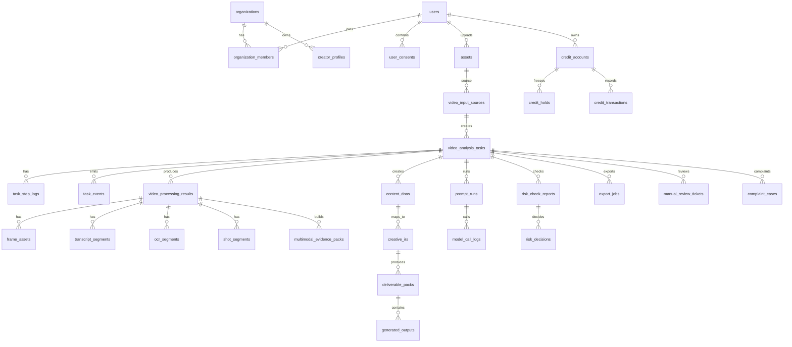

# D16｜数据库 Schema、数据字典与 API 契约文档

> 文档编号：D16  
> 文档名称：数据库 Schema、数据字典与 API 契约文档  
> 文档版本：V1.0  
> 生成日期：2026-05-25  
> 根上下文：D00《AIcoding 研发总控文档 / 项目上下文总索引》  
> 前置文档：D00、D01、D02、D03、D04、D05、D06、D07、D08、D09、D10、D11、D12、D13、D14、D15  
> 后置文档：D17 异步任务队列、文件存储与生成资产生命周期文档；D18 AIcoding 执行规约；D19 测试发布监控；D20 商业化系统；D21 合规审核；D22 数据安全与权限；D23 运营后台与人工复核；D24 最终交接  
> 当前主线版本：MVP1「视频拆解 + 原创脚本生成」  
> 文档性质：数据库 Schema + 数据字典 + API 契约 + 错误码 + 枚举 + AI/任务/风控/积分工程硬契约 + AIcoding 执行文档  
> 核心定位：D16 是前端、后端、AI 服务、任务队列、运营后台、风控合规、商业化计费和测试验收之间的硬接口契约。它不是泛泛的数据表建议，而是防止 AIcoding 多 Agent 并行开发时接口冲突、字段丢失、计费失真、风控缺口和数据无法联动的工程级单一实现口径。

---

## 1. 文档元信息

| 项目 | 内容 |
|---|---|
| 文档编号 | D16 |
| 文档名称 | 数据库 Schema、数据字典与 API 契约文档 |
| 所属项目 | AI 短视频爆款增长引擎 |
| 当前版本 | MVP1：视频拆解 + 原创脚本生成 |
| 文档级别 | S+，工程硬契约文档 |
| 上级根文档 | D00《AIcoding 研发总控文档 / 项目上下文总索引》 |
| 直接前置依赖 | D00-D15，重点依赖 D04 总 PRD、D05 模块边界、D07 Content DNA、D08 视频处理、D09 Creative IR、D10 Prompt、D11 模型路由、D12 Benchmark、D13 风控、D15 技术架构 |
| 直接后置依赖 | D17、D18、D19、D20、D21、D22、D23、D24 |
| 适用阶段 | MVP1 后端开发、前后端联调、AI 服务接入、任务队列编排、数据库迁移、API 测试、商业化扣费、风控合规、后台验收、上线交接 |
| 适用对象 | 创始人、产品负责人、AI 产品经理、技术产品经理、后端 Agent、前端 Agent、AI/Prompt Agent、测试 Agent、DevOps Agent、运营后台 Agent、风控合规负责人 |
| 文档目标 | 固化 MVP1 所需数据库表、字段、枚举、索引、约束、API 请求响应、错误码、权限、幂等、日志、计费、风控与测试验收标准 |
| 最高约束 | 与 D00 冲突时，以 D00 为准；与 D07/D09 的 AI Schema 冲突时，需要回写 D07/D09；与 D17 的任务状态冲突时，以 D17 最终状态机为准并回写 D16；与 D20 计费规则冲突时，以 D20 商业化最终口径为准；API/数据库字段冲突时，D16 是工程实现口径 |
| 更新责任人 | 项目 Owner / AI 产品总控 / 技术架构负责人 / 后端负责人 |
| 更新触发条件 | 核心表字段变更、API 契约变更、任务状态变更、Prompt 输出 Schema 变更、模型成本字段变更、积分规则变更、风控字段变更、上线验收失败、重大线上数据事故 |
| 输出形态 | Markdown 文档 + 数据域模型 + 枚举表 + 数据字典 + SQL/ORM 迁移草案 + API 契约 + 错误码 + AIcoding 任务拆分 + 验收 Checklist |
| 文档状态 | V1.0 初版可执行，后续必须随 D17-D24 深化持续回写 |

### 1.1 编号兼容说明

当前项目在 D12-D14 的编号上存在历史演进。D16 工程实现统一采用以下口径：

| 工程别名 | 当前文档 | 兼容旧口径 |
|---|---|---|
| `AI_BENCHMARK_REGRESSION` | D12：AI 评测样本集、Benchmark 与回归测试 | 旧 D14 |
| `QUALITY_SIMILARITY_COMPLIANCE_GUARDRAIL` | D13：质检评分、相似度风控与合规拦截 | 旧 D12 |
| `DATA_DIAGNOSIS_ATTRIBUTION_PROMPT_EVOLUTION` | D14：数据诊断、归因与提示词进化 | 旧 D13 |

工程中不得把文档编号写死为业务判断逻辑，应使用 `doc_alias` 或配置项做兼容。

---

## 2. 文档目标

### 2.1 本文档要解决的问题

D16 要解决的是 MVP1 真实工程落地中的“硬契约”问题。AIcoding 多 Agent 并行开发时，最容易出现的问题不是页面做不出来，而是：字段名称不一致、接口返回结构不一致、任务状态无法串联、积分扣费无法追溯、AI 输出无法校验、风控结果没有落库、失败后无法补偿、后台无法排查、测试无法断言。

D16 必须解决以下 12 个问题：

1. **数据库怎么建**：明确 MVP1 必须落库的数据表、字段、类型、约束、索引、外键、JSONB Schema、软删除和审计字段。
2. **数据字典怎么统一**：统一用户、组织、画像、资产、任务、视频处理、Content DNA、Creative IR、输出包、Prompt、模型、风控、积分、导出、反馈、后台等对象的字段语义。
3. **API 怎么对齐**：明确前端、后端、Worker、AI 服务、后台之间的 REST API 契约、请求体、响应体、错误码、鉴权、幂等与分页。
4. **AI Schema 怎么落库**：明确 Content DNA、Creative IR、PromptRun、ModelCallLog、Quality/Risk Report 等 AI 结构化输出如何保存、版本化、校验和回放。
5. **任务状态怎么串联**：明确 `video_analysis_tasks`、`task_step_logs`、`task_events` 与 D17 队列状态的接口边界。
6. **商业化怎么闭环**：明确积分账户、积分冻结、扣费、返还、订单、成本、毛利统计如何和任务、模型调用、失败补偿关联。
7. **风控合规怎么落库**：明确授权确认、AIGC 标识、风险分级、拦截策略、人工复核、投诉删除和审计日志的字段与 API。
8. **异常如何恢复**：明确幂等键、重试次数、失败原因、可重试标记、补偿事务、人工介入入口。
9. **权限如何控制**：明确用户、组织成员、管理员、运营、风控复核员、系统 Worker 的访问边界。
10. **测试如何断言**：明确数据库迁移测试、API 合约测试、Schema 校验测试、计费幂等测试、风控拦截测试、E2E 测试。
11. **AIcoding 如何执行**：把 D16 拆成可直接执行的数据库、ORM、API、测试、后台、文档任务。
12. **哪些不做**：明确 MVP1 不做账号级自动抓取、完整视频生成、自动发布、绕平台规则、仿脸仿声、批量搬运等能力，避免 Schema/API 被误设计成违规扩展。

### 2.2 本文档不解决的问题

| 不在 D16 完整展开的内容 | 负责文档 | D16 只提供 |
|---|---|---|
| 产品战略、价值主张、商业定位 | D01 | 数据/API 必须遵守的定位和商业闭环 |
| 首发用户画像与行业验证 | D02 | 画像字段、行业配置表、验证事件字段 |
| MVP 版本路线与范围 | D03 | MVP1 P0/P1/P2 的数据库和 API 边界 |
| 总 PRD 与用户故事 | D04 | 需求对象到数据/API 的工程映射 |
| 模块拆分与研发边界 | D05 | 数据表、API、事件与模块归属 |
| 页面原型、按钮、交互 | D06 | 页面 ViewModel 和 API 字段支持 |
| Content DNA 字段全集 | D07 | 落库结构、版本字段、API 输出；字段以 D07 为语义源 |
| 视频处理细节 | D08 | 视频处理结果、证据包、段落表的落库契约 |
| Creative IR 字段全集 | D09 | Creative IR 落库结构、版本字段、输出包关系 |
| Prompt 模板、变量、版本规则 | D10 | Prompt Registry 表与 PromptRun API 契约 |
| 模型供应商路由与成本策略 | D11 | Provider/Model/CallLog/CostLedger 的数据结构 |
| AI Benchmark 样本全集 | D12 | Benchmark 相关表的预留与 API 草案 |
| 质检风控细则 | D13 | 风控报告、决策、复核、投诉删除的数据/API 契约 |
| 数据诊断与 Prompt 进化规则 | D14 | 发布数据、诊断报告、Prompt 进化候选的预留结构 |
| 技术架构与部署 | D15 | 继承技术栈与服务边界，细化数据库/API |
| 队列、文件生命周期最终状态机 | D17 | 数据/API 与状态字段预留，最终状态流转由 D17 固化 |
| 商业化套餐、支付、退款 | D20 | 积分、订单、交易流水、成本字段草案 |
| 合规法律条款 | D21 | 工程字段和 API 触发点，最终法律文案由 D21 确认 |
| 数据安全与隐私治理 | D22 | 数据分级、权限字段、审计、脱敏、删除机制入口 |

### 2.3 D16 的研发落点

D16 最终必须落到以下工程对象：

1. 数据库迁移文件：`migrations/0001_init_core.sql`、`0002_ai_assets.sql`、`0003_billing_risk_admin.sql`。
2. ORM Schema：推荐 `Prisma schema` 或 `Drizzle schema`，与 SQL 迁移一致。
3. API 类型定义：`OpenAPI 3.1` 或 `zod/openapi` 生成契约。
4. 全局枚举和错误码：后端、前端、Worker、测试共享。
5. JSON Schema：Content DNA、Creative IR、DeliverablePack、PromptRun、RiskCheckReport、QualityCheckReport。
6. 幂等与事务策略：任务创建、积分冻结、扣费、返还、导出、人工补偿。
7. 后台查询视图：用户、任务、日志、模型成本、积分、风险、复核、投诉。
8. 测试资产：迁移测试、API 合约测试、Schema 校验测试、E2E 主路径测试。
9. AIcoding 任务拆分与执行提示词。

---

## 3. 与 D00 及其他文档的关系

### 3.1 D00 对 D16 的硬约束

| D00 约束 | D16 落地方式 |
|---|---|
| 项目是 AI 短视频爆款增长引擎，不是搬运、克隆、洗稿、仿脸、仿声工具 | 数据库和 API 不设计下载搬运、仿脸仿声、绕平台规则、1:1 克隆能力；所有输出必须保留原创化、风控和授权字段 |
| 当前优先 MVP1：视频拆解 + 原创脚本生成 | D16 P0 只覆盖单条视频上传、处理、拆解、Content DNA、Creative IR、脚本/标题/封面/Prompt 输出、风控、导出、积分、后台 |
| 不得跳过风控、任务日志、成本记录、测试验收 | 风控表、任务日志表、模型调用日志表、积分流水表、测试验收 API 均列为 P0 |
| 不得用 mock 冒充真实能力 | `is_mock`、`mock_reason`、`environment` 字段必须存在于 AI 输出、模型调用和测试数据中；生产默认不允许 mock |
| 每个模块必须独立开发、测试、验收、交接 | 表、API、事件按模块归属；每个 API 有输入、输出、错误码、权限和测试口径 |
| 文档冲突时 D16 作为 API/数据库口径 | API/数据库冲突以 D16 为准；任务状态冲突回写 D17；Prompt 冲突回写 D10；风控冲突回写 D13/D21 |

### 3.2 D04 对 D16 的输入

D04 已明确 MVP1 的产品需求总入口：注册/登录、画像、上传、授权、积分冻结、任务处理、结果查看、导出、反馈；系统输出包括拆解报告、Content DNA、镜头表、可复用/不可复用清单、原创脚本、标题、封面建议、视频 Prompt、质量评分、风险提示、导出文件。D16 将这些对象固化为表、字段和 API。

### 3.3 D15 对 D16 的输入

D15 已确定 MVP1 工程架构需要前端 Web App、后端 API/BFF、异步任务编排、Python 视频/AI Worker、Prompt Registry、Model Router、Risk Gate、Credit Ledger、Object Storage、Admin Console、PostgreSQL、Redis、对象存储、统一鉴权、RBAC、审计日志、Trace ID、Correlation ID、Idempotency Key。D16 将这些架构能力映射为数据库与 API 契约。

### 3.4 D16 对后续文档的输出

| 后续文档 | D16 输出 |
|---|---|
| D17 | 任务表、任务步骤表、任务事件表、资产表、状态枚举、重试字段、清理字段 |
| D18 | AIcoding Agent 必须遵守的数据库迁移、API 契约、测试和交接口径 |
| D19 | API 合约测试、数据库迁移测试、E2E 数据断言、监控指标字段 |
| D20 | 积分账户、积分冻结、扣费、返还、订单、成本、毛利统计字段 |
| D21 | 授权确认、AIGC 标识、合规风险、投诉删除、人工复核字段 |
| D22 | 数据分级、权限、脱敏、删除、审计日志、保留周期字段 |
| D23 | 后台用户、任务、日志、成本、风控、复核、投诉、补偿查询 API |
| D24 | 数据库迁移说明、API 文档、环境变量、交接清单 |

---

## 4. 核心结论

### 4.1 一句话结论

D16 必须把 MVP1 的核心业务闭环固定为以下数据和 API 链路：

```text
User / Organization / CreatorProfile
→ Asset / VideoInputSource / UserConsent
→ VideoAnalysisTask / TaskStepLog / TaskEvent
→ VideoProcessingResult / EvidencePack
→ ContentDNA / CreativeIR
→ DeliverablePack / GeneratedOutput
→ QualityCheckReport / RiskCheckReport / RiskDecision
→ CreditHold / CreditTransaction / ModelCallLog / CostLedger
→ ExportJob / Feedback / Complaint / AuditLog
→ Admin Query / ManualReview / Compensation
```

任何研发 Agent 不能绕过这条主链路直接写“结果页面”或“Prompt Demo”。

### 4.2 MVP1 P0 数据对象

| 数据域 | P0 表 | 说明 |
|---|---|---|
| 账号与组织 | `users`、`organizations`、`organization_members` | 支持个人用户与未来团队，不做复杂企业协作 |
| 用户画像 | `creator_profiles` | 行业、人设、目标用户、平台、产品/服务、禁用内容 |
| 授权与合规前置 | `user_consents` | 上传授权、AIGC 标识确认、禁止能力确认 |
| 文件资产 | `assets`、`video_input_sources` | 上传视频、抽帧、音频、报告导出、生成资产引用 |
| 任务 | `video_analysis_tasks`、`task_step_logs`、`task_events` | 异步任务主表、步骤日志、事件流 |
| 视频处理 | `video_processing_results`、`frame_assets`、`transcript_segments`、`ocr_segments`、`shot_segments`、`multimodal_evidence_packs` | D08 证据资产 |
| AI 核心资产 | `content_dnas`、`creative_irs`、`deliverable_packs`、`generated_outputs` | D07/D09/D10 输出 |
| Prompt 与模型 | `prompt_templates`、`prompt_versions`、`prompt_runs`、`model_providers`、`model_catalog`、`model_call_logs`、`cost_ledger_entries` | Prompt 工程与模型成本 |
| 风控与质检 | `quality_check_reports`、`similarity_check_reports`、`compliance_check_reports`、`risk_check_reports`、`risk_decisions` | 质量、相似度、合规、总决策 |
| 商业化积分 | `credit_accounts`、`credit_holds`、`credit_transactions`、`orders` | 积分冻结、扣费、返还、订单预留 |
| 导出与反馈 | `export_jobs`、`user_feedback` | 报告导出、用户反馈 |
| 人工复核与投诉 | `manual_review_tickets`、`complaint_cases` | 高风险内容、人审、投诉删除 |
| 后台与审计 | `audit_logs`、`admin_action_logs`、`feature_flags`、`system_configs` | 后台操作、配置、审计 |

### 4.3 数据库技术约定

| 项 | 约定 |
|---|---|
| 主数据库 | PostgreSQL 15+ |
| 缓存 / 队列辅助 | Redis 7+，最终由 D17 固化队列实现 |
| 主键 | UUID v7 或 ULID；数据库层使用 `uuid`，应用层使用字符串 |
| JSON 结构 | PostgreSQL `jsonb`，必须绑定 JSON Schema 版本字段 |
| 时间 | 全部使用 UTC `timestamptz`；前端显示时转换用户时区 |
| 金额 / 成本 | 使用整数最小单位，例如 `amount_cents`、`cost_microusd`、`credits`，禁止浮点金额入库 |
| 软删除 | 业务核心表统一使用 `deleted_at`；合规删除使用 `deletion_status` + `deleted_at` + `audit_logs` |
| 审计字段 | `created_at`、`updated_at`、`created_by`、`updated_by`、`request_id`、`trace_id` |
| 幂等 | 任务创建、扣费、返还、导出、人工补偿必须携带 `idempotency_key` |
| 多租户 | MVP1 以 `organization_id` 预留，多数用户默认拥有个人组织 |
| 权限 | 用户只能访问本组织数据；后台按 RBAC 查询；Worker 使用 service role |
| 生产 mock | 生产环境默认禁止 `is_mock=true` 数据进入用户可见主流程 |

### 4.4 API 技术约定

| 项 | 约定 |
|---|---|
| 风格 | RESTful + JSON；后续可补 GraphQL，但 MVP1 不做 |
| 版本 | 所有业务 API 前缀 `/api/v1` |
| 鉴权 | Bearer Token；后台接口要求 Admin RBAC |
| 幂等 | 写操作支持 `Idempotency-Key` Header |
| Trace | 请求必须生成并返回 `request_id`；异步链路传递 `trace_id` |
| 响应包 | 统一 `{ success, data, error, meta }` |
| 分页 | Cursor pagination，字段 `next_cursor`、`limit` |
| 错误码 | 统一 `APP_DOMAIN_REASON`，例如 `CREDIT_INSUFFICIENT_BALANCE` |
| 时间字段 | ISO 8601 UTC 字符串 |
| 文件 URL | 默认返回短期签名 URL，不返回永久公开 URL |

---

## 5. 详细设计

### 5.1 数据域总览



### 5.2 Schema 分层原则

| 层级 | 作用 | 典型对象 | 设计原则 |
|---|---|---|---|
| 基础身份层 | 用户、组织、权限、审计 | `users`、`organizations`、`organization_members`、`audit_logs` | 稳定、少变、强约束 |
| 输入资产层 | 视频、链接、上传、授权 | `assets`、`video_input_sources`、`user_consents` | 所有用户输入必须可追踪 |
| 任务编排层 | 异步任务、步骤、事件 | `video_analysis_tasks`、`task_step_logs`、`task_events` | 可重试、可恢复、可审计 |
| 多模态证据层 | 抽帧、ASR、OCR、镜头、证据包 | `video_processing_results`、`frame_assets`、`shot_segments` | 支撑 AI 输出证据化 |
| AI 资产层 | Content DNA、Creative IR、Prompt、输出包 | `content_dnas`、`creative_irs`、`deliverable_packs` | JSONB + schema_version + quality gate |
| 风控合规层 | 质检、相似度、合规、决策、人审 | `risk_check_reports`、`risk_decisions`、`manual_review_tickets` | 所有放行/拦截必须有理由 |
| 商业化层 | 积分、冻结、扣费、成本、订单 | `credit_accounts`、`credit_transactions`、`model_call_logs` | 账务不可丢、幂等优先 |
| 运营后台层 | 查询、补偿、投诉、配置 | `admin_action_logs`、`complaint_cases`、`feature_flags` | 后台动作必须审计 |

### 5.3 全局字段规范

所有 P0 业务表默认包含以下字段，除非明确不需要：

| 字段 | 类型 | 必填 | 说明 |
|---|---:|---:|---|
| `id` | uuid | 是 | 主键，UUID v7/ULID |
| `organization_id` | uuid | 条件 | 组织隔离字段，个人用户默认个人组织 |
| `user_id` | uuid | 条件 | 数据归属用户 |
| `created_at` | timestamptz | 是 | 创建时间 UTC |
| `updated_at` | timestamptz | 是 | 更新时间 UTC |
| `deleted_at` | timestamptz | 否 | 软删除时间 |
| `created_by` | uuid | 否 | 创建人，系统任务可为空 |
| `updated_by` | uuid | 否 | 更新人，系统任务可为空 |
| `request_id` | text | 否 | API 请求 ID |
| `trace_id` | text | 否 | 跨服务链路 ID |
| `idempotency_key` | text | 条件 | 高风险写操作必填 |
| `metadata` | jsonb | 否 | 扩展信息，禁止放敏感明文 |

### 5.4 命名规范

| 类型 | 规范 | 示例 |
|---|---|---|
| 表名 | snake_case 复数 | `video_analysis_tasks` |
| 字段名 | snake_case | `risk_level` |
| 枚举值 | UPPER_SNAKE_CASE | `MANUAL_REVIEW_REQUIRED` |
| API 路径 | kebab-case / 资源名复数 | `/api/v1/video-analysis-tasks` |
| 错误码 | DOMAIN_REASON | `TASK_NOT_FOUND` |
| JSON Schema | PascalCase | `ContentDNA` |
| Prompt ID | `PXX_DOMAIN_ACTION` | `P04_CREATIVE_IR_GENERATION` |
| 队列名 | dot notation | `video.process.metadata` |

---

## 6. 数据结构 / API / Prompt / 流程 / 页面 / 状态

## 6.1 全局枚举

### 6.1.1 用户与权限枚举

| 枚举 | 值 | 说明 |
|---|---|---|
| `user_status` | `ACTIVE`、`DISABLED`、`PENDING_DELETE` | 用户状态 |
| `org_role` | `OWNER`、`ADMIN`、`MEMBER`、`VIEWER` | 组织成员角色 |
| `admin_role` | `SUPER_ADMIN`、`OPS_ADMIN`、`RISK_REVIEWER`、`SUPPORT_AGENT`、`FINANCE_ADMIN` | 后台角色 |

### 6.1.2 任务状态枚举

| 枚举 | 值 | 说明 |
|---|---|---|
| `task_status` | `DRAFT`、`QUEUED`、`PROCESSING`、`WAITING_MANUAL_REVIEW`、`PARTIAL_SUCCESS`、`SUCCEEDED`、`FAILED`、`CANCELED`、`EXPIRED` | 任务主状态 |
| `task_step_status` | `PENDING`、`RUNNING`、`SUCCEEDED`、`FAILED_RETRYABLE`、`FAILED_FINAL`、`SKIPPED`、`CANCELED` | 步骤状态 |
| `task_step_type` | `UPLOAD_VALIDATE`、`RISK_PRECHECK`、`CREDIT_HOLD`、`METADATA_PARSE`、`FRAME_EXTRACT`、`AUDIO_EXTRACT`、`ASR`、`OCR`、`SHOT_DETECT`、`EVIDENCE_PACK`、`VIDEO_UNDERSTANDING`、`CONTENT_DNA`、`CREATIVE_IR`、`DELIVERABLE_GENERATE`、`QUALITY_CHECK`、`RISK_DECIDE`、`CREDIT_SETTLE`、`EXPORT_REPORT` | MVP1 步骤类型 |

### 6.1.3 资产枚举

| 枚举 | 值 | 说明 |
|---|---|---|
| `asset_kind` | `SOURCE_VIDEO`、`NORMALIZED_VIDEO`、`FRAME_IMAGE`、`AUDIO`、`TRANSCRIPT`、`OCR_TEXT`、`REPORT_MD`、`REPORT_PDF`、`GENERATED_TEXT`、`COVER_REFERENCE`、`OTHER` | 文件类型 |
| `asset_status` | `UPLOADING`、`READY`、`PROCESSING`、`FAILED`、`DELETED`、`QUARANTINED` | 资产状态 |
| `storage_visibility` | `PRIVATE`、`SIGNED_URL_ONLY`、`PUBLIC` | MVP1 默认不允许用户上传资产公开 |

### 6.1.4 AI 与 Prompt 枚举

| 枚举 | 值 | 说明 |
|---|---|---|
| `prompt_type` | `FRAME_DESCRIPTION`、`ASR_CLEANUP`、`OCR_AGGREGATION`、`VIDEO_UNDERSTANDING`、`CONTENT_DNA`、`REPORT_GENERATION`、`CREATIVE_IR`、`SCRIPT_GENERATION`、`TITLE_GENERATION`、`COVER_SUGGESTION`、`VIDEO_PROMPT_GENERATION`、`QUALITY_CHECK`、`RISK_CHECK`、`JSON_REPAIR` | Prompt 类型 |
| `prompt_run_status` | `PENDING`、`RUNNING`、`SUCCEEDED`、`FAILED`、`REPAIRED`、`CANCELED` | Prompt 执行状态 |
| `model_call_status` | `PENDING`、`SUCCEEDED`、`FAILED_TIMEOUT`、`FAILED_RATE_LIMIT`、`FAILED_PROVIDER`、`FAILED_SCHEMA`、`CANCELED` | 模型调用状态 |
| `schema_validation_status` | `NOT_REQUIRED`、`PASSED`、`FAILED_REPAIRABLE`、`FAILED_FINAL` | Schema 校验状态 |

### 6.1.5 风控与合规枚举

| 枚举 | 值 | 说明 |
|---|---|---|
| `risk_level` | `LOW`、`MEDIUM`、`HIGH`、`PROHIBITED` | 风险等级 |
| `risk_decision_action` | `ALLOW`、`ALLOW_WITH_NOTICE`、`REWRITE_REQUIRED`、`USER_EDIT_REQUIRED`、`MANUAL_REVIEW_REQUIRED`、`BLOCK` | 风控决策 |
| `manual_review_status` | `OPEN`、`IN_REVIEW`、`APPROVED`、`REJECTED`、`NEEDS_USER_EDIT`、`CLOSED` | 人工复核状态 |
| `complaint_status` | `OPEN`、`PROCESSING`、`ACTION_TAKEN`、`REJECTED`、`CLOSED` | 投诉处理状态 |
| `consent_type` | `UPLOAD_AUTHORIZATION`、`AIGC_LABEL_ACK`、`NO_CLONE_ACK`、`TERMS_ACCEPTED`、`PRIVACY_ACCEPTED` | 用户确认类型 |

### 6.1.6 积分与订单枚举

| 枚举 | 值 | 说明 |
|---|---|---|
| `credit_transaction_type` | `GRANT`、`PURCHASE`、`HOLD`、`DEBIT`、`REFUND`、`RELEASE_HOLD`、`ADJUSTMENT`、`EXPIRE` | 积分流水类型 |
| `credit_hold_status` | `ACTIVE`、`CAPTURED`、`RELEASED`、`EXPIRED`、`FAILED` | 积分冻结状态 |
| `order_status` | `PENDING`、`PAID`、`FAILED`、`CANCELED`、`REFUNDED`、`PARTIALLY_REFUNDED` | 订单状态 |
| `settlement_status` | `NOT_REQUIRED`、`HELD`、`DEBITED`、`REFUNDED`、`PARTIAL_DEBITED`、`FAILED` | 任务结算状态 |

---

## 6.2 数据库 Schema 总览

### 6.2.1 基础身份与组织

#### `users`

| 字段 | 类型 | 必填 | 索引 | 说明 |
|---|---:|---:|---:|---|
| `id` | uuid | 是 | PK | 用户 ID |
| `email` | citext | 是 | unique | 登录邮箱 |
| `phone` | text | 否 | unique partial | 手机号，国内版可启用 |
| `display_name` | text | 否 |  | 显示名 |
| `avatar_url` | text | 否 |  | 头像 |
| `status` | user_status | 是 | idx | 用户状态 |
| `default_organization_id` | uuid | 否 | idx | 默认组织 |
| `locale` | text | 否 |  | 默认 `zh-CN` |
| `timezone` | text | 否 |  | 默认 `Asia/Shanghai` 或用户设置 |
| `last_login_at` | timestamptz | 否 |  | 最近登录 |
| `metadata` | jsonb | 否 |  | 扩展信息 |
| `created_at` / `updated_at` / `deleted_at` | timestamptz | 是/是/否 | idx | 审计字段 |

约束：

- `email` 必须唯一。
- `status=DISABLED` 用户不可创建任务。
- 删除用户时不物理删除业务资产，进入 `PENDING_DELETE` 并由 D22 的数据删除流程处理。

#### `organizations`

| 字段 | 类型 | 必填 | 索引 | 说明 |
|---|---:|---:|---:|---|
| `id` | uuid | 是 | PK | 组织 ID |
| `name` | text | 是 |  | 组织名称 |
| `org_type` | text | 是 | idx | `PERSONAL`、`TEAM`、`ENTERPRISE` |
| `owner_user_id` | uuid | 是 | fk | 组织 owner |
| `status` | text | 是 | idx | `ACTIVE`、`DISABLED` |
| `billing_email` | citext | 否 |  | 账单邮箱 |
| `metadata` | jsonb | 否 |  | 扩展 |
| `created_at` / `updated_at` / `deleted_at` | timestamptz | 是/是/否 |  | 审计字段 |

#### `organization_members`

| 字段 | 类型 | 必填 | 索引 | 说明 |
|---|---:|---:|---:|---|
| `id` | uuid | 是 | PK | 成员关系 ID |
| `organization_id` | uuid | 是 | unique composite | 组织 |
| `user_id` | uuid | 是 | unique composite | 用户 |
| `role` | org_role | 是 | idx | 角色 |
| `status` | text | 是 | idx | `ACTIVE`、`INVITED`、`REMOVED` |
| `joined_at` | timestamptz | 否 |  | 加入时间 |
| `created_at` / `updated_at` | timestamptz | 是 |  | 审计 |

MVP1 只开放个人组织，团队角色作为 P1/P2 预留，但字段必须保留，避免后续迁移困难。

---

### 6.2.2 用户画像与行业配置

#### `creator_profiles`

| 字段 | 类型 | 必填 | 索引 | 说明 |
|---|---:|---:|---:|---|
| `id` | uuid | 是 | PK | 画像 ID |
| `organization_id` | uuid | 是 | idx | 组织 |
| `user_id` | uuid | 是 | idx | 用户 |
| `profile_name` | text | 是 |  | 画像名称 |
| `creator_type` | text | 是 | idx | `BOSS_IP`、`LOCAL_BUSINESS`、`KNOWLEDGE_IP`、`MCN_TEAM` 等 |
| `industry_code` | text | 是 | idx | 行业编码 |
| `risk_industry_level` | risk_level | 是 | idx | 行业风险等级 |
| `target_platforms` | text[] | 是 | gin | 抖音/快手/视频号/小红书/B站等 |
| `persona` | jsonb | 是 |  | 人设、口吻、身份、禁用表达 |
| `product_or_service` | jsonb | 是 |  | 产品/服务、卖点、价格区间、禁用承诺 |
| `target_audience` | jsonb | 是 |  | 目标用户、痛点、地域、购买阶段 |
| `content_goals` | text[] | 是 |  | 获客/涨粉/转化/信任建立 |
| `forbidden_topics` | text[] | 否 | gin | 禁用话题 |
| `brand_terms` | jsonb | 否 |  | 品牌术语、CTA、安全口径 |
| `quality_score` | numeric(5,2) | 否 |  | 画像完整度 |
| `status` | text | 是 | idx | `ACTIVE`、`INCOMPLETE`、`ARCHIVED` |
| `created_at` / `updated_at` / `deleted_at` | timestamptz | 是/是/否 |  | 审计 |

JSON 示例：

```json
{
  "persona": {
    "identity": "本地餐饮店老板",
    "tone": "真实、接地气、轻度幽默",
    "avoid": ["夸大收益", "贬低同行", "绝对化承诺"]
  },
  "product_or_service": {
    "name": "社区火锅店",
    "selling_points": ["现切牛肉", "家庭聚餐", "工作日套餐"],
    "forbidden_claims": ["全城第一", "吃了必瘦"]
  }
}
```

#### `launch_industry_configs`

| 字段 | 类型 | 必填 | 说明 |
|---|---:|---:|---|
| `id` | uuid | 是 | 配置 ID |
| `industry_code` | text | 是 | 行业编码 |
| `industry_name` | text | 是 | 行业名称 |
| `priority_level` | int | 是 | 首发优先级，数字越小越优先 |
| `risk_level` | risk_level | 是 | 行业风险 |
| `default_prompt_variables` | jsonb | 否 | 默认 Prompt 变量 |
| `forbidden_claim_patterns` | text[] | 否 | 禁用承诺 |
| `requires_manual_review` | boolean | 是 | 是否默认人工复核 |
| `is_enabled` | boolean | 是 | 是否启用 |
| `created_at` / `updated_at` | timestamptz | 是 | 审计 |

---

### 6.2.3 授权与合规确认

#### `user_consents`

| 字段 | 类型 | 必填 | 索引 | 说明 |
|---|---:|---:|---:|---|
| `id` | uuid | 是 | PK | 确认记录 ID |
| `organization_id` | uuid | 是 | idx | 组织 |
| `user_id` | uuid | 是 | idx | 用户 |
| `task_id` | uuid | 否 | idx | 与任务绑定，上传授权必须绑定任务或输入源 |
| `asset_id` | uuid | 否 | idx | 与资产绑定 |
| `consent_type` | consent_type | 是 | idx | 授权类型 |
| `version` | text | 是 |  | 条款版本 |
| `consent_text_hash` | text | 是 |  | 确认文案 hash |
| `accepted` | boolean | 是 |  | 是否确认 |
| `accepted_at` | timestamptz | 是 | idx | 确认时间 |
| `ip_address_hash` | text | 否 |  | IP hash，避免明文滥用 |
| `user_agent` | text | 否 |  | 浏览器标识 |
| `metadata` | jsonb | 否 |  | 扩展 |

硬规则：

- `UPLOAD_AUTHORIZATION` 未确认时不得创建视频分析任务。
- `NO_CLONE_ACK` 未确认时不得进入对标视频分析流程。
- `AIGC_LABEL_ACK` 未确认时不得导出最终报告。

---

### 6.2.4 文件资产与视频输入

#### `assets`

| 字段 | 类型 | 必填 | 索引 | 说明 |
|---|---:|---:|---:|---|
| `id` | uuid | 是 | PK | 资产 ID |
| `organization_id` | uuid | 是 | idx | 组织 |
| `user_id` | uuid | 是 | idx | 上传人 |
| `asset_kind` | asset_kind | 是 | idx | 资产类型 |
| `status` | asset_status | 是 | idx | 资产状态 |
| `storage_provider` | text | 是 |  | `s3`、`r2`、`oss`、`local_dev` |
| `bucket` | text | 是 |  | 存储桶 |
| `object_key` | text | 是 | unique | 对象 Key |
| `file_name` | text | 否 |  | 原文件名 |
| `mime_type` | text | 否 | idx | MIME |
| `file_size_bytes` | bigint | 否 |  | 大小 |
| `checksum_sha256` | text | 否 | idx | 文件 hash |
| `duration_ms` | int | 否 |  | 视频/音频时长 |
| `width` / `height` | int | 否 |  | 尺寸 |
| `visibility` | storage_visibility | 是 |  | 默认 `SIGNED_URL_ONLY` |
| `is_user_uploaded` | boolean | 是 |  | 是否用户上传 |
| `is_generated` | boolean | 是 |  | 是否系统生成 |
| `is_mock` | boolean | 是 |  | 是否 mock |
| `retention_until` | timestamptz | 否 | idx | 保留到期时间 |
| `deleted_at` | timestamptz | 否 | idx | 删除时间 |
| `metadata` | jsonb | 否 |  | 扩展 |
| `created_at` / `updated_at` | timestamptz | 是 |  | 审计 |

#### `video_input_sources`

| 字段 | 类型 | 必填 | 索引 | 说明 |
|---|---:|---:|---:|---|
| `id` | uuid | 是 | PK | 输入源 ID |
| `organization_id` | uuid | 是 | idx | 组织 |
| `user_id` | uuid | 是 | idx | 用户 |
| `source_type` | text | 是 | idx | `UPLOAD`、`URL_MANUAL`、`PAST_WORK`、`REFERENCE_SAMPLE` |
| `asset_id` | uuid | 条件 | fk | 上传视频资产 |
| `source_url` | text | 条件 |  | 手动输入链接；MVP1 不自动抓取，仅记录来源 |
| `platform` | text | 否 | idx | 平台 |
| `source_title` | text | 否 |  | 用户填写标题 |
| `source_author_hint` | text | 否 |  | 用户填写来源作者，合规辅助 |
| `authorization_status` | text | 是 | idx | `CONFIRMED`、`MISSING`、`REJECTED` |
| `risk_precheck_status` | text | 是 | idx | `NOT_RUN`、`PASSED`、`WARNING`、`BLOCKED` |
| `metadata` | jsonb | 否 |  | 扩展 |
| `created_at` / `updated_at` | timestamptz | 是 |  | 审计 |

MVP1 不提供平台自动下载能力。`source_url` 仅用于用户来源记录和报告引用，不作为自动抓取入口。

---

### 6.2.5 视频分析任务与步骤日志

#### `video_analysis_tasks`

| 字段 | 类型 | 必填 | 索引 | 说明 |
|---|---:|---:|---:|---|
| `id` | uuid | 是 | PK | 任务 ID |
| `organization_id` | uuid | 是 | idx | 组织 |
| `user_id` | uuid | 是 | idx | 创建人 |
| `creator_profile_id` | uuid | 是 | fk | 使用的用户画像 |
| `video_input_source_id` | uuid | 是 | fk | 输入源 |
| `task_type` | text | 是 | idx | MVP1 默认 `SINGLE_VIDEO_ANALYSIS` |
| `status` | task_status | 是 | idx | 主状态 |
| `current_step` | task_step_type | 否 | idx | 当前步骤 |
| `progress_percent` | int | 是 |  | 0-100 |
| `originalization_level` | text | 是 |  | `MEDIUM`、`HIGH`，MVP1 默认 `HIGH` |
| `requested_outputs` | text[] | 是 |  | `REPORT`、`SCRIPTS`、`TITLES`、`COVER_SUGGESTIONS`、`VIDEO_PROMPTS` |
| `credit_hold_id` | uuid | 否 | idx | 积分冻结 |
| `settlement_status` | settlement_status | 是 | idx | 结算状态 |
| `risk_level` | risk_level | 否 | idx | 当前最高风险 |
| `risk_decision_action` | risk_decision_action | 否 | idx | 风控动作 |
| `quality_score` | numeric(5,2) | 否 |  | 综合质量分 |
| `error_code` | text | 否 | idx | 失败错误码 |
| `error_message` | text | 否 |  | 安全错误摘要 |
| `is_retryable` | boolean | 是 |  | 是否可重试 |
| `retry_count` | int | 是 |  | 主任务重试次数 |
| `started_at` | timestamptz | 否 |  | 开始时间 |
| `completed_at` | timestamptz | 否 | idx | 完成时间 |
| `failed_at` | timestamptz | 否 | idx | 失败时间 |
| `expires_at` | timestamptz | 否 | idx | 任务过期 |
| `metadata` | jsonb | 否 |  | 扩展 |
| `created_at` / `updated_at` / `deleted_at` | timestamptz | 是/是/否 |  | 审计 |

索引建议：

- `(organization_id, created_at desc)`：历史列表。
- `(status, created_at)`：Worker 扫描。
- `(user_id, status, created_at desc)`：用户任务查询。
- `(risk_level, risk_decision_action)`：后台风控。

#### `task_step_logs`

| 字段 | 类型 | 必填 | 索引 | 说明 |
|---|---:|---:|---:|---|
| `id` | uuid | 是 | PK | 步骤日志 ID |
| `task_id` | uuid | 是 | idx | 任务 |
| `step_type` | task_step_type | 是 | idx | 步骤 |
| `status` | task_step_status | 是 | idx | 状态 |
| `attempt_no` | int | 是 |  | 第几次尝试 |
| `worker_id` | text | 否 | idx | Worker 标识 |
| `input_ref` | jsonb | 否 |  | 输入引用，不放大文本 |
| `output_ref` | jsonb | 否 |  | 输出引用 |
| `started_at` | timestamptz | 否 |  | 开始 |
| `ended_at` | timestamptz | 否 |  | 结束 |
| `duration_ms` | int | 否 |  | 耗时 |
| `error_code` | text | 否 | idx | 错误码 |
| `error_message` | text | 否 |  | 安全错误摘要 |
| `is_retryable` | boolean | 是 |  | 是否可重试 |
| `model_call_log_id` | uuid | 否 | idx | 关联模型调用 |
| `cost_microusd` | bigint | 否 |  | 步骤成本 |
| `created_at` | timestamptz | 是 | idx | 创建时间 |

#### `task_events`

事件表用于前端进度、后台审计和调试，不替代步骤日志。

| 字段 | 类型 | 必填 | 说明 |
|---|---:|---:|---|
| `id` | uuid | 是 | 事件 ID |
| `task_id` | uuid | 是 | 任务 |
| `event_type` | text | 是 | `TASK_CREATED`、`STEP_STARTED`、`STEP_SUCCEEDED`、`RISK_BLOCKED` 等 |
| `event_payload` | jsonb | 否 | 事件载荷 |
| `visible_to_user` | boolean | 是 | 是否展示给用户 |
| `created_at` | timestamptz | 是 | 事件时间 |

---

### 6.2.6 视频处理与多模态证据

#### `video_processing_results`

| 字段 | 类型 | 必填 | 索引 | 说明 |
|---|---:|---:|---:|---|
| `id` | uuid | 是 | PK | 处理结果 ID |
| `task_id` | uuid | 是 | unique | 任务 |
| `source_asset_id` | uuid | 是 | fk | 原始视频 |
| `normalized_asset_id` | uuid | 否 | fk | 规范化后视频 |
| `metadata` | jsonb | 是 |  | 时长、尺寸、编码、fps、码率 |
| `processing_quality` | jsonb | 是 |  | ASR/OCR/抽帧/镜头质量摘要 |
| `has_audio` | boolean | 是 | idx | 是否有音频 |
| `has_subtitle` | boolean | 否 |  | 是否检测到字幕 |
| `frame_count` | int | 是 |  | 抽帧数量 |
| `shot_count` | int | 是 |  | 镜头数量 |
| `transcript_confidence` | numeric(5,2) | 否 |  | ASR 置信度 |
| `ocr_confidence` | numeric(5,2) | 否 |  | OCR 置信度 |
| `overall_confidence` | numeric(5,2) | 否 |  | 综合证据置信度 |
| `status` | text | 是 | idx | `SUCCEEDED`、`PARTIAL_SUCCESS`、`FAILED` |
| `created_at` / `updated_at` | timestamptz | 是 |  | 审计 |

#### `frame_assets`

| 字段 | 类型 | 必填 | 说明 |
|---|---:|---:|---|
| `id` | uuid | 是 | 帧 ID |
| `task_id` | uuid | 是 | 任务 |
| `video_processing_result_id` | uuid | 是 | 处理结果 |
| `asset_id` | uuid | 是 | 帧图片资产 |
| `frame_index` | int | 是 | 帧序号 |
| `timestamp_ms` | int | 是 | 时间点 |
| `description` | text | 否 | 帧描述 |
| `objects` | jsonb | 否 | 检测对象 |
| `scene_tags` | text[] | 否 | 场景标签 |
| `confidence_score` | numeric(5,2) | 否 | 描述置信度 |
| `created_at` | timestamptz | 是 | 创建时间 |

#### `transcript_segments`

| 字段 | 类型 | 必填 | 说明 |
|---|---:|---:|---|
| `id` | uuid | 是 | ASR 段 ID |
| `task_id` | uuid | 是 | 任务 |
| `start_ms` / `end_ms` | int | 是 | 时间范围 |
| `speaker_label` | text | 否 | 说话人标签 |
| `text` | text | 是 | 转写文本 |
| `cleaned_text` | text | 否 | 清洗文本 |
| `confidence_score` | numeric(5,2) | 否 | 置信度 |
| `language` | text | 否 | 语言 |
| `created_at` | timestamptz | 是 | 创建时间 |

#### `ocr_segments`

| 字段 | 类型 | 必填 | 说明 |
|---|---:|---:|---|
| `id` | uuid | 是 | OCR 段 ID |
| `task_id` | uuid | 是 | 任务 |
| `frame_asset_id` | uuid | 否 | 所属帧 |
| `start_ms` / `end_ms` | int | 否 | 时间范围 |
| `text` | text | 是 | OCR 文本 |
| `bbox` | jsonb | 否 | 坐标框 |
| `confidence_score` | numeric(5,2) | 否 | 置信度 |
| `created_at` | timestamptz | 是 | 创建时间 |

#### `shot_segments`

| 字段 | 类型 | 必填 | 说明 |
|---|---:|---:|---|
| `id` | uuid | 是 | 镜头 ID |
| `task_id` | uuid | 是 | 任务 |
| `shot_index` | int | 是 | 镜头序号 |
| `start_ms` / `end_ms` | int | 是 | 镜头时间 |
| `representative_frame_asset_id` | uuid | 否 | 代表帧 |
| `visual_summary` | text | 否 | 视觉摘要 |
| `audio_summary` | text | 否 | 音频摘要 |
| `screen_text_summary` | text | 否 | 屏幕文字摘要 |
| `camera_motion` | text | 否 | 运镜 |
| `scene_type` | text | 否 | 场景类型 |
| `emotion_tone` | text | 否 | 情绪 |
| `risk_flags` | text[] | 否 | 风险标记 |
| `created_at` | timestamptz | 是 | 创建时间 |

#### `multimodal_evidence_packs`

| 字段 | 类型 | 必填 | 说明 |
|---|---:|---:|---|
| `id` | uuid | 是 | 证据包 ID |
| `task_id` | uuid | 是 | 任务 |
| `schema_version` | text | 是 | Schema 版本 |
| `evidence_json` | jsonb | 是 | 证据包结构化内容 |
| `source_refs` | jsonb | 是 | 帧、ASR、OCR、镜头引用 |
| `quality_report` | jsonb | 是 | 质量报告 |
| `status` | text | 是 | `READY`、`PARTIAL`、`FAILED` |
| `created_at` / `updated_at` | timestamptz | 是 | 审计 |

---

### 6.2.7 Content DNA、Creative IR 与输出包

#### `content_dnas`

| 字段 | 类型 | 必填 | 索引 | 说明 |
|---|---:|---:|---:|---|
| `id` | uuid | 是 | PK | Content DNA ID |
| `task_id` | uuid | 是 | unique | 任务 |
| `schema_version` | text | 是 | idx | D07 Schema 版本 |
| `evidence_pack_id` | uuid | 是 | fk | 证据包 |
| `content_dna_json` | jsonb | 是 | gin | Content DNA 完整 JSON |
| `shot_dna_json` | jsonb | 否 | gin | 镜头级 DNA |
| `report_outline_json` | jsonb | 否 |  | 报告结构 |
| `reusable_parts` | jsonb | 是 |  | 可学习结构 |
| `non_replicable_parts` | jsonb | 是 |  | 不可复用表达 |
| `risk_flags` | text[] | 否 | gin | 风险标记 |
| `confidence_score` | numeric(5,2) | 是 | idx | 置信度 |
| `quality_score` | numeric(5,2) | 否 |  | 质量分 |
| `prompt_run_id` | uuid | 否 | idx | 生成 PromptRun |
| `model_call_log_id` | uuid | 否 | idx | 模型调用 |
| `is_mock` | boolean | 是 | idx | 是否 mock |
| `created_at` / `updated_at` | timestamptz | 是 |  | 审计 |

#### `creative_irs`

| 字段 | 类型 | 必填 | 索引 | 说明 |
|---|---:|---:|---:|---|
| `id` | uuid | 是 | PK | Creative IR ID |
| `task_id` | uuid | 是 | unique | 任务 |
| `content_dna_id` | uuid | 是 | fk | 来源 Content DNA |
| `creator_profile_id` | uuid | 是 | fk | 使用画像 |
| `schema_version` | text | 是 | idx | D09 Schema 版本 |
| `originalization_level` | text | 是 | idx | 原创化强度 |
| `creative_ir_json` | jsonb | 是 | gin | Creative IR JSON |
| `originalization_plan_json` | jsonb | 是 |  | 原创化计划 |
| `risk_constraints_json` | jsonb | 是 |  | 风控约束 |
| `source_similarity_guardrails` | jsonb | 是 |  | 相似度约束 |
| `confidence_score` | numeric(5,2) | 是 |  | 置信度 |
| `quality_score` | numeric(5,2) | 否 |  | 质量分 |
| `prompt_run_id` | uuid | 否 | idx | 生成 PromptRun |
| `is_mock` | boolean | 是 | idx | 是否 mock |
| `created_at` / `updated_at` | timestamptz | 是 |  | 审计 |

#### `deliverable_packs`

| 字段 | 类型 | 必填 | 索引 | 说明 |
|---|---:|---:|---:|---|
| `id` | uuid | 是 | PK | 输出包 ID |
| `task_id` | uuid | 是 | unique | 任务 |
| `creative_ir_id` | uuid | 是 | fk | 来源 IR |
| `schema_version` | text | 是 | idx | 输出包 Schema 版本 |
| `pack_json` | jsonb | 是 | gin | 输出包完整结构 |
| `summary` | text | 否 |  | 摘要 |
| `scripts_count` | int | 是 |  | 脚本数量，MVP1 目标 5 |
| `titles_count` | int | 是 |  | 标题数量，MVP1 目标 10 |
| `cover_suggestions_count` | int | 是 |  | 封面建议数量，MVP1 目标 3 |
| `video_prompts_count` | int | 是 |  | 视频 Prompt 数量，MVP1 目标 3 |
| `quality_score` | numeric(5,2) | 否 |  | 质量分 |
| `risk_level` | risk_level | 否 | idx | 风险等级 |
| `risk_decision_action` | risk_decision_action | 否 | idx | 风控动作 |
| `is_exportable` | boolean | 是 |  | 是否可导出 |
| `aigc_label_required` | boolean | 是 |  | 是否要求 AIGC 标识 |
| `created_at` / `updated_at` | timestamptz | 是 |  | 审计 |

#### `generated_outputs`

| 字段 | 类型 | 必填 | 索引 | 说明 |
|---|---:|---:|---:|---|
| `id` | uuid | 是 | PK | 单项输出 ID |
| `task_id` | uuid | 是 | idx | 任务 |
| `deliverable_pack_id` | uuid | 是 | fk | 输出包 |
| `output_type` | text | 是 | idx | `SCRIPT`、`TITLE`、`COVER_SUGGESTION`、`VIDEO_PROMPT`、`REPORT_SECTION` |
| `output_index` | int | 是 |  | 序号 |
| `title` | text | 否 |  | 标题 |
| `content_text` | text | 否 |  | 文本内容 |
| `content_json` | jsonb | 否 | gin | 结构化内容 |
| `source_ir_refs` | jsonb | 否 |  | 来源 IR 引用 |
| `quality_score` | numeric(5,2) | 否 |  | 质量分 |
| `risk_level` | risk_level | 否 | idx | 风险等级 |
| `is_user_visible` | boolean | 是 |  | 是否展示 |
| `is_copied` | boolean | 是 |  | 用户是否复制过，事件也需记录 |
| `created_at` / `updated_at` | timestamptz | 是 |  | 审计 |

---

### 6.2.8 Prompt Registry 与模型调用

#### `prompt_templates`

| 字段 | 类型 | 必填 | 说明 |
|---|---:|---:|---|
| `id` | uuid | 是 | Prompt 模板 ID |
| `prompt_key` | text | 是 | 唯一键，如 `P04_CREATIVE_IR_GENERATION` |
| `prompt_type` | prompt_type | 是 | 类型 |
| `name` | text | 是 | 名称 |
| `description` | text | 否 | 说明 |
| `owner_module` | text | 是 | 所属模块 |
| `status` | text | 是 | `ACTIVE`、`DRAFT`、`DEPRECATED` |
| `created_at` / `updated_at` | timestamptz | 是 | 审计 |

#### `prompt_versions`

| 字段 | 类型 | 必填 | 说明 |
|---|---:|---:|---|
| `id` | uuid | 是 | 版本 ID |
| `prompt_template_id` | uuid | 是 | 模板 |
| `version` | text | 是 | 例如 `1.0.0` |
| `system_prompt` | text | 是 | System Prompt |
| `user_prompt_template` | text | 是 | 用户 Prompt 模板 |
| `input_schema` | jsonb | 是 | 输入 Schema |
| `output_schema` | jsonb | 是 | 输出 JSON Schema |
| `model_capability_requirements` | jsonb | 否 | 模型能力要求 |
| `risk_constraints` | jsonb | 否 | 风控约束 |
| `status` | text | 是 | `DRAFT`、`ACTIVE`、`CANARY`、`ROLLBACK`、`DEPRECATED` |
| `created_at` / `updated_at` | timestamptz | 是 | 审计 |

#### `prompt_runs`

| 字段 | 类型 | 必填 | 索引 | 说明 |
|---|---:|---:|---:|---|
| `id` | uuid | 是 | PK | PromptRun ID |
| `task_id` | uuid | 否 | idx | 关联任务 |
| `prompt_template_id` | uuid | 是 | fk | 模板 |
| `prompt_version_id` | uuid | 是 | fk | 版本 |
| `prompt_type` | prompt_type | 是 | idx | 类型 |
| `input_variables` | jsonb | 是 |  | 输入变量快照 |
| `rendered_prompt_hash` | text | 是 | idx | 渲染后 hash，不默认保存完整 Prompt 到用户可见日志 |
| `output_raw` | jsonb | 否 |  | 原始输出，需权限控制 |
| `output_parsed` | jsonb | 否 | gin | 解析后输出 |
| `schema_validation_status` | schema_validation_status | 是 | idx | Schema 校验 |
| `json_repair_attempts` | int | 是 |  | JSON 修复次数 |
| `status` | prompt_run_status | 是 | idx | 执行状态 |
| `quality_score` | numeric(5,2) | 否 |  | 质量分 |
| `risk_level` | risk_level | 否 |  | 风险等级 |
| `model_call_log_id` | uuid | 否 | idx | 模型调用 |
| `error_code` | text | 否 | idx | 错误码 |
| `created_at` / `updated_at` | timestamptz | 是 |  | 审计 |

#### `model_providers` / `model_catalog`

`model_providers` 记录供应商，`model_catalog` 记录模型能力与价格快照。价格必须有生效时间，避免历史成本回算错误。

#### `model_call_logs`

| 字段 | 类型 | 必填 | 索引 | 说明 |
|---|---:|---:|---:|---|
| `id` | uuid | 是 | PK | 模型调用 ID |
| `task_id` | uuid | 否 | idx | 任务 |
| `prompt_run_id` | uuid | 否 | idx | PromptRun |
| `provider_key` | text | 是 | idx | 供应商 |
| `model_key` | text | 是 | idx | 模型 |
| `model_version` | text | 否 |  | 模型版本 |
| `call_type` | text | 是 | idx | `CHAT`、`VISION`、`ASR`、`OCR`、`EMBEDDING` |
| `status` | model_call_status | 是 | idx | 状态 |
| `input_tokens` | int | 否 |  | 输入 token |
| `output_tokens` | int | 否 |  | 输出 token |
| `input_units` | int | 否 |  | 图片/音频/视频等单位 |
| `estimated_cost_microusd` | bigint | 是 |  | 预估成本 |
| `actual_cost_microusd` | bigint | 否 |  | 实际成本 |
| `latency_ms` | int | 否 |  | 延迟 |
| `retry_count` | int | 是 |  | 重试次数 |
| `request_payload_hash` | text | 否 |  | 请求 hash |
| `response_payload_hash` | text | 否 |  | 响应 hash |
| `error_code` | text | 否 | idx | 错误码 |
| `error_message` | text | 否 |  | 安全错误摘要 |
| `created_at` | timestamptz | 是 | idx | 创建时间 |

---

### 6.2.9 风控、质检、人审与投诉

#### `quality_check_reports`

| 字段 | 类型 | 必填 | 说明 |
|---|---:|---:|---|
| `id` | uuid | 是 | 质量报告 ID |
| `task_id` | uuid | 是 | 任务 |
| `target_type` | text | 是 | `CONTENT_DNA`、`CREATIVE_IR`、`DELIVERABLE_PACK` |
| `target_id` | uuid | 是 | 目标 ID |
| `schema_version` | text | 是 | 评分 Schema |
| `score_total` | numeric(5,2) | 是 | 总分 |
| `score_breakdown` | jsonb | 是 | 维度分 |
| `passed` | boolean | 是 | 是否通过 |
| `issues` | jsonb | 否 | 问题列表 |
| `created_at` | timestamptz | 是 | 创建时间 |

#### `similarity_check_reports`

| 字段 | 类型 | 必填 | 说明 |
|---|---:|---:|---|
| `id` | uuid | 是 | 相似度报告 ID |
| `task_id` | uuid | 是 | 任务 |
| `source_refs` | jsonb | 是 | 原视频证据引用 |
| `target_refs` | jsonb | 是 | 输出引用 |
| `text_similarity_score` | numeric(5,2) | 否 | 文本相似度 |
| `structure_similarity_score` | numeric(5,2) | 否 | 结构相似度 |
| `visual_similarity_score` | numeric(5,2) | 否 | 视觉相似度，MVP1 可预留 |
| `overall_similarity_score` | numeric(5,2) | 是 | 综合相似度 |
| `risk_level` | risk_level | 是 | 风险等级 |
| `evidence` | jsonb | 是 | 命中证据 |
| `created_at` | timestamptz | 是 | 创建时间 |

#### `compliance_check_reports`

| 字段 | 类型 | 必填 | 说明 |
|---|---:|---:|---|
| `id` | uuid | 是 | 合规报告 ID |
| `task_id` | uuid | 是 | 任务 |
| `industry_code` | text | 否 | 行业 |
| `risk_level` | risk_level | 是 | 风险等级 |
| `policy_hits` | jsonb | 是 | 命中策略 |
| `forbidden_claim_hits` | jsonb | 否 | 夸大/违规承诺 |
| `rights_risk_hits` | jsonb | 否 | 版权/肖像/商标/声音风险 |
| `requires_aigc_label` | boolean | 是 | 是否要求标识 |
| `requires_manual_review` | boolean | 是 | 是否人审 |
| `created_at` | timestamptz | 是 | 创建时间 |

#### `risk_check_reports`

| 字段 | 类型 | 必填 | 说明 |
|---|---:|---:|---|
| `id` | uuid | 是 | 风控总报告 |
| `task_id` | uuid | 是 | 任务 |
| `quality_check_report_id` | uuid | 否 | 质量报告 |
| `similarity_check_report_id` | uuid | 否 | 相似度报告 |
| `compliance_check_report_id` | uuid | 否 | 合规报告 |
| `overall_risk_level` | risk_level | 是 | 总风险 |
| `summary` | text | 是 | 摘要 |
| `risk_flags` | text[] | 否 | 风险标签 |
| `recommended_action` | risk_decision_action | 是 | 推荐动作 |
| `created_at` | timestamptz | 是 | 创建时间 |

#### `risk_decisions`

| 字段 | 类型 | 必填 | 说明 |
|---|---:|---:|---|
| `id` | uuid | 是 | 决策 ID |
| `task_id` | uuid | 是 | 任务 |
| `risk_check_report_id` | uuid | 是 | 风控报告 |
| `action` | risk_decision_action | 是 | 决策动作 |
| `reason_code` | text | 是 | 原因码 |
| `reason_text` | text | 是 | 用户可见原因 |
| `is_user_visible` | boolean | 是 | 是否给用户展示 |
| `decided_by` | text | 是 | `SYSTEM`、`ADMIN`、`RISK_REVIEWER` |
| `created_at` | timestamptz | 是 | 决策时间 |

#### `manual_review_tickets`

| 字段 | 类型 | 必填 | 说明 |
|---|---:|---:|---|
| `id` | uuid | 是 | 工单 ID |
| `task_id` | uuid | 是 | 任务 |
| `risk_check_report_id` | uuid | 否 | 风控报告 |
| `status` | manual_review_status | 是 | 状态 |
| `priority` | int | 是 | 优先级 |
| `assigned_to` | uuid | 否 | 复核员 |
| `review_notes` | text | 否 | 复核说明 |
| `decision_action` | risk_decision_action | 否 | 人审结论 |
| `created_at` / `updated_at` / `closed_at` | timestamptz | 是/是/否 | 时间 |

#### `complaint_cases`

| 字段 | 类型 | 必填 | 说明 |
|---|---:|---:|---|
| `id` | uuid | 是 | 投诉 ID |
| `organization_id` | uuid | 是 | 组织 |
| `user_id` | uuid | 否 | 投诉提交者，匿名投诉可为空 |
| `task_id` | uuid | 否 | 关联任务 |
| `asset_id` | uuid | 否 | 关联资产 |
| `complaint_type` | text | 是 | `COPYRIGHT`、`TRADEMARK`、`PORTRAIT`、`PRIVACY`、`OTHER` |
| `status` | complaint_status | 是 | 状态 |
| `description` | text | 是 | 描述 |
| `evidence_assets` | jsonb | 否 | 证据资产 |
| `action_taken` | jsonb | 否 | 处理动作 |
| `created_at` / `updated_at` / `closed_at` | timestamptz | 是/是/否 | 时间 |

---

### 6.2.10 积分、订单与成本

#### `credit_accounts`

| 字段 | 类型 | 必填 | 索引 | 说明 |
|---|---:|---:|---:|---|
| `id` | uuid | 是 | PK | 账户 ID |
| `organization_id` | uuid | 是 | unique | 组织 |
| `balance_credits` | bigint | 是 |  | 可用积分 |
| `held_credits` | bigint | 是 |  | 冻结积分 |
| `lifetime_purchased_credits` | bigint | 是 |  | 累计购买 |
| `lifetime_used_credits` | bigint | 是 |  | 累计消耗 |
| `status` | text | 是 | idx | `ACTIVE`、`FROZEN` |
| `created_at` / `updated_at` | timestamptz | 是 | 审计 |

#### `credit_holds`

| 字段 | 类型 | 必填 | 索引 | 说明 |
|---|---:|---:|---:|---|
| `id` | uuid | 是 | PK | 冻结 ID |
| `credit_account_id` | uuid | 是 | idx | 积分账户 |
| `task_id` | uuid | 是 | unique | 任务 |
| `amount_credits` | bigint | 是 |  | 冻结积分 |
| `status` | credit_hold_status | 是 | idx | 状态 |
| `reason` | text | 是 |  | 冻结原因 |
| `expires_at` | timestamptz | 是 | idx | 过期时间 |
| `captured_at` | timestamptz | 否 |  | 扣除时间 |
| `released_at` | timestamptz | 否 |  | 释放时间 |
| `idempotency_key` | text | 是 | unique | 幂等键 |
| `created_at` / `updated_at` | timestamptz | 是 | 审计 |

#### `credit_transactions`

| 字段 | 类型 | 必填 | 索引 | 说明 |
|---|---:|---:|---:|---|
| `id` | uuid | 是 | PK | 流水 ID |
| `credit_account_id` | uuid | 是 | idx | 积分账户 |
| `organization_id` | uuid | 是 | idx | 组织 |
| `user_id` | uuid | 否 | idx | 用户 |
| `task_id` | uuid | 否 | idx | 任务 |
| `credit_hold_id` | uuid | 否 | idx | 冻结 |
| `transaction_type` | credit_transaction_type | 是 | idx | 类型 |
| `amount_credits` | bigint | 是 |  | 正数入账，负数出账 |
| `balance_after` | bigint | 是 |  | 变动后可用余额 |
| `held_after` | bigint | 是 |  | 变动后冻结余额 |
| `reason_code` | text | 是 | idx | 原因码 |
| `description` | text | 否 |  | 描述 |
| `idempotency_key` | text | 是 | unique | 幂等键 |
| `created_at` | timestamptz | 是 | idx | 创建时间 |

#### `orders`

MVP1 可仅做积分后台充值或手动订单预留；正式支付在 D20 固化。

| 字段 | 类型 | 必填 | 说明 |
|---|---:|---:|---|
| `id` | uuid | 是 | 订单 ID |
| `organization_id` | uuid | 是 | 组织 |
| `user_id` | uuid | 是 | 用户 |
| `order_no` | text | 是 | 唯一订单号 |
| `order_status` | order_status | 是 | 状态 |
| `amount_cents` | bigint | 是 | 金额分 |
| `currency` | text | 是 | CNY/USD |
| `credits_granted` | bigint | 是 | 发放积分 |
| `payment_provider` | text | 否 | 支付供应商 |
| `paid_at` | timestamptz | 否 | 支付时间 |
| `created_at` / `updated_at` | timestamptz | 是 | 审计 |

#### `cost_ledger_entries`

| 字段 | 类型 | 必填 | 说明 |
|---|---:|---:|---|
| `id` | uuid | 是 | 成本流水 ID |
| `task_id` | uuid | 否 | 任务 |
| `model_call_log_id` | uuid | 否 | 模型调用 |
| `cost_type` | text | 是 | `MODEL_CALL`、`STORAGE`、`EXPORT`、`WORKER` |
| `estimated_cost_microusd` | bigint | 是 | 预估成本 |
| `actual_cost_microusd` | bigint | 否 | 实际成本 |
| `provider_key` | text | 否 | 供应商 |
| `cost_metadata` | jsonb | 否 | 成本细节 |
| `created_at` | timestamptz | 是 | 创建时间 |

---

### 6.2.11 导出、反馈与数据诊断预留

#### `export_jobs`

| 字段 | 类型 | 必填 | 说明 |
|---|---:|---:|---|
| `id` | uuid | 是 | 导出任务 ID |
| `task_id` | uuid | 是 | 视频分析任务 |
| `organization_id` | uuid | 是 | 组织 |
| `user_id` | uuid | 是 | 用户 |
| `export_type` | text | 是 | `MD`、`PDF`、`DOCX`，MVP1 默认 `MD/PDF` |
| `status` | text | 是 | `QUEUED`、`PROCESSING`、`SUCCEEDED`、`FAILED` |
| `asset_id` | uuid | 否 | 导出文件 |
| `error_code` | text | 否 | 错误码 |
| `created_at` / `updated_at` / `completed_at` | timestamptz | 是/是/否 | 时间 |

#### `user_feedback`

| 字段 | 类型 | 必填 | 说明 |
|---|---:|---:|---|
| `id` | uuid | 是 | 反馈 ID |
| `task_id` | uuid | 否 | 任务 |
| `organization_id` | uuid | 是 | 组织 |
| `user_id` | uuid | 是 | 用户 |
| `feedback_type` | text | 是 | `OUTPUT_QUALITY`、`BUG`、`RISK`、`BILLING` |
| `rating` | int | 否 | 1-5 |
| `comment` | text | 否 | 反馈内容 |
| `metadata` | jsonb | 否 | 扩展 |
| `created_at` | timestamptz | 是 | 创建时间 |

#### `publish_metrics` / `diagnosis_reports` P1 预留

D14 相关功能在 MVP1 不进入默认主流程。D16 预留最小表结构，用 Feature Flag 关闭 UI/API 默认入口。

---

### 6.2.12 后台、配置与审计

#### `audit_logs`

| 字段 | 类型 | 必填 | 索引 | 说明 |
|---|---:|---:|---:|---|
| `id` | uuid | 是 | PK | 审计 ID |
| `organization_id` | uuid | 否 | idx | 组织 |
| `actor_user_id` | uuid | 否 | idx | 操作人 |
| `actor_type` | text | 是 | idx | `USER`、`ADMIN`、`SYSTEM_WORKER` |
| `action` | text | 是 | idx | 操作 |
| `resource_type` | text | 是 | idx | 资源类型 |
| `resource_id` | uuid | 否 | idx | 资源 ID |
| `before_json` | jsonb | 否 |  | 变更前，敏感字段脱敏 |
| `after_json` | jsonb | 否 |  | 变更后，敏感字段脱敏 |
| `ip_address_hash` | text | 否 |  | IP hash |
| `request_id` | text | 否 | idx | 请求 ID |
| `trace_id` | text | 否 | idx | Trace ID |
| `created_at` | timestamptz | 是 | idx | 创建时间 |

#### `feature_flags`

| 字段 | 类型 | 必填 | 说明 |
|---|---:|---:|---|
| `id` | uuid | 是 | Flag ID |
| `flag_key` | text | 是 | 唯一键 |
| `description` | text | 否 | 描述 |
| `is_enabled` | boolean | 是 | 是否启用 |
| `scope` | text | 是 | `GLOBAL`、`ORG`、`USER` |
| `rules_json` | jsonb | 否 | 规则 |
| `created_at` / `updated_at` | timestamptz | 是 | 审计 |

---

## 6.3 最小可执行 SQL 迁移草案

> 说明：以下是 AIcoding 可直接落地的起始迁移草案。真实项目可由 Prisma/Drizzle 生成迁移，但生成后必须与本节字段和约束一致。为节省篇幅，以下展示 P0 核心表骨架；完整工程实现需按 6.2 数据字典补齐所有字段、索引、外键和审计触发器。

```sql
CREATE EXTENSION IF NOT EXISTS "uuid-ossp";
CREATE EXTENSION IF NOT EXISTS "citext";

CREATE TYPE user_status AS ENUM ('ACTIVE', 'DISABLED', 'PENDING_DELETE');
CREATE TYPE org_role AS ENUM ('OWNER', 'ADMIN', 'MEMBER', 'VIEWER');
CREATE TYPE task_status AS ENUM ('DRAFT', 'QUEUED', 'PROCESSING', 'WAITING_MANUAL_REVIEW', 'PARTIAL_SUCCESS', 'SUCCEEDED', 'FAILED', 'CANCELED', 'EXPIRED');
CREATE TYPE task_step_status AS ENUM ('PENDING', 'RUNNING', 'SUCCEEDED', 'FAILED_RETRYABLE', 'FAILED_FINAL', 'SKIPPED', 'CANCELED');
CREATE TYPE risk_level AS ENUM ('LOW', 'MEDIUM', 'HIGH', 'PROHIBITED');
CREATE TYPE risk_decision_action AS ENUM ('ALLOW', 'ALLOW_WITH_NOTICE', 'REWRITE_REQUIRED', 'USER_EDIT_REQUIRED', 'MANUAL_REVIEW_REQUIRED', 'BLOCK');
CREATE TYPE settlement_status AS ENUM ('NOT_REQUIRED', 'HELD', 'DEBITED', 'REFUNDED', 'PARTIAL_DEBITED', 'FAILED');
CREATE TYPE credit_hold_status AS ENUM ('ACTIVE', 'CAPTURED', 'RELEASED', 'EXPIRED', 'FAILED');
CREATE TYPE credit_transaction_type AS ENUM ('GRANT', 'PURCHASE', 'HOLD', 'DEBIT', 'REFUND', 'RELEASE_HOLD', 'ADJUSTMENT', 'EXPIRE');

CREATE TABLE users (
  id uuid PRIMARY KEY DEFAULT uuid_generate_v4(),
  email citext NOT NULL UNIQUE,
  phone text UNIQUE,
  display_name text,
  avatar_url text,
  status user_status NOT NULL DEFAULT 'ACTIVE',
  default_organization_id uuid,
  locale text DEFAULT 'zh-CN',
  timezone text DEFAULT 'Asia/Shanghai',
  last_login_at timestamptz,
  metadata jsonb NOT NULL DEFAULT '{}'::jsonb,
  created_at timestamptz NOT NULL DEFAULT now(),
  updated_at timestamptz NOT NULL DEFAULT now(),
  deleted_at timestamptz
);

CREATE TABLE organizations (
  id uuid PRIMARY KEY DEFAULT uuid_generate_v4(),
  name text NOT NULL,
  org_type text NOT NULL DEFAULT 'PERSONAL',
  owner_user_id uuid NOT NULL REFERENCES users(id),
  status text NOT NULL DEFAULT 'ACTIVE',
  billing_email citext,
  metadata jsonb NOT NULL DEFAULT '{}'::jsonb,
  created_at timestamptz NOT NULL DEFAULT now(),
  updated_at timestamptz NOT NULL DEFAULT now(),
  deleted_at timestamptz
);

ALTER TABLE users ADD CONSTRAINT fk_users_default_org
  FOREIGN KEY (default_organization_id) REFERENCES organizations(id);

CREATE TABLE organization_members (
  id uuid PRIMARY KEY DEFAULT uuid_generate_v4(),
  organization_id uuid NOT NULL REFERENCES organizations(id),
  user_id uuid NOT NULL REFERENCES users(id),
  role org_role NOT NULL DEFAULT 'OWNER',
  status text NOT NULL DEFAULT 'ACTIVE',
  joined_at timestamptz,
  created_at timestamptz NOT NULL DEFAULT now(),
  updated_at timestamptz NOT NULL DEFAULT now(),
  UNIQUE (organization_id, user_id)
);

CREATE TABLE creator_profiles (
  id uuid PRIMARY KEY DEFAULT uuid_generate_v4(),
  organization_id uuid NOT NULL REFERENCES organizations(id),
  user_id uuid NOT NULL REFERENCES users(id),
  profile_name text NOT NULL,
  creator_type text NOT NULL,
  industry_code text NOT NULL,
  risk_industry_level risk_level NOT NULL DEFAULT 'LOW',
  target_platforms text[] NOT NULL DEFAULT '{}',
  persona jsonb NOT NULL DEFAULT '{}'::jsonb,
  product_or_service jsonb NOT NULL DEFAULT '{}'::jsonb,
  target_audience jsonb NOT NULL DEFAULT '{}'::jsonb,
  content_goals text[] NOT NULL DEFAULT '{}',
  forbidden_topics text[] NOT NULL DEFAULT '{}',
  brand_terms jsonb NOT NULL DEFAULT '{}'::jsonb,
  quality_score numeric(5,2),
  status text NOT NULL DEFAULT 'INCOMPLETE',
  created_at timestamptz NOT NULL DEFAULT now(),
  updated_at timestamptz NOT NULL DEFAULT now(),
  deleted_at timestamptz
);

CREATE TABLE assets (
  id uuid PRIMARY KEY DEFAULT uuid_generate_v4(),
  organization_id uuid NOT NULL REFERENCES organizations(id),
  user_id uuid NOT NULL REFERENCES users(id),
  asset_kind text NOT NULL,
  status text NOT NULL DEFAULT 'UPLOADING',
  storage_provider text NOT NULL,
  bucket text NOT NULL,
  object_key text NOT NULL UNIQUE,
  file_name text,
  mime_type text,
  file_size_bytes bigint,
  checksum_sha256 text,
  duration_ms int,
  width int,
  height int,
  visibility text NOT NULL DEFAULT 'SIGNED_URL_ONLY',
  is_user_uploaded boolean NOT NULL DEFAULT false,
  is_generated boolean NOT NULL DEFAULT false,
  is_mock boolean NOT NULL DEFAULT false,
  retention_until timestamptz,
  metadata jsonb NOT NULL DEFAULT '{}'::jsonb,
  created_at timestamptz NOT NULL DEFAULT now(),
  updated_at timestamptz NOT NULL DEFAULT now(),
  deleted_at timestamptz
);

CREATE TABLE video_input_sources (
  id uuid PRIMARY KEY DEFAULT uuid_generate_v4(),
  organization_id uuid NOT NULL REFERENCES organizations(id),
  user_id uuid NOT NULL REFERENCES users(id),
  source_type text NOT NULL,
  asset_id uuid REFERENCES assets(id),
  source_url text,
  platform text,
  source_title text,
  source_author_hint text,
  authorization_status text NOT NULL DEFAULT 'MISSING',
  risk_precheck_status text NOT NULL DEFAULT 'NOT_RUN',
  metadata jsonb NOT NULL DEFAULT '{}'::jsonb,
  created_at timestamptz NOT NULL DEFAULT now(),
  updated_at timestamptz NOT NULL DEFAULT now(),
  CHECK ((source_type = 'UPLOAD' AND asset_id IS NOT NULL) OR (source_type <> 'UPLOAD'))
);

CREATE TABLE credit_accounts (
  id uuid PRIMARY KEY DEFAULT uuid_generate_v4(),
  organization_id uuid NOT NULL UNIQUE REFERENCES organizations(id),
  balance_credits bigint NOT NULL DEFAULT 0 CHECK (balance_credits >= 0),
  held_credits bigint NOT NULL DEFAULT 0 CHECK (held_credits >= 0),
  lifetime_purchased_credits bigint NOT NULL DEFAULT 0,
  lifetime_used_credits bigint NOT NULL DEFAULT 0,
  status text NOT NULL DEFAULT 'ACTIVE',
  created_at timestamptz NOT NULL DEFAULT now(),
  updated_at timestamptz NOT NULL DEFAULT now()
);

CREATE TABLE video_analysis_tasks (
  id uuid PRIMARY KEY DEFAULT uuid_generate_v4(),
  organization_id uuid NOT NULL REFERENCES organizations(id),
  user_id uuid NOT NULL REFERENCES users(id),
  creator_profile_id uuid NOT NULL REFERENCES creator_profiles(id),
  video_input_source_id uuid NOT NULL REFERENCES video_input_sources(id),
  task_type text NOT NULL DEFAULT 'SINGLE_VIDEO_ANALYSIS',
  status task_status NOT NULL DEFAULT 'DRAFT',
  current_step text,
  progress_percent int NOT NULL DEFAULT 0 CHECK (progress_percent >= 0 AND progress_percent <= 100),
  originalization_level text NOT NULL DEFAULT 'HIGH',
  requested_outputs text[] NOT NULL DEFAULT ARRAY['REPORT','SCRIPTS','TITLES','COVER_SUGGESTIONS','VIDEO_PROMPTS'],
  credit_hold_id uuid,
  settlement_status settlement_status NOT NULL DEFAULT 'NOT_REQUIRED',
  risk_level risk_level,
  risk_decision_action risk_decision_action,
  quality_score numeric(5,2),
  error_code text,
  error_message text,
  is_retryable boolean NOT NULL DEFAULT false,
  retry_count int NOT NULL DEFAULT 0,
  started_at timestamptz,
  completed_at timestamptz,
  failed_at timestamptz,
  expires_at timestamptz,
  metadata jsonb NOT NULL DEFAULT '{}'::jsonb,
  created_at timestamptz NOT NULL DEFAULT now(),
  updated_at timestamptz NOT NULL DEFAULT now(),
  deleted_at timestamptz
);

CREATE TABLE credit_holds (
  id uuid PRIMARY KEY DEFAULT uuid_generate_v4(),
  credit_account_id uuid NOT NULL REFERENCES credit_accounts(id),
  task_id uuid NOT NULL UNIQUE REFERENCES video_analysis_tasks(id),
  amount_credits bigint NOT NULL CHECK (amount_credits > 0),
  status credit_hold_status NOT NULL DEFAULT 'ACTIVE',
  reason text NOT NULL,
  expires_at timestamptz NOT NULL,
  captured_at timestamptz,
  released_at timestamptz,
  idempotency_key text NOT NULL UNIQUE,
  created_at timestamptz NOT NULL DEFAULT now(),
  updated_at timestamptz NOT NULL DEFAULT now()
);

ALTER TABLE video_analysis_tasks ADD CONSTRAINT fk_tasks_credit_hold
  FOREIGN KEY (credit_hold_id) REFERENCES credit_holds(id);

CREATE TABLE credit_transactions (
  id uuid PRIMARY KEY DEFAULT uuid_generate_v4(),
  credit_account_id uuid NOT NULL REFERENCES credit_accounts(id),
  organization_id uuid NOT NULL REFERENCES organizations(id),
  user_id uuid REFERENCES users(id),
  task_id uuid REFERENCES video_analysis_tasks(id),
  credit_hold_id uuid REFERENCES credit_holds(id),
  transaction_type credit_transaction_type NOT NULL,
  amount_credits bigint NOT NULL,
  balance_after bigint NOT NULL,
  held_after bigint NOT NULL,
  reason_code text NOT NULL,
  description text,
  idempotency_key text NOT NULL UNIQUE,
  created_at timestamptz NOT NULL DEFAULT now()
);

CREATE TABLE task_step_logs (
  id uuid PRIMARY KEY DEFAULT uuid_generate_v4(),
  task_id uuid NOT NULL REFERENCES video_analysis_tasks(id),
  step_type text NOT NULL,
  status task_step_status NOT NULL DEFAULT 'PENDING',
  attempt_no int NOT NULL DEFAULT 1,
  worker_id text,
  input_ref jsonb NOT NULL DEFAULT '{}'::jsonb,
  output_ref jsonb NOT NULL DEFAULT '{}'::jsonb,
  started_at timestamptz,
  ended_at timestamptz,
  duration_ms int,
  error_code text,
  error_message text,
  is_retryable boolean NOT NULL DEFAULT false,
  model_call_log_id uuid,
  cost_microusd bigint,
  created_at timestamptz NOT NULL DEFAULT now()
);

CREATE TABLE content_dnas (
  id uuid PRIMARY KEY DEFAULT uuid_generate_v4(),
  task_id uuid NOT NULL UNIQUE REFERENCES video_analysis_tasks(id),
  schema_version text NOT NULL,
  evidence_pack_id uuid,
  content_dna_json jsonb NOT NULL,
  shot_dna_json jsonb NOT NULL DEFAULT '{}'::jsonb,
  reusable_parts jsonb NOT NULL DEFAULT '[]'::jsonb,
  non_replicable_parts jsonb NOT NULL DEFAULT '[]'::jsonb,
  risk_flags text[] NOT NULL DEFAULT '{}',
  confidence_score numeric(5,2) NOT NULL,
  quality_score numeric(5,2),
  prompt_run_id uuid,
  model_call_log_id uuid,
  is_mock boolean NOT NULL DEFAULT false,
  created_at timestamptz NOT NULL DEFAULT now(),
  updated_at timestamptz NOT NULL DEFAULT now()
);

CREATE TABLE creative_irs (
  id uuid PRIMARY KEY DEFAULT uuid_generate_v4(),
  task_id uuid NOT NULL UNIQUE REFERENCES video_analysis_tasks(id),
  content_dna_id uuid NOT NULL REFERENCES content_dnas(id),
  creator_profile_id uuid NOT NULL REFERENCES creator_profiles(id),
  schema_version text NOT NULL,
  originalization_level text NOT NULL,
  creative_ir_json jsonb NOT NULL,
  originalization_plan_json jsonb NOT NULL DEFAULT '{}'::jsonb,
  risk_constraints_json jsonb NOT NULL DEFAULT '{}'::jsonb,
  source_similarity_guardrails jsonb NOT NULL DEFAULT '{}'::jsonb,
  confidence_score numeric(5,2) NOT NULL,
  quality_score numeric(5,2),
  prompt_run_id uuid,
  is_mock boolean NOT NULL DEFAULT false,
  created_at timestamptz NOT NULL DEFAULT now(),
  updated_at timestamptz NOT NULL DEFAULT now()
);

CREATE INDEX idx_tasks_org_created ON video_analysis_tasks (organization_id, created_at DESC);
CREATE INDEX idx_tasks_status_created ON video_analysis_tasks (status, created_at);
CREATE INDEX idx_task_steps_task_step ON task_step_logs (task_id, step_type, attempt_no);
CREATE INDEX idx_assets_org_kind ON assets (organization_id, asset_kind, created_at DESC);
CREATE INDEX idx_content_dnas_json ON content_dnas USING GIN (content_dna_json);
CREATE INDEX idx_creative_irs_json ON creative_irs USING GIN (creative_ir_json);
```

---

## 6.4 API 契约总规范

### 6.4.1 统一响应格式

成功：

```json
{
  "success": true,
  "data": {},
  "error": null,
  "meta": {
    "request_id": "req_01J...",
    "trace_id": "trc_01J...",
    "timestamp": "2026-05-25T12:00:00Z"
  }
}
```

失败：

```json
{
  "success": false,
  "data": null,
  "error": {
    "code": "CREDIT_INSUFFICIENT_BALANCE",
    "message": "积分余额不足，请充值后重试。",
    "details": {
      "required_credits": 30,
      "available_credits": 12
    },
    "retryable": false,
    "user_action_required": true
  },
  "meta": {
    "request_id": "req_01J...",
    "trace_id": "trc_01J..."
  }
}
```

### 6.4.2 Header 规范

| Header | 必填 | 说明 |
|---|---:|---|
| `Authorization: Bearer <token>` | 是 | 用户鉴权 |
| `Idempotency-Key` | 写操作必填 | 任务创建、扣费、导出、补偿 |
| `X-Request-Id` | 可选 | 客户端请求 ID；服务端没有则生成 |
| `X-Trace-Id` | 可选 | 跨链路 Trace ID |
| `X-Client-Version` | 建议 | 前端版本 |

### 6.4.3 分页规范

```json
{
  "success": true,
  "data": {
    "items": [],
    "next_cursor": "eyJjcmVhdGVkX2F0Ijoi...",
    "has_more": true
  },
  "meta": {
    "limit": 20
  }
}
```

### 6.4.4 权限规范

| 角色 | 权限 |
|---|---|
| 普通用户 | 只能访问自己组织下的任务、资产、输出、积分 |
| 组织 Owner/Admin | 可访问组织任务、成员、积分、订单 |
| `OPS_ADMIN` | 后台查看任务、用户、失败日志，不能查看敏感原文 Prompt 全量 |
| `RISK_REVIEWER` | 查看风险报告、人审工单、投诉证据 |
| `FINANCE_ADMIN` | 查看积分流水、订单、成本统计，可执行补偿但需审计 |
| `SYSTEM_WORKER` | 内部服务角色，仅可访问执行任务需要的数据 |

---

## 6.5 核心 API 契约

### 6.5.1 用户画像 API

#### `GET /api/v1/me/profile`

返回当前用户默认 Creator Profile。

响应：

```json
{
  "success": true,
  "data": {
    "profile_id": "uuid",
    "profile_name": "老板IP默认画像",
    "creator_type": "BOSS_IP",
    "industry_code": "LOCAL_FOOD",
    "risk_industry_level": "LOW",
    "target_platforms": ["douyin", "xiaohongshu"],
    "persona": {},
    "product_or_service": {},
    "target_audience": {},
    "content_goals": ["LEAD_GENERATION"],
    "quality_score": 86.5,
    "status": "ACTIVE"
  },
  "error": null,
  "meta": {}
}
```

#### `PUT /api/v1/me/profile`

更新画像。

请求：

```json
{
  "profile_name": "本地餐饮老板IP",
  "creator_type": "LOCAL_BUSINESS",
  "industry_code": "LOCAL_FOOD",
  "target_platforms": ["douyin"],
  "persona": {
    "identity": "社区餐饮店老板",
    "tone": "真实、接地气"
  },
  "product_or_service": {
    "name": "火锅店",
    "selling_points": ["家庭聚餐", "现切牛肉"]
  },
  "target_audience": {
    "city": "广州",
    "pain_points": ["周末聚餐不知道去哪"]
  },
  "content_goals": ["LEAD_GENERATION", "TRUST_BUILDING"],
  "forbidden_topics": ["医疗功效", "绝对化承诺"]
}
```

错误：

| 错误码 | 场景 |
|---|---|
| `PROFILE_INVALID_INDUSTRY` | 行业不存在或已禁用 |
| `PROFILE_RISK_INDUSTRY_REQUIRES_REVIEW` | 高风险行业需要人工复核或额外确认 |
| `PROFILE_REQUIRED_FIELD_MISSING` | 缺少 P0 必填字段 |

---

### 6.5.2 上传与资产 API

#### `POST /api/v1/assets/upload-url`

生成上传签名 URL。

请求：

```json
{
  "asset_kind": "SOURCE_VIDEO",
  "file_name": "sample.mp4",
  "mime_type": "video/mp4",
  "file_size_bytes": 52428800,
  "checksum_sha256": "..."
}
```

响应：

```json
{
  "success": true,
  "data": {
    "asset_id": "uuid",
    "upload_url": "https://signed-upload-url",
    "method": "PUT",
    "headers": {
      "Content-Type": "video/mp4"
    },
    "expires_at": "2026-05-25T12:10:00Z",
    "max_file_size_bytes": 104857600
  },
  "error": null,
  "meta": {}
}
```

#### `POST /api/v1/assets/{asset_id}/complete`

确认上传完成并触发基础校验。

请求：

```json
{
  "checksum_sha256": "...",
  "file_size_bytes": 52428800
}
```

响应：返回 `asset_status=READY` 或校验失败。

错误：

| 错误码 | 场景 |
|---|---|
| `ASSET_FILE_TOO_LARGE` | 超过大小限制 |
| `ASSET_UNSUPPORTED_MIME_TYPE` | 不支持格式 |
| `ASSET_CHECKSUM_MISMATCH` | 文件 hash 不一致 |
| `ASSET_SECURITY_SCAN_FAILED` | 文件安全扫描失败 |

---

### 6.5.3 报价与任务创建 API

#### `POST /api/v1/video-analysis-tasks/quote`

创建任务前预估积分和成本，不冻结积分。

请求：

```json
{
  "creator_profile_id": "uuid",
  "video_input": {
    "source_type": "UPLOAD",
    "asset_id": "uuid"
  },
  "requested_outputs": ["REPORT", "SCRIPTS", "TITLES", "COVER_SUGGESTIONS", "VIDEO_PROMPTS"],
  "originalization_level": "HIGH"
}
```

响应：

```json
{
  "success": true,
  "data": {
    "quote_id": "qt_01J...",
    "estimated_credits": 30,
    "estimated_cost_microusd": 180000,
    "expires_at": "2026-05-25T12:15:00Z",
    "risk_precheck": {
      "risk_level": "LOW",
      "warnings": []
    },
    "included_outputs": {
      "scripts": 5,
      "titles": 10,
      "cover_suggestions": 3,
      "video_prompts": 3
    }
  },
  "error": null,
  "meta": {}
}
```

#### `POST /api/v1/video-analysis-tasks`

创建任务，必须完成授权确认并冻结积分。

Header：`Idempotency-Key` 必填。

请求：

```json
{
  "quote_id": "qt_01J...",
  "creator_profile_id": "uuid",
  "video_input": {
    "source_type": "UPLOAD",
    "asset_id": "uuid",
    "platform": "douyin",
    "source_title": "参考视频标题",
    "source_author_hint": "用户手动填写"
  },
  "consents": [
    {
      "consent_type": "UPLOAD_AUTHORIZATION",
      "accepted": true,
      "version": "2026-05-25"
    },
    {
      "consent_type": "NO_CLONE_ACK",
      "accepted": true,
      "version": "2026-05-25"
    },
    {
      "consent_type": "AIGC_LABEL_ACK",
      "accepted": true,
      "version": "2026-05-25"
    }
  ],
  "requested_outputs": ["REPORT", "SCRIPTS", "TITLES", "COVER_SUGGESTIONS", "VIDEO_PROMPTS"],
  "originalization_level": "HIGH"
}
```

响应：

```json
{
  "success": true,
  "data": {
    "task_id": "uuid",
    "status": "QUEUED",
    "progress_percent": 0,
    "credit_hold": {
      "credit_hold_id": "uuid",
      "amount_credits": 30,
      "status": "ACTIVE"
    },
    "next_poll_url": "/api/v1/video-analysis-tasks/uuid/progress"
  },
  "error": null,
  "meta": {}
}
```

错误：

| 错误码 | HTTP | 场景 |
|---|---:|---|
| `CONSENT_REQUIRED` | 400 | 未完成授权或禁止能力确认 |
| `CREDIT_INSUFFICIENT_BALANCE` | 402 | 积分不足 |
| `TASK_QUOTE_EXPIRED` | 409 | 报价过期 |
| `TASK_DUPLICATE_IDEMPOTENCY_KEY` | 409 | 幂等键重复但请求体不一致 |
| `RISK_PRECHECK_BLOCKED` | 403 | 输入预检禁止 |

---

### 6.5.4 任务进度与历史 API

#### `GET /api/v1/video-analysis-tasks/{task_id}`

返回任务摘要。

#### `GET /api/v1/video-analysis-tasks/{task_id}/progress`

响应：

```json
{
  "success": true,
  "data": {
    "task_id": "uuid",
    "status": "PROCESSING",
    "current_step": "CONTENT_DNA",
    "progress_percent": 62,
    "steps": [
      {
        "step_type": "METADATA_PARSE",
        "status": "SUCCEEDED",
        "started_at": "2026-05-25T12:00:00Z",
        "ended_at": "2026-05-25T12:00:03Z"
      },
      {
        "step_type": "CONTENT_DNA",
        "status": "RUNNING",
        "started_at": "2026-05-25T12:02:00Z"
      }
    ],
    "user_visible_message": "正在生成 Content DNA，请稍后。",
    "credit_status": {
      "settlement_status": "HELD",
      "held_credits": 30
    }
  },
  "error": null,
  "meta": {}
}
```

#### `GET /api/v1/video-analysis-tasks?cursor=&limit=&status=`

返回历史任务列表。

---

### 6.5.5 报告与 AI 输出 API

#### `GET /api/v1/video-analysis-tasks/{task_id}/content-dna`

权限：任务所属组织成员。

响应：

```json
{
  "success": true,
  "data": {
    "content_dna_id": "uuid",
    "schema_version": "content_dna.v1",
    "confidence_score": 88.5,
    "quality_score": 86.0,
    "reusable_parts": [],
    "non_replicable_parts": [],
    "risk_flags": [],
    "content_dna": {}
  },
  "error": null,
  "meta": {}
}
```

#### `GET /api/v1/video-analysis-tasks/{task_id}/creative-ir`

返回 Creative IR 摘要和完整结构。默认用户只看可读版本；后台可看完整 JSON。

#### `GET /api/v1/video-analysis-tasks/{task_id}/deliverables`

响应：

```json
{
  "success": true,
  "data": {
    "deliverable_pack_id": "uuid",
    "is_exportable": true,
    "aigc_label_required": true,
    "risk_decision_action": "ALLOW_WITH_NOTICE",
    "scripts": [
      {
        "id": "uuid",
        "index": 1,
        "title": "脚本方案 1",
        "content": "...",
        "quality_score": 88.0,
        "risk_level": "LOW"
      }
    ],
    "titles": [],
    "cover_suggestions": [],
    "video_prompts": []
  },
  "error": null,
  "meta": {}
}
```

#### `GET /api/v1/video-analysis-tasks/{task_id}/report`

返回用户可读报告 ViewModel，聚合 Content DNA、Creative IR、输出包、风险提示、AIGC 标识。

---

### 6.5.6 导出 API

#### `POST /api/v1/video-analysis-tasks/{task_id}/exports`

Header：`Idempotency-Key` 必填。

请求：

```json
{
  "export_type": "PDF",
  "include_sections": ["REPORT", "SCRIPTS", "TITLES", "COVER_SUGGESTIONS", "VIDEO_PROMPTS", "RISK_NOTICE"],
  "include_aigc_label": true
}
```

响应：

```json
{
  "success": true,
  "data": {
    "export_job_id": "uuid",
    "status": "QUEUED"
  },
  "error": null,
  "meta": {}
}
```

#### `GET /api/v1/exports/{export_job_id}`

成功时返回签名下载 URL。

错误：

| 错误码 | 场景 |
|---|---|
| `EXPORT_NOT_ALLOWED_RISK_BLOCKED` | 风控未放行 |
| `EXPORT_AIGC_LABEL_REQUIRED` | 必须包含 AIGC 标识 |
| `EXPORT_TASK_NOT_SUCCEEDED` | 任务未完成 |

---

### 6.5.7 积分 API

#### `GET /api/v1/credits/account`

响应：

```json
{
  "success": true,
  "data": {
    "balance_credits": 120,
    "held_credits": 30,
    "lifetime_used_credits": 300
  },
  "error": null,
  "meta": {}
}
```

#### `GET /api/v1/credits/transactions?cursor=&limit=`

返回积分流水。

---

### 6.5.8 反馈与投诉 API

#### `POST /api/v1/feedback`

请求：

```json
{
  "task_id": "uuid",
  "feedback_type": "OUTPUT_QUALITY",
  "rating": 4,
  "comment": "脚本方向不错，但标题偏夸张"
}
```

#### `POST /api/v1/complaints`

请求：

```json
{
  "task_id": "uuid",
  "complaint_type": "COPYRIGHT",
  "description": "认为该输出可能过度接近我的原创内容",
  "contact_email": "example@example.com"
}
```

投诉创建后必须生成 `complaint_cases` 与 `audit_logs`，高风险投诉触发资产冻结或隐藏。

---

### 6.5.9 后台 Admin API

后台 API 前缀：`/api/v1/admin`。

| API | 方法 | 作用 | 角色 |
|---|---|---|---|
| `/admin/users` | GET | 用户列表 | `OPS_ADMIN` |
| `/admin/tasks` | GET | 任务列表、筛选失败/风险/成本 | `OPS_ADMIN` |
| `/admin/tasks/{task_id}` | GET | 任务全量详情 | `OPS_ADMIN` |
| `/admin/tasks/{task_id}/logs` | GET | 步骤、事件、模型调用、成本 | `OPS_ADMIN` |
| `/admin/risk-reports` | GET | 风险报告列表 | `RISK_REVIEWER` |
| `/admin/manual-review-tickets` | GET | 人审工单列表 | `RISK_REVIEWER` |
| `/admin/manual-review-tickets/{id}/decision` | POST | 人审决策 | `RISK_REVIEWER` |
| `/admin/complaints` | GET | 投诉列表 | `SUPPORT_AGENT`/`RISK_REVIEWER` |
| `/admin/credits/adjustments` | POST | 手动补偿积分 | `FINANCE_ADMIN` |
| `/admin/costs/model-calls` | GET | 模型成本统计 | `FINANCE_ADMIN`/`OPS_ADMIN` |
| `/admin/prompt-runs` | GET | PromptRun 排查 | `OPS_ADMIN`，敏感字段脱敏 |

后台写操作必须写入 `admin_action_logs` 和 `audit_logs`。

---

### 6.5.10 Internal Worker API

内部 Worker API 不对公网开放，必须通过 service token、IP allowlist 或内网调用。

| API | 方法 | 作用 |
|---|---|---|
| `/internal/tasks/{task_id}/claim` | POST | Worker 认领任务 |
| `/internal/tasks/{task_id}/steps/{step_type}/start` | POST | 标记步骤开始 |
| `/internal/tasks/{task_id}/steps/{step_type}/complete` | POST | 写入步骤结果 |
| `/internal/tasks/{task_id}/steps/{step_type}/fail` | POST | 写入失败和重试信息 |
| `/internal/model-calls` | POST | 记录模型调用 |
| `/internal/credits/{credit_hold_id}/capture` | POST | 任务成功后扣除冻结积分 |
| `/internal/credits/{credit_hold_id}/release` | POST | 失败后释放冻结积分 |

---

## 6.6 Prompt 与 JSON Schema 契约

D16 不重写 D10 的 Prompt 内容，但必须规定 PromptRun 的数据输入输出契约。

### 6.6.1 PromptRun 输入快照

每次 Prompt 执行必须保存 `input_variables` 快照，至少包含：

```json
{
  "task_id": "uuid",
  "creator_profile_snapshot": {},
  "video_evidence_pack_ref": "uuid",
  "content_dna_ref": "uuid",
  "creative_ir_ref": "uuid",
  "requested_output": "SCRIPT_GENERATION",
  "risk_constraints": {},
  "schema_version": "deliverable_pack.v1"
}
```

### 6.6.2 AI 输出保存规则

| 输出 | 保存位置 | 必须字段 |
|---|---|---|
| Content DNA | `content_dnas.content_dna_json` | `schema_version`、`reusable_parts`、`non_replicable_parts`、`risk_flags`、`confidence_score` |
| Creative IR | `creative_irs.creative_ir_json` | `originalization_level`、`originalization_plan`、`risk_constraints`、`source_similarity_guardrails` |
| 输出包 | `deliverable_packs.pack_json` + `generated_outputs` | 脚本 5、标题 10、封面建议 3、视频 Prompt 3 |
| 质检 | `quality_check_reports` | 总分、维度分、是否通过、问题列表 |
| 风控 | `risk_check_reports` + `risk_decisions` | 风险等级、原因、动作、用户提示 |

### 6.6.3 JSON Schema 校验规则

1. 所有核心 AI 输出必须先进入 `prompt_runs.output_raw`。
2. 后端执行 JSON parse。
3. 若 parse 失败且可修复，调用 `JSON_REPAIR` Prompt，最多 1 次。
4. 通过 JSON Schema 校验后写入业务表。
5. 校验失败不可展示给用户，不可扣费为成功任务。
6. 若部分输出通过，任务可进入 `PARTIAL_SUCCESS`，但必须触发部分返还或降级说明。

---

## 6.7 核心流程契约

### 6.7.1 任务创建事务

```text
前端请求 quote
→ 后端校验用户、组织、画像、资产、授权
→ 风险预检
→ 估算积分与模型成本
→ 返回 quote
→ 用户确认创建任务
→ 后端开启数据库事务
  → 创建/确认 video_input_source
  → 写入 user_consents
  → 创建 video_analysis_task(status=QUEUED)
  → 创建 credit_hold(status=ACTIVE)
  → 写 credit_transactions(type=HOLD)
  → 写 task_event(TASK_CREATED)
→ 提交事务
→ 投递 D17 队列
```

### 6.7.2 任务成功结算事务

```text
Worker 完成全部步骤
→ 写 deliverable_pack、generated_outputs、risk_decision
→ 若 action=ALLOW 或 ALLOW_WITH_NOTICE
  → capture credit_hold
  → 写 credit_transactions(type=DEBIT)
  → 更新 task settlement_status=DEBITED, status=SUCCEEDED
→ 若 action=MANUAL_REVIEW_REQUIRED
  → 创建 manual_review_ticket
  → 更新 task status=WAITING_MANUAL_REVIEW
→ 若 action=BLOCK
  → release credit_hold
  → 写 credit_transactions(type=RELEASE_HOLD/REFUND)
  → 更新 task status=FAILED 或 WAITING_MANUAL_REVIEW
```

### 6.7.3 失败返还事务

```text
步骤失败且不可重试
→ 写 task_step_logs(status=FAILED_FINAL)
→ 写 task_events(STEP_FAILED)
→ release credit_hold
→ 写 credit_transactions(type=RELEASE_HOLD 或 REFUND)
→ 更新 task status=FAILED, settlement_status=REFUNDED
→ 返回用户可理解失败原因
```

### 6.7.4 人工复核流程

```text
risk_decision=MANUAL_REVIEW_REQUIRED
→ 创建 manual_review_ticket
→ 前端展示“等待人工复核”
→ 风控人员后台查看证据、输出、风险原因
→ 人审通过：更新 risk_decision=ALLOW_WITH_NOTICE，捕获积分，开放结果
→ 人审拒绝：释放积分，隐藏/删除高风险输出，给用户提示
→ 全过程写 audit_logs
```

---

## 6.8 页面 ViewModel 契约

### 6.8.1 任务列表 ViewModel

```json
{
  "task_id": "uuid",
  "source_title": "参考视频标题",
  "status": "SUCCEEDED",
  "progress_percent": 100,
  "created_at": "2026-05-25T12:00:00Z",
  "completed_at": "2026-05-25T12:05:00Z",
  "risk_level": "LOW",
  "quality_score": 88.5,
  "settlement_status": "DEBITED",
  "credits_charged": 30
}
```

### 6.8.2 报告页 ViewModel

必须包含：

1. 任务摘要。
2. 视频证据质量摘要。
3. Content DNA 摘要。
4. 可复用结构。
5. 不可复用风险。
6. 原创化重构说明。
7. 5 条脚本。
8. 10 条标题。
9. 3 条封面建议。
10. 3 条视频 Prompt。
11. 质检评分。
12. 风险提示。
13. AIGC 标识建议。
14. 导出按钮状态。
15. 积分扣费状态。

### 6.8.3 风控拦截 ViewModel

```json
{
  "task_id": "uuid",
  "risk_level": "HIGH",
  "action": "USER_EDIT_REQUIRED",
  "user_message": "当前输出存在过高相似度风险，请降低对原视频表达的依赖后重新生成。",
  "editable_fields": ["script_direction", "product_context"],
  "credit_policy": {
    "current_status": "HELD",
    "will_refund_if_rejected": true
  }
}
```

---

## 6.9 错误码字典

| 错误码 | HTTP | 是否可重试 | 用户动作 | 说明 |
|---|---:|---:|---|---|
| `AUTH_UNAUTHORIZED` | 401 | 否 | 登录 | 未登录或 Token 无效 |
| `AUTH_FORBIDDEN` | 403 | 否 | 联系管理员 | 无权限 |
| `PROFILE_REQUIRED` | 400 | 否 | 完成画像 | 未创建有效画像 |
| `ASSET_NOT_READY` | 409 | 是 | 稍后重试 | 资产未上传完成 |
| `ASSET_UNSUPPORTED_FORMAT` | 400 | 否 | 更换文件 | 格式不支持 |
| `CONSENT_REQUIRED` | 400 | 否 | 勾选授权 | 缺少授权确认 |
| `CREDIT_INSUFFICIENT_BALANCE` | 402 | 否 | 充值 | 积分不足 |
| `CREDIT_HOLD_FAILED` | 500 | 是 | 重试 | 冻结失败 |
| `TASK_NOT_FOUND` | 404 | 否 | 检查链接 | 任务不存在 |
| `TASK_STATE_CONFLICT` | 409 | 视情况 | 刷新页面 | 状态冲突 |
| `TASK_QUOTE_EXPIRED` | 409 | 否 | 重新报价 | 报价过期 |
| `VIDEO_PROCESSING_FAILED` | 500 | 是 | 重试/联系客服 | 视频处理失败 |
| `AI_MODEL_TIMEOUT` | 503 | 是 | 稍后重试 | 模型超时 |
| `AI_SCHEMA_VALIDATION_FAILED` | 500 | 是 | 系统重试 | AI 输出不符合 Schema |
| `RISK_PRECHECK_BLOCKED` | 403 | 否 | 更换素材/场景 | 输入风险禁止 |
| `RISK_MANUAL_REVIEW_REQUIRED` | 202 | 否 | 等待复核 | 需人工复核 |
| `EXPORT_NOT_ALLOWED_RISK_BLOCKED` | 403 | 否 | 查看原因 | 风控未放行 |
| `IDEMPOTENCY_CONFLICT` | 409 | 否 | 更换幂等键 | 幂等键冲突 |
| `INTERNAL_ERROR` | 500 | 是 | 稍后重试 | 未分类错误 |

---

## 7. 异常与失败处理

### 7.1 数据库异常

| 异常 | 处理 |
|---|---|
| 唯一键冲突 | 若幂等键一致且请求体 hash 一致，返回上次结果；否则返回 `IDEMPOTENCY_CONFLICT` |
| 外键不存在 | 返回 `RESOURCE_NOT_FOUND`，不得创建孤儿数据 |
| JSON Schema 校验失败 | 不写入业务主表，仅写 `prompt_runs` 失败状态 |
| 事务提交失败 | 回滚任务创建、积分冻结和事件写入 |
| 积分账户并发更新 | 使用行级锁或乐观锁，保证余额不为负 |

### 7.2 AI 输出失败

| 失败类型 | 处理 |
|---|---|
| 模型超时 | 按 D11 路由重试，最多按配置重试；记录 `model_call_logs` |
| 输出非 JSON | 触发 JSON repair 1 次 |
| Schema 缺字段 | 可补字段则 repair，不可补则失败或降级 |
| 质量分低 | 触发重写或人工复核，不直接展示 |
| 相似度高 | 触发重写、用户编辑或拦截 |
| 风险等级禁止 | 拦截，释放或返还积分，写风险报告 |

### 7.3 任务失败和积分返还

| 场景 | 结算 |
|---|---|
| 用户上传文件非法，任务未开始 | 不冻结或立即释放 |
| 视频处理失败且无法降级 | 全额释放冻结积分 |
| ASR/OCR 部分失败但报告可生成 | 部分成功，按 D20 规则部分扣费或给补偿 |
| AI 生成失败 | 未产生可用输出则全额返还 |
| 风控拦截 | 原则上返还高成本输出积分；如已产生报告但不可导出，按 D20 细化 |
| 用户取消 | 未开始处理全额释放；已消耗模型成本按 D20 规则处理 |

### 7.4 后台人工补偿

人工补偿必须写入：

1. `credit_transactions(type=ADJUSTMENT 或 REFUND)`。
2. `admin_action_logs`。
3. `audit_logs`。
4. 若与投诉相关，关联 `complaint_cases`。

---

## 8. 风控与合规

### 8.1 授权前置

所有视频分析任务必须满足：

1. 用户确认有权上传或分析该素材。
2. 用户确认系统不是用于搬运、克隆、洗稿、仿脸、仿声。
3. 用户确认输出需要按平台要求进行 AIGC 标识。
4. 用户同意投诉删除机制。

这些确认必须写入 `user_consents`，并通过 `task_id` 或 `asset_id` 绑定。

### 8.2 AIGC 标识

D16 强制在以下位置保存标识字段：

| 表 | 字段 |
|---|---|
| `deliverable_packs` | `aigc_label_required` |
| `compliance_check_reports` | `requires_aigc_label` |
| `export_jobs` | `include_aigc_label` |
| `task_events` | `AIGC_LABEL_NOTICE_SHOWN` |

若 `requires_aigc_label=true` 且导出请求未包含标识，返回 `EXPORT_AIGC_LABEL_REQUIRED`。

### 8.3 风险分级与拦截

| 风险等级 | 默认动作 | 积分策略 |
|---|---|---|
| `LOW` | 放行 | 成功扣费 |
| `MEDIUM` | 放行但提示 | 成功扣费 |
| `HIGH` | 重写 / 用户编辑 / 人工复核 | 复核期间保持冻结 |
| `PROHIBITED` | 拦截 | 释放或返还 |

### 8.4 投诉删除机制

投诉成立时必须：

1. 更新 `complaint_cases.status=ACTION_TAKEN`。
2. 对相关资产设置 `status=QUARANTINED` 或 `deleted_at`。
3. 对相关导出文件失效签名 URL。
4. 隐藏用户可见高风险输出。
5. 写入 `audit_logs`。
6. 如涉及计费争议，触发补偿流程。

### 8.5 数据脱敏和权限

1. 后台默认不展示完整用户上传视频公开 URL，只展示短期签名 URL。
2. Prompt 原文、模型响应、用户画像中的敏感字段必须按角色脱敏。
3. `OPS_ADMIN` 可排查任务，但不能默认导出用户全量数据。
4. `RISK_REVIEWER` 可查看风险证据，但操作必须审计。
5. `SYSTEM_WORKER` 只能读写执行任务所需字段。

---

## 9. 测试与验收标准

### 9.1 数据库测试

| 测试项 | 验收标准 |
|---|---|
| 迁移测试 | 空库可一键迁移成功，可回滚到上一版本 |
| 外键测试 | 不能产生孤儿任务、孤儿资产、孤儿积分流水 |
| 唯一键测试 | email、object_key、idempotency_key 唯一约束有效 |
| JSONB 测试 | 核心 JSON 字段能通过应用层 Schema 校验 |
| 索引测试 | 任务列表、后台失败任务、模型成本查询在样本数据下性能可接受 |
| 软删除测试 | 用户不可见已删除数据，后台可审计 |

### 9.2 API 合约测试

| 测试项 | 验收标准 |
|---|---|
| OpenAPI 校验 | 所有 P0 API 有请求/响应 Schema |
| 鉴权测试 | 未登录、跨组织访问、角色不足均被拒绝 |
| 幂等测试 | 同一幂等键重复请求返回一致结果，不重复扣费/创建任务 |
| 错误码测试 | 常见失败返回明确错误码和用户可理解信息 |
| 分页测试 | 历史任务、积分流水、后台任务列表支持 cursor 分页 |

### 9.3 任务与计费测试

| 场景 | 验收标准 |
|---|---|
| 成功任务 | 冻结 → 扣费 → 任务成功 → 生成输出 → 可导出 |
| 处理失败 | 冻结 → 失败 → 释放 → 流水准确 |
| 风控拦截 | 输出不可导出，风险报告可见，积分按规则返还 |
| 人工复核 | 用户看到等待状态；后台可通过/拒绝；结算正确 |
| 重复回调 | Worker 重复 complete 不重复扣费 |

### 9.4 AI Schema 测试

| 对象 | 验收标准 |
|---|---|
| Content DNA | 必填字段完整，`reusable_parts` 与 `non_replicable_parts` 不为空 |
| Creative IR | 必须包含原创化计划、风险约束、目标行业迁移 |
| DeliverablePack | 默认生成 5 脚本、10 标题、3 封面建议、3 视频 Prompt |
| RiskCheckReport | 必须有风险等级、证据、建议动作 |
| PromptRun | 有版本、输入快照、模型调用、Schema 校验状态 |

### 9.5 上线验收门槛

MVP1 上线前必须满足：

1. P0 表迁移完成。
2. P0 API 全部有合约测试。
3. 主流程 E2E 跑通：上传 → 授权 → 报价 → 冻结 → 任务 → AI 输出 → 风控 → 扣费 → 导出。
4. 失败流程 E2E 跑通：模型失败 → 任务失败 → 积分释放。
5. 风控流程 E2E 跑通：高风险输入 → 拦截/人审 → 日志审计。
6. 后台可查询任务、日志、成本、积分、风险、人审和投诉。
7. 无 mock 数据在生产默认路径展示为真实结果。

---

## 10. AIcoding 研发任务拆分

### D16-T01：数据库迁移与基础 Schema

| 项 | 内容 |
|---|---|
| 目标 | 建立 PostgreSQL 初始迁移、枚举、基础表、索引、审计字段 |
| 输入文档 | D00、D04、D05、D15、D16 |
| 输出 | SQL migration / ORM schema / migration test |
| 验收 | 空库迁移成功；核心表存在；外键和唯一键有效 |

### D16-T02：用户、组织、画像与授权 API

| 项 | 内容 |
|---|---|
| 目标 | 实现用户组织隔离、CreatorProfile、UserConsent API |
| 输出 | `/me/profile`、consent 写入、权限中间件 |
| 验收 | 未完成授权不能创建任务；画像缺失返回明确错误 |

### D16-T03：资产上传与视频输入 API

| 项 | 内容 |
|---|---|
| 目标 | 实现资产签名上传、完成确认、视频输入源记录 |
| 输出 | upload-url、complete、assets 表写入 |
| 验收 | 格式、大小、hash 校验有效；不提供自动下载能力 |

### D16-T04：任务报价、创建与幂等

| 项 | 内容 |
|---|---|
| 目标 | 实现 quote、create task、credit hold、idempotency |
| 输出 | `/video-analysis-tasks/quote`、`POST /video-analysis-tasks` |
| 验收 | 重复请求不重复创建；积分不足不可创建 |

### D16-T05：任务进度、步骤日志与事件 API

| 项 | 内容 |
|---|---|
| 目标 | 实现任务进度查询、历史列表、步骤日志写入 |
| 输出 | progress API、task_events、task_step_logs |
| 验收 | 前端可展示完整进度；后台可排查失败步骤 |

### D16-T06：视频处理结果与证据包 Schema

| 项 | 内容 |
|---|---|
| 目标 | 实现 D08 相关表与内部写入 API |
| 输出 | processing result、frame/asr/ocr/shot/evidence tables |
| 验收 | Worker 可写入并关联任务；D07 可读取证据包 |

### D16-T07：Content DNA 与 Creative IR 存储 API

| 项 | 内容 |
|---|---|
| 目标 | 实现 AI 核心资产落库和读取 API |
| 输出 | content_dnas、creative_irs、读取接口 |
| 验收 | JSON Schema 校验后才能写入；版本字段完整 |

### D16-T08：DeliverablePack 与报告 API

| 项 | 内容 |
|---|---|
| 目标 | 实现输出包、单项输出、报告聚合 ViewModel |
| 输出 | deliverables API、report API |
| 验收 | 5/10/3/3 输出数量达标；不可导出状态正确 |

### D16-T09：PromptRun 与 ModelCallLog

| 项 | 内容 |
|---|---|
| 目标 | 实现 Prompt 和模型调用日志表/API |
| 输出 | prompt_runs、model_call_logs、cost_ledger_entries |
| 验收 | 每次 AI 调用可追踪版本、模型、成本、延迟、错误 |

### D16-T10：风控、质检、人审、投诉 API

| 项 | 内容 |
|---|---|
| 目标 | 实现质量、相似度、合规、风险决策、人审、投诉表与 API |
| 输出 | risk reports、manual review、complaints API |
| 验收 | 高风险输出不可导出；投诉可冻结/隐藏相关资产 |

### D16-T11：积分结算与补偿

| 项 | 内容 |
|---|---|
| 目标 | 实现积分账户、冻结、扣费、释放、返还、后台调整 |
| 输出 | credit APIs、internal capture/release、admin adjustment |
| 验收 | 所有结算幂等；余额不会为负；流水可审计 |

### D16-T12：导出与历史记录

| 项 | 内容 |
|---|---|
| 目标 | 实现导出任务、签名下载、历史任务列表 |
| 输出 | export_jobs、exports API |
| 验收 | 风控未放行不可导出；AIGC 标识缺失不可导出 |

### D16-T13：后台查询与审计

| 项 | 内容 |
|---|---|
| 目标 | 实现后台任务、日志、成本、风控、人审、投诉、积分查询 |
| 输出 | `/admin/*` APIs、audit_logs |
| 验收 | 后台写操作全部审计；敏感字段脱敏 |

### D16-T14：OpenAPI 与类型生成

| 项 | 内容 |
|---|---|
| 目标 | 生成 OpenAPI 3.1 契约和前后端共享类型 |
| 输出 | `openapi.yaml`、TypeScript types、API client |
| 验收 | 前端可基于类型调用；CI 校验契约 |

### D16-T15：数据库与 API 自动化测试

| 项 | 内容 |
|---|---|
| 目标 | 补齐迁移、权限、幂等、计费、风控、E2E 测试 |
| 输出 | 单测、集成测试、E2E 测试 |
| 验收 | CI 通过；关键失败流可复现 |

---

## 11. AIcoding 执行提示词

### 11.1 D16 总执行提示词

```text
你是本项目的资深后端工程 Agent、数据库架构师和 API 契约工程师。请严格读取并遵守 D00、D04、D05、D15、D16，不允许自行扩大 MVP1 范围，不允许只做 UI Demo，不允许用 mock 冒充真实能力。

本次任务：实现 D16《数据库 Schema、数据字典与 API 契约文档》中的数据库迁移、ORM Schema、API 契约、错误码、幂等、积分、风控、日志和测试基础。

项目定位：AI 短视频爆款增长引擎，不是搬运、克隆、洗稿、仿脸、仿声工具。

必须完成：
1. 创建 PostgreSQL 迁移文件，包含 D16 P0 表、枚举、索引、外键和审计字段。
2. 创建 ORM Schema，并与迁移一致。
3. 实现 OpenAPI 3.1 或等价契约，覆盖 P0 API。
4. 实现统一响应格式、错误码、鉴权、组织隔离、幂等键。
5. 实现任务创建事务：授权确认、积分冻结、任务创建、事件写入。
6. 实现 AI 输出落库结构：ContentDNA、CreativeIR、DeliverablePack、PromptRun、ModelCallLog。
7. 实现风控与质检落库结构：QualityCheckReport、RiskCheckReport、RiskDecision、ManualReviewTicket、ComplaintCase。
8. 实现积分闭环：CreditAccount、CreditHold、CreditTransaction，成功扣费，失败释放。
9. 实现后台基础查询 API，所有后台写操作必须写 audit_logs。
10. 补齐迁移测试、API 合约测试、权限测试、幂等测试、计费测试和风控测试。

禁止事项：
- 不得实现自动抓取、自动下载、搬运、仿脸、仿声、自动发布。
- 不得跳过授权、风控、任务日志、模型成本、积分流水。
- 不得把 Prompt 或模型调用写成不可追踪的临时代码。
- 不得让生产默认路径展示 mock 数据。

交付格式：
1. 已读取文档列表。
2. 文件变更清单。
3. 数据库迁移说明和回滚方式。
4. API 清单和 OpenAPI 地址。
5. 测试命令和测试结果。
6. 已知风险与未完成事项。
```

### 11.2 数据库迁移专项提示词

```text
请基于 D16 第 6.2 和 6.3 节，生成 PostgreSQL 15+ 的完整迁移文件。要求：
1. 使用 uuid 主键、timestamptz 时间、jsonb 结构化字段。
2. 创建所有 P0 枚举、核心表、外键、唯一键、索引。
3. 核心业务表包含 organization_id、user_id、created_at、updated_at、deleted_at 或合理说明。
4. 积分相关表必须保证余额不为负、幂等键唯一。
5. 任务、Prompt、模型调用、风控、积分必须能通过 task_id 串联。
6. 增加必要的 GIN 索引用于 jsonb 查询。
7. 生成迁移回滚脚本或说明。
8. 生成最小 seed 数据：测试用户、个人组织、积分账户、行业配置、Prompt 模板占位。
```

### 11.3 API 契约专项提示词

```text
请基于 D16 第 6.4 和 6.5 节，生成 OpenAPI 3.1 契约和后端路由骨架。要求：
1. 所有响应使用统一 envelope：success/data/error/meta。
2. 写操作支持 Idempotency-Key。
3. 所有 API 返回 request_id 和 trace_id。
4. 覆盖用户画像、资产上传、任务报价、任务创建、任务进度、报告输出、导出、积分、反馈、投诉、后台查询。
5. 每个 API 有请求 Schema、响应 Schema、错误码、权限说明。
6. 生成 TypeScript 类型和前端 API client。
7. 补齐 API 合约测试。
```

### 11.4 积分与风控专项提示词

```text
请实现 D16 中积分与风控的数据/API闭环。要求：
1. 任务创建时冻结积分，写 CreditHold 和 CreditTransaction(HOLD)。
2. 任务成功且风控放行时扣费，写 CreditTransaction(DEBIT)。
3. 任务失败、风控拦截或人工复核拒绝时释放/返还积分。
4. 重复回调、重复请求、重复补偿都必须幂等。
5. 高风险输出不得导出。
6. 人工复核和投诉处理必须写 audit_logs。
7. 写测试覆盖成功扣费、失败返还、风控拦截、人审通过/拒绝、后台补偿。
```

---

## 12. 不做事项

MVP1 D16 明确不做以下事项：

1. 不做平台自动抓取、自动下载、批量搬运数据表和 API。
2. 不做对标账号 1:1 克隆、洗稿、仿脸、仿声相关字段和接口。
3. 不做自动发布到短视频平台。
4. 不做完整视频生成和视频拼接生产链路，仅输出视频生成 Prompt；`generated_video_assets` 可作为 P2 预留但不进入 P0。
5. 不做复杂企业多团队审批流，仅预留组织字段和角色。
6. 不做完整支付订阅系统，订单表仅为 D20 预留；MVP1 可先支持手动充值或测试积分。
7. 不做自动数据抓取诊断，发布数据回填和诊断表仅 P1/P2 预留。
8. 不做用户私有数据对外公开分享链接，报告导出使用私有签名 URL。
9. 不把 Prompt 原文、模型响应、用户上传视频设置为后台全员可见。
10. 不允许生产环境默认返回 mock AI 输出。

---

## 13. 待确认问题

| 编号 | 问题 | 影响 | 建议默认值 |
|---|---|---|---|
| Q1 | 鉴权使用自研、Supabase Auth、Clerk 还是 NextAuth？ | `users` 表与登录流程 | 先抽象应用 users 表，外部 auth_id 后续补充 |
| Q2 | 对象存储使用 S3、R2、OSS 还是本地 MinIO？ | `assets.storage_provider` | 开发 MinIO，生产 R2/S3 兼容 |
| Q3 | UUID v7 是否由应用层生成？ | 主键顺序与索引性能 | 应用层生成 UUID v7/ULID |
| Q4 | MVP1 单任务积分价格是多少？ | `quote`、`credit_holds` | 默认按配置，不写死代码 |
| Q5 | 失败后部分成功如何扣费？ | 结算与用户满意度 | D20 细化，D16 保留 `PARTIAL_DEBITED` |
| Q6 | 用户上传视频保留多久？ | 存储成本与隐私 | 默认 30 天，可由 D22 调整 |
| Q7 | 报告导出文件保留多久？ | 存储与复购 | 默认 90 天，可配置 |
| Q8 | 高风险行业是否允许自助使用？ | 风控和合规 | 默认需要额外提示或人工复核 |
| Q9 | 后台管理员体系是否独立于普通用户？ | 权限设计 | MVP1 可以同表用户 + admin role |
| Q10 | PromptRun 是否保存完整 Prompt 文本？ | 排查与隐私 | 默认保存 hash + 受限原文，后台脱敏显示 |
| Q11 | 模型成本是否按实际账单回写？ | 毛利统计准确性 | 先预估，后续支持实际成本回填 |
| Q12 | 是否需要多语言 API 错误信息？ | 国际化 | MVP1 中文，保留 `message_key` |

---

## 14. 最终 Checklist

### 14.1 数据库 Checklist

- [ ] 所有 P0 表已创建。
- [ ] 所有枚举已创建。
- [ ] 外键、唯一键、索引已创建。
- [ ] 核心表包含审计字段。
- [ ] JSONB 字段有 Schema 版本。
- [ ] 积分表不允许余额为负。
- [ ] 幂等键唯一约束已生效。
- [ ] 软删除字段已支持。
- [ ] 后台审计日志已支持。

### 14.2 API Checklist

- [ ] 所有 API 使用 `/api/v1`。
- [ ] 所有响应使用统一 envelope。
- [ ] 所有写操作支持 `Idempotency-Key`。
- [ ] 所有 API 返回 `request_id`。
- [ ] 用户不能跨组织访问数据。
- [ ] 任务报价、创建、进度、报告、导出 API 可用。
- [ ] 积分账户和流水 API 可用。
- [ ] 风控、人审、投诉 API 可用。
- [ ] 后台查询 API 可用。
- [ ] OpenAPI / 类型生成通过。

### 14.3 AI Schema Checklist

- [ ] Content DNA 可落库、可读取、可校验。
- [ ] Creative IR 可落库、可读取、可校验。
- [ ] DeliverablePack 默认输出数量达标。
- [ ] PromptRun 记录 Prompt 版本、输入快照、输出、Schema 校验。
- [ ] ModelCallLog 记录模型、成本、延迟、错误。
- [ ] AI 输出失败不会伪装成功。

### 14.4 商业化 Checklist

- [ ] 创建任务前可报价。
- [ ] 创建任务时冻结积分。
- [ ] 成功后扣费。
- [ ] 失败后释放/返还。
- [ ] 人审期间冻结状态清晰。
- [ ] 后台可查成本和毛利。
- [ ] 重复请求不重复扣费。

### 14.5 风控合规 Checklist

- [ ] 上传授权确认已落库。
- [ ] 禁止克隆/搬运/仿脸/仿声确认已落库。
- [ ] AIGC 标识要求已落库并影响导出。
- [ ] 风控报告和决策已落库。
- [ ] 高风险输出不可导出。
- [ ] 人工复核流程可用。
- [ ] 投诉删除机制可用。
- [ ] 后台操作可审计。

### 14.6 测试验收 Checklist

- [ ] 迁移测试通过。
- [ ] API 合约测试通过。
- [ ] 权限测试通过。
- [ ] 幂等测试通过。
- [ ] 计费测试通过。
- [ ] 风控测试通过。
- [ ] E2E 主流程通过。
- [ ] E2E 失败返还流程通过。
- [ ] 后台查询流程通过。
- [ ] 无生产默认 mock 输出。

---

# 附录 A：P0 API 清单

| 模块 | API | 方法 | P0 |
|---|---|---|---|
| Profile | `/api/v1/me/profile` | GET/PUT | 是 |
| Asset | `/api/v1/assets/upload-url` | POST | 是 |
| Asset | `/api/v1/assets/{asset_id}/complete` | POST | 是 |
| Task | `/api/v1/video-analysis-tasks/quote` | POST | 是 |
| Task | `/api/v1/video-analysis-tasks` | POST | 是 |
| Task | `/api/v1/video-analysis-tasks/{task_id}` | GET | 是 |
| Task | `/api/v1/video-analysis-tasks/{task_id}/progress` | GET | 是 |
| Task | `/api/v1/video-analysis-tasks` | GET | 是 |
| Report | `/api/v1/video-analysis-tasks/{task_id}/report` | GET | 是 |
| AI Asset | `/api/v1/video-analysis-tasks/{task_id}/content-dna` | GET | 是 |
| AI Asset | `/api/v1/video-analysis-tasks/{task_id}/creative-ir` | GET | 是 |
| Deliverable | `/api/v1/video-analysis-tasks/{task_id}/deliverables` | GET | 是 |
| Export | `/api/v1/video-analysis-tasks/{task_id}/exports` | POST | 是 |
| Export | `/api/v1/exports/{export_job_id}` | GET | 是 |
| Credit | `/api/v1/credits/account` | GET | 是 |
| Credit | `/api/v1/credits/transactions` | GET | 是 |
| Feedback | `/api/v1/feedback` | POST | 是 |
| Complaint | `/api/v1/complaints` | POST | 是 |
| Admin | `/api/v1/admin/tasks` | GET | 是 |
| Admin | `/api/v1/admin/tasks/{task_id}` | GET | 是 |
| Admin | `/api/v1/admin/manual-review-tickets` | GET/POST | 是 |
| Admin | `/api/v1/admin/credits/adjustments` | POST | 是 |

# 附录 B：P0 表清单

| 表 | P0 | 说明 |
|---|---:|---|
| `users` | 是 | 用户 |
| `organizations` | 是 | 组织 |
| `organization_members` | 是 | 成员 |
| `creator_profiles` | 是 | 用户画像 |
| `launch_industry_configs` | 是 | 行业配置 |
| `user_consents` | 是 | 授权确认 |
| `assets` | 是 | 文件资产 |
| `video_input_sources` | 是 | 视频输入源 |
| `video_analysis_tasks` | 是 | 视频分析任务 |
| `task_step_logs` | 是 | 步骤日志 |
| `task_events` | 是 | 任务事件 |
| `video_processing_results` | 是 | 视频处理结果 |
| `frame_assets` | 是 | 抽帧 |
| `transcript_segments` | 是 | ASR |
| `ocr_segments` | 是 | OCR |
| `shot_segments` | 是 | 镜头 |
| `multimodal_evidence_packs` | 是 | 多模态证据包 |
| `content_dnas` | 是 | Content DNA |
| `creative_irs` | 是 | Creative IR |
| `deliverable_packs` | 是 | 输出包 |
| `generated_outputs` | 是 | 单项输出 |
| `prompt_templates` | 是 | Prompt 模板 |
| `prompt_versions` | 是 | Prompt 版本 |
| `prompt_runs` | 是 | Prompt 执行 |
| `model_providers` | 是 | 模型供应商 |
| `model_catalog` | 是 | 模型目录 |
| `model_call_logs` | 是 | 模型调用日志 |
| `cost_ledger_entries` | 是 | 成本流水 |
| `quality_check_reports` | 是 | 质量检查 |
| `similarity_check_reports` | 是 | 相似度检查 |
| `compliance_check_reports` | 是 | 合规检查 |
| `risk_check_reports` | 是 | 风控总报告 |
| `risk_decisions` | 是 | 风控决策 |
| `manual_review_tickets` | 是 | 人工复核 |
| `complaint_cases` | 是 | 投诉 |
| `credit_accounts` | 是 | 积分账户 |
| `credit_holds` | 是 | 积分冻结 |
| `credit_transactions` | 是 | 积分流水 |
| `orders` | P1/预留 | 订单 |
| `export_jobs` | 是 | 导出任务 |
| `user_feedback` | 是 | 用户反馈 |
| `audit_logs` | 是 | 审计日志 |
| `admin_action_logs` | 是 | 后台操作日志 |
| `feature_flags` | 是 | 功能开关 |
| `system_configs` | 是 | 系统配置 |
